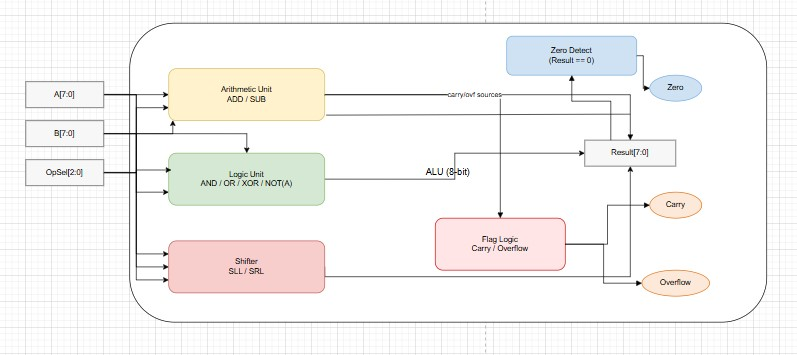
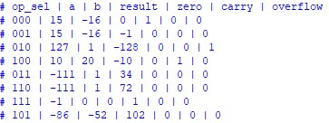

#  LAB 01: Basic Combinational Circuits  

## Lab 1A: 8-bit Arithmetic Logic Unit (ALU)  

### Introduction  
This document describes an **8-bit Arithmetic Logic Unit (ALU)** implemented in **SystemVerilog**.  

- The unit accepts two signed 8-bit operands (`A`, `B`) and a **3-bit operation select (`op_sel`)**.  
- It produces an **8-bit result** with **three status flags**:  
  - `zero` → 1 when result = `8'h00`  
  - `carry` → operation-dependent  
  - `overflow` → signed overflow indicator for ADD/SUB  
- The ALU is purely **combinational**, suitable for single-cycle datapaths on FPGAs.  

---

## Port & Datapath Summary  

### Inputs
- `A`, `B`: signed `[7:0]` operands  
- `op_sel`: `[2:0]` operation select  

### Outputs
- `result`: `[7:0]` ALU result  
- `zero`: 1 when `result == 8'h00`  
- `carry`: operation-dependent  
- `overflow`: signed overflow indicator (ADD/SUB)  

---

## Operation Encoding (000 → 111)  

| `op_sel` | Operation | Result Expression | Flags Used |
|----------|-----------|------------------|------------|
| `000`    | AND       | `result = A & B` | zero |
| `001`    | OR        | `result = A | B` | zero |
| `010`    | ADD       | `sum = {0,A} + {0,B}; result = sum[7:0]` | `carry = sum[8]`, overflow via signed ADD rule, zero |
| `011`    | SLL       | `result = A << B` | zero |
| `100`    | SUB       | `sub = {0,A} - {0,B}; result = ~sub[7:0]` | `carry = sub[8]`, overflow via ADD rule, zero |
| `101`    | XOR       | `result = A ^ B` | zero |
| `110`    | SRL       | `result = A >> B (logical)` | zero |
| `111`    | NOT       | `result = ~A` | zero |

---

## Operation Descriptions  

### 1. ADD  
- Unsigned and signed addition of `A` and `B`.  
- Carry: `sum[8]`.  
- Signed overflow: occurs when `A[7]` and `B[7]` are equal but differ from `result[7]`.  

---

### 2. AND  
Bitwise conjunction (masking).  

| A | B | A & B |
|---|---|-------|
| 0 | 0 | 0 |
| 0 | 1 | 0 |
| 1 | 0 | 0 |
| 1 | 1 | 1 |

Flags: `zero` only.  

---

### 3. OR  
Bitwise inclusive OR (bit setting).  

| A | B | A \| B |
|---|---|--------|
| 0 | 0 | 0 |
| 0 | 1 | 1 |
| 1 | 0 | 1 |
| 1 | 1 | 1 |

Flags: `zero` only.  

---

### 4. XOR  
Bitwise exclusive OR (parity/toggling).  

| A | B | A ^ B |
|---|---|-------|
| 0 | 0 | 0 |
| 0 | 1 | 1 |
| 1 | 0 | 1 |
| 1 | 1 | 0 |

Flags: `zero` only.  

---

### 5. SUB  
- As coded:  
  - Compute `sub = {0,A} - {0,B}`  
  - Assign `result = ~sub[7:0]` (**bitwise complement** of the true difference).  
- Carry: `sub[8]` (note: for direct subtraction this indicates borrow).  
- Overflow: same formula as ADD.  

---

### 6. NOT  
Unary bitwise inversion of `A`.  
- `result = ~A`  
- Ignores `B`.  

| A | ~A |
|---|----|
| 0 | 1  |
| 1 | 0  |

Flags: `zero` only.  

---

### 7. SLL (Shift Left Logical)  
- `result = A << B`  
- Bits shift toward MSB; zeros fill LSBs.  
- For `B ≥ 8`, result = 0.  
- Flags: `zero` only.  

---

### 8. SRL (Shift Right Logical)  
- `result = A >> B` (logical right shift).  
- Bits shift toward LSB; zeros fill MSBs.  
- Flags: `zero` only.  

---

## Status Flags  

| Flag     | Set In     | Rule |
|----------|------------|------|
| **zero** | All ops    | `1 when result == 8'h00` |
| **carry** | ADD, SUB   | ADD: `sum[8]`   SUB: `sub[8]` (borrow indicator) |
| **overflow** | ADD, SUB | ADD: `(A7 == B7) && (A7 != result7)`   SUB: same formula (note: not the conventional subtraction overflow test) |

---

##  Verification  and Testing  
To test the SystemVerilog code, a **testbench** was written that includes different test cases to verify all possible conditions. The testbench was **compiled and simulated** using **QuestaSim**. During simulation, the behavior of signals was observed and verified through the **waveform window**. This waveform verification ensured that the design produced the expected outputs and functioned correctly under all scenarios.

- All **8 operations (000 → 111)** were tested on **QuestaSim**.  
- Flags (`zero`, `carry`, `overflow`) were monitored for correctness.  
- Simulation results matched expected outputs for all cases. 
Following are the results after testing the ALU module.

  

