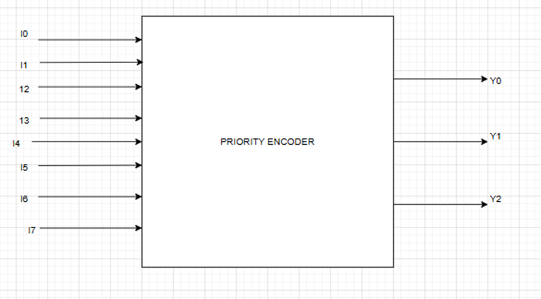
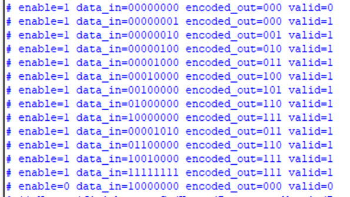

# Lab 1B: 8-to-3 Priority Encoder with Enable

## Introduction
A **priority encoder** is a combinational circuit that encodes multiple input lines into a binary code based on the **highest-priority active input**.  

- In an **8-to-3 priority encoder**, there are **8 input lines** (`I7..I0`) and **3 output lines** (`Y2, Y1, Y0`).  
- `I7` has the **highest priority**, and `I0` has the **lowest priority**.  
- If multiple inputs are active, the encoder outputs the binary code corresponding to the **highest-priority input**.  
- An **enable input (E)** controls whether the encoder is active. When `E=0`, the output is disabled.  
- A **valid output (V)** is asserted when **at least one input is active** and `E=1`.  

---

## Working
The priority is resolved by checking inputs **from the most significant (I7) to the least significant (I0)**.  

- If `I7=1` → output is `111` (regardless of other inputs).  
- If `I7=0` and `I6=1` → output is `110`.  
- If only `I0=1` → output is `000`.  

 This ensures that the **highest-numbered input dominates** when multiple inputs are asserted.  

---

## Truth Table

| I7 | I6 | I5 | I4 | I3 | I2 | I1 | I0 | Y2 | Y1 | Y0 |
|----|----|----|----|----|----|----|----|----|----|----|
| 0  | 0  | 0  | 0  | 0  | 0  | 0  | 1  | 0  | 0  | 0  |
| 0  | 0  | 0  | 0  | 0  | 0  | 1  | X  | 0  | 0  | 1  |
| 0  | 0  | 0  | 0  | 0  | 1  | X  | X  | 0  | 1  | 0  |
| 0  | 0  | 0  | 0  | 1  | X  | X  | X  | 0  | 1  | 1  |
| 0  | 0  | 0  | 1  | X  | X  | X  | X  | 1  | 0  | 0  |
| 0  | 0  | 1  | X  | X  | X  | X  | X  | 1  | 0  | 1  |
| 0  | 1  | X  | X  | X  | X  | X  | X  | 1  | 1  | 0  |
| 1  | X  | X  | X  | X  | X  | X  | X  | 1  | 1  | 1  |

---

## Notes
- `X` means **don’t care** (value can be 0 or 1).  
- If **Enable (E=0)** → outputs are **disabled** (not shown in the above table).  
- **Valid (V)** signal = `1` when any input is active and `E=1`.  

---

## SystemVerilog Implementation

We implemented the **8-to-3 Priority Encoder** using the `casez` statement.  
The `casez` approach makes it easier to handle **don’t care conditions** (`?`) and ensures **priority encoding** from `I7` down to `I0`.

---

 **Key Point:**  
The use of `casez` allows grouping don’t care conditions (`?`) and gives a **clean, compact, and priority-based encoding** without needing multiple nested `if-else` statements.

## Testing and Verfication
To test the SystemVerilog code, a **testbench** was written that includes different test cases to verify all possible conditions. The testbench was **compiled and simulated** using **QuestaSim**. During simulation, the behavior of signals was observed and verified through the **waveform window**. This waveform verification ensured that the design produced the expected outputs and functioned correctly under all scenarios. Following is the output.

### References
- I didn't know the use of **casez** so I used Chatgpt to get its understanding.
- https://www.geeksforgeeks.org/digital-logic/encoder-in-digital-logic/