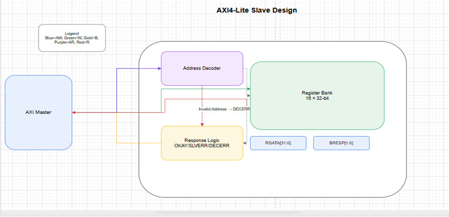
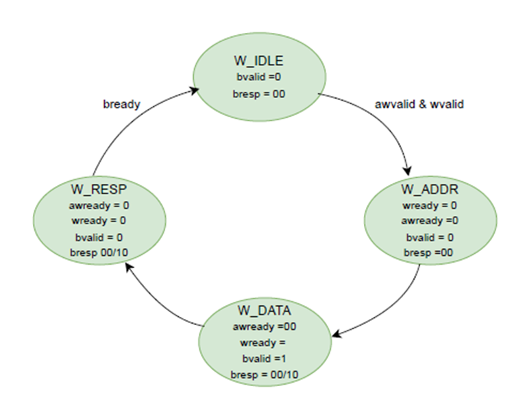
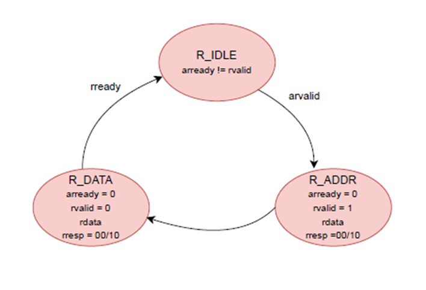

# LAB10: AXI4-Lite Protocol and Slave Design

## Introduction
The **AXI4-Lite protocol** is a simplified subset of the **Advanced eXtensible Interface (AXI4)** protocol defined by ARM.  
Unlike the full AXI4 protocol, **AXI4-Lite does not support burst transfers** and is limited to **single 32-bit read and write transactions**.  

This makes it ideal for **low-complexity control interfaces**.  
The design is **lightweight, easy to implement**, and ensures **compatibility with a wide range of AXI-compliant masters**.

---

## Key Characteristics of AXI4-Lite
- **32-bit address bus** and **32-bit data bus** for register-level operations.
- Communication separated into **independent channels**:
  - Address
  - Data
  - Response
- **VALID/READY handshake principle**:
  - Master asserts **VALID** when it has data or an address to transfer.
  - Slave asserts **READY** when it can accept.
  - Transfer occurs only when **both are high in the same cycle**.
- **Simplified design**:
  - Only single transfers.
  - No burst management, outstanding transactions, or complex buffering.
- **Error detection** via response channels.

## Write Operation
A typical AXI4-Lite write transaction flow:
1. **Address Phase**:  
   - Master asserts **AWVALID** with the target address.  
   - Slave responds with **AWREADY** when it can accept the address.  

2. **Data Phase**:  
   - Master asserts **WVALID** with **WDATA**.  
   - Slave responds with **WREADY** when it accepts the data.  

3. **Response Phase**:  
   - Slave updates its internal register bank.  
   - Slave asserts **BVALID** with **BRESP**.  
   - Master asserts **BREADY** to acknowledge.  

Transaction completes at this point.

### Write FSM (Finite State Machine)

| Current State | Inputs             | Next State                          | Outputs (awready, wready, bvalid, bresp)                  |
|---------------|--------------------|-------------------------------------|-----------------------------------------------------------|
| **W_IDLE**    | awvalid, wvalid    | W_ADDR (if both captured) / W_IDLE  | awready = !aw_captured wready = !w_captured bvalid = 0 bresp = 00 |
| **W_ADDR**    | -                  | W_DATA                              | awready = 0 wready = 0 bvalid = 0 bresp = 00 |
| **W_DATA**    | -                  | W_RESP                              | awready = 0 wready = 0 bvalid = 1 bresp = 00 (valid) / 10 (slave error) |
| **W_RESP**    | bready             | W_IDLE                              | awready = 0 wready = 0 bvalid = 0 bresp = same as W_DATA |

## Read Operation
A typical AXI4-Lite read transaction flow:
1. **Address Phase**:  
   - Master asserts **ARVALID** with the read address.  
   - Slave asserts **ARREADY** to acknowledge.  

2. **Data Phase**:  
   - Slave decodes the address.  
   - If valid → retrieves data from register bank.  
   - If invalid → prepares an error response.  

3. **Response Phase**:  
   - Slave asserts **RVALID** with **RDATA** and **RRESP**.  
   - Master asserts **RREADY** to acknowledge.  

Transaction completes at this point.

### Read FSM (Finite State Machine)

| Current State | Inputs   | Next State | Outputs (arready, rvalid, rdata, rresp) |
|---------------|----------|------------|-----------------------------------------|
| **R_IDLE**    | arvalid  | R_ADDR     | arready = !rvalid |
| **R_ADDR**    | -        | R_DATA     | arready = 0 rvalid = 1 rdata = register_bank[read_addr_index] (if valid) / 32'h0 (if error) rresp = 00 (valid) / 10 (slave error) |
| **R_DATA**    | rready   | R_IDLE     | arready = 0 rvalid = 0 rdata = register_bank[read_addr_index] (if valid) / 32'h0 (if error) rresp =  00 (valid) / 10 (slave error)|

## Testing and Verification
To test the SystemVerilog code, a **testbench** was written that includes different test cases. The testbench was **compiled and simulated** using **QuestaSim**. During simulation, the behavior of signals was observed and verified through the **waveform window**. This waveform verification ensured that the design produced the expected outputs and functioned correctly.

## Summary
- AXI4-Lite is ideal for **control registers** and **simple peripherals**.  
- The **FSM-based approach** ensures correct **handshake sequencing** for both **read** and **write** transactions.  
- Its **lightweight design** makes it the standard interface in **SoCs and embedded systems**.  

## References
- https://www.realdigital.org/doc/a9fee931f7a172423e1ba73f66ca4081
- https://developer.arm.com/documentation/dui0534/b/Protocol-Assertions-Descriptions/AXI4-and-AXI4-Lite-protocol-assertion-descriptions
- Chatgpt

