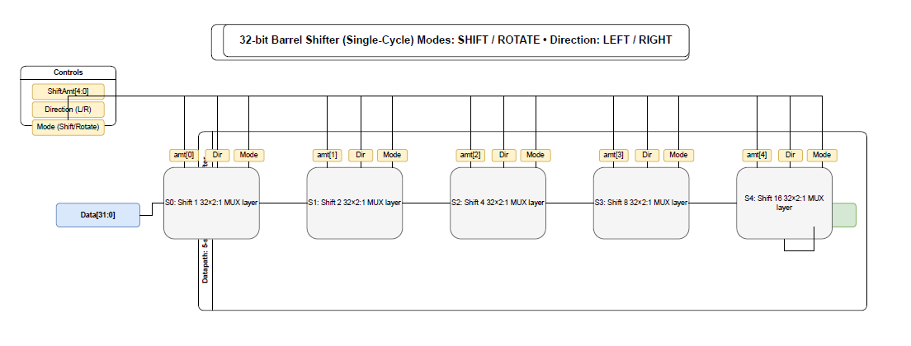
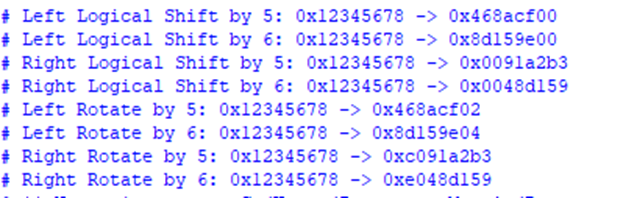

# Lab 02: Advanced Combinational Logic  
## Lab 2A: 32-bit Barrel Shifter  

##  Introduction  
A **barrel shifter** is a combinational digital circuit designed to **shift or rotate data** by a specified number of positions in a single clock cycle.  

Unlike sequential shifters (which require multiple clock cycles), a barrel shifter performs the entire operation in **one cycle**, making it highly efficient for **high-speed processors** and **digital signal processing (DSP)** applications.  

In this lab, a **32-bit barrel shifter** was implemented with the following features:  
- 32-bit data input and output  
- 5-bit shift amount to select number of positions (0–31)  
- Direction control: **left** or **right** shift/rotation  
- Mode control: **shift** or **rotate**  
- Single-cycle operation for high-speed processing  

---

## Shifting and Rotating Operations  

### Shift Operation  
- **Logical Shift Left (LSL):** Moves all bits to the left by the shift amount. Vacant LSBs are filled with **zeros**.  
- **Logical Shift Right (LSR):** Moves all bits to the right. Vacant MSBs are filled with **zeros**.  

### Rotate Operation  
- **Rotate Left (ROL):** Bits shifted out from the MSB re-enter at the LSB.  
- **Rotate Right (ROR):** Bits shifted out from the LSB re-enter at the MSB.  

---

## Barrel Shifter Architecture  

The barrel shifter is implemented as a **multi-stage combinational circuit**.  
Each stage shifts the input by a **power of 2** (`1, 2, 4, 8, 16`) if the corresponding bit of the **shift amount** is set.  

This structure allows for:  
- Flexible shift amounts (0–31)  
- Single-cycle operation (no sequential logic required)  

### Stages of the 32-bit Barrel Shifter  

| Stage   | Shift Amount | Condition (shift_amt[x]) |
|---------|--------------|--------------------------|
| Stage 0 | Shift by 1   | if `shift_amt[0] = 1`   |
| Stage 1 | Shift by 2   | if `shift_amt[1] = 1`   |
| Stage 2 | Shift by 4   | if `shift_amt[2] = 1`   |
| Stage 3 | Shift by 8   | if `shift_amt[3] = 1`   |
| Stage 4 | Shift by 16  | if `shift_amt[4] = 1`   |

---

## Handling Fill Bits  

- **In Shift Mode:** Vacant positions are filled with **zeros**.  
- **In Rotate Mode:** Bits shifted out from one end are **wrapped around** and inserted at the opposite end.  

This is controlled in Verilog using **if-else** or **ternary operators**, based on:  
- `shift_rotate` (select shift or rotate)  
- `left_right` (select left or right direction)  

---

## Diagram  

---

## Verification and Testing  

The barrel shifter was tested for different:  
- Shift amounts  
- Directions (left/right)  
- Modes (shift/rotate)  

 The output matched expected results, confirming correctness of the design.  
 

---

## Conclusion  

The **32-bit barrel shifter** demonstrates an efficient method to perform **variable-length shift and rotate operations** in a single cycle.  

- Its **multi-stage design** and use of **multiplexers** provide both **speed** and **flexibility**.  
- It is a **critical component** in modern digital systems, including **CPUs, DSPs, and FPGA-based designs**.  

---

### References
https://community.element14.com/technologies/fpga-group/b/blog/posts/systemverilog-study-notes-barrel-shifter-rtl-combinational-circuit

