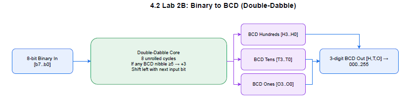
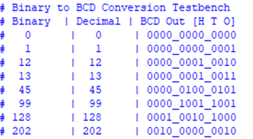

# Lab 02: Advanced Combinational Logic  
## Lab 2B: Binary Coded Decimal (BCD) Converter  

---

## Introduction  
A **Binary-Coded Decimal (BCD) converter** transforms a binary number into its decimal representation encoded in binary form.  

- Each **decimal digit** is represented by **4 bits**.  
- Example: Decimal `195` → BCD `0001 1001 0101`  
  - `0001` → 1  
  - `1001` → 9  
  - `0101` → 5  

---

## Double-Dabble Algorithm (Shift-and-Add-3)  

The **Double-Dabble algorithm** (shift-and-add-3) is widely used for converting binary numbers to BCD.  

### Steps:  
1. **Initialize** a shift register wide enough to hold BCD digits + input binary.  
   - For 8-bit input: `shift_reg = {12’b0, binary_in}`  
   - 12 bits for 3 BCD digits + 8 bits for binary input  
2. **Shift left** the register by 1 bit (repeat 8 times for an 8-bit input).  
3. **Add 3** to each BCD digit if its value ≥ 5.  
   - Ensures no digit exceeds `9` after the next shift.  
4. Repeat until all bits are shifted into the BCD portion.  
5. **Extract** the BCD result from the upper bits of the shift register.  

---

## Design  

- **Combinational Implementation:**  
  No registers or sequential logic; output depends directly on input.  

- **Input Range:**  
  Handles all **8-bit inputs (0–255)**, producing 3 BCD digits (`[11:8] [7:4] [3:0]`).  

- **Shift Register Width:**  
  Must accommodate binary + BCD digits (`12 + 8 = 20 bits`).  

- **Efficiency:**  
  Uses **simple shifts and add-3 operations**, easy to synthesize in hardware.  

---

## Implementation Notes  

- Written in **SystemVerilog** using `always_comb`.  
- **For-loop** iterates through each bit, applying shift-and-add-3.  
- **BCD digits** are extracted from upper portion after all iterations.  

---

## Diagram  

## Testing and Verification 

- Converter tested for **all input values (0–255)**.  
- Correct BCD outputs verified using **simulation in QuestaSim**.  

- Example runs:  

| Binary Input | Decimal Equivalent | BCD Output        |
|--------------|--------------------|-------------------|
| `00000011`   | 3                  | `0000 0000 0011`  |
| `01011001`   | 89                 | `0000 1000 1001`  |
| `11000011`   | 195                | `0001 1001 0101`  |
| `11111111`   | 255                | `0010 0101 0101`  |

---

## Conclusion  

The **Double-Dabble algorithm** provides a **simple, hardware-friendly** method for binary-to-BCD conversion:  

- Works efficiently with **combinational logic**.  
- Requires only **shift and conditional add-3** operations.  
- For 8-bit input, a **12-bit shift register** is sufficient to produce 3 BCD digits.  
- Widely used in digital systems that display decimal values, e.g., **seven-segment displays**.  

---
### Reference
https://en.wikipedia.org/wiki/Double_dabble