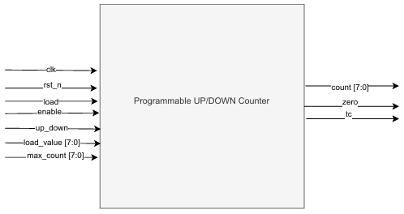
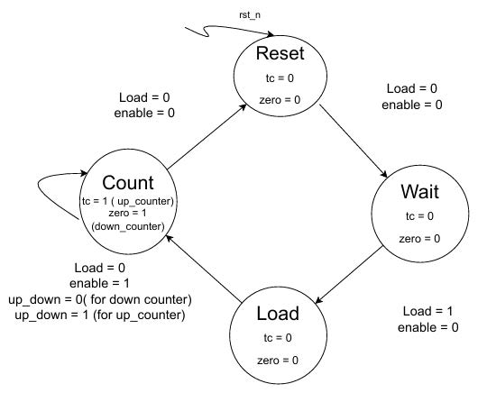

# Lab 03: Sequential Circuit Fundamentals  
## Lab 3A: Programmable Counter  

## Purpose  
This is an **8-bit programmable up/down counter** with:  

- **Load capability** (`load_value`)  
- **Enable control** (`enable`)  
- **Direction select** (`up_down`)  
- **Terminal count (tc)** and **zero flag** outputs  
- **Wrap-around behavior** when limits are reached  

---

## Interface Signals  

### Inputs  
- **clk (logic):** Rising edge clock.  
- **rst_n (logic):** Active-low reset (asynchronous).  
- **load (logic):** Load the counter with `load_value`.  
- **enable (logic):** Enables counting.  
- **up_down (logic):** Direction select → `1=up`, `0=down`.  
- **load_value [7:0]:** Initial value to load.  
- **max_count [7:0]:** Maximum count for up mode.  

### Outputs  
- **count [7:0]:** Current counter value.  
- **tc (logic):** Terminal count flag (set at `max_count` or `0`).  
- **zero (logic):** Zero flag (set when count reaches `0`).  

  

### State Machine

  

## How It Works  

1. **Reset (`!rst_n`)** → Counter clears to `0`.  
2. **Load (`load=1`)** → Loads `load_value` into `count`.  
3. **Enable (`enable=1`)** → Counter starts counting:  
   - **Up mode (`up_down=1`)** →  
     - Increments `count` by 1.  
     - If `count == max_count`, wraps around to `load_value`.  
   - **Down mode (`up_down=0`)** →  
     - Decrements `count` by 1.  
     - If `count == 0`, wraps around to `load_value`.  
4. **Status Flags:**  
   - `zero=1` when `count==0`.  
   - `tc=1` when:  
     - `count==max_count` (up mode).  
     - `count==0` (down mode).  
5. **Effect of change in max_count during operation:**
   - If **`max_count`** changes during operation, it takes effect **immediately** because the counter always compares its value against the current `max_count`.  

- **Up Counter Mode (`up_down = 1`)**  
  - If `max_count` is reduced and the current `count` is now greater than the new `max_count`, then on the next clock the counter will be forced down to the new `max_count` and freeze there.  
  - If `max_count` is increased, the counter will simply continue counting upwards until it reaches the new limit.  

- **Down Counter Mode (`up_down = 0`)**  
  - The counter ignores `max_count` and only counts down to zero, so changes in `max_count` have **no effect** in this mode.  

---

## Verification and Testing
To test the SystemVerilog code, a **testbench** was written that includes different test cases to verify all possible conditions. The testbench was **compiled and simulated** using **QuestaSim**. During simulation, the behavior of signals was observed and verified through the **waveform window**. This waveform verification ensured that the design produced the expected outputs and functioned correctly under all scenarios.

- Flags (`tc`, `zero`) were observed in waveforms and matched expected behavior. 
---

## Design Review Checklist  

-  Clean FSM with synchronous logic.  
-  Handles both **up** and **down** counting correctly.  
-  **Load and reset priority** implemented properly.  
-  Status flags (`tc`, `zero`) fully verified.  
-  QuestaSim simulation confirms correctness.  

---
