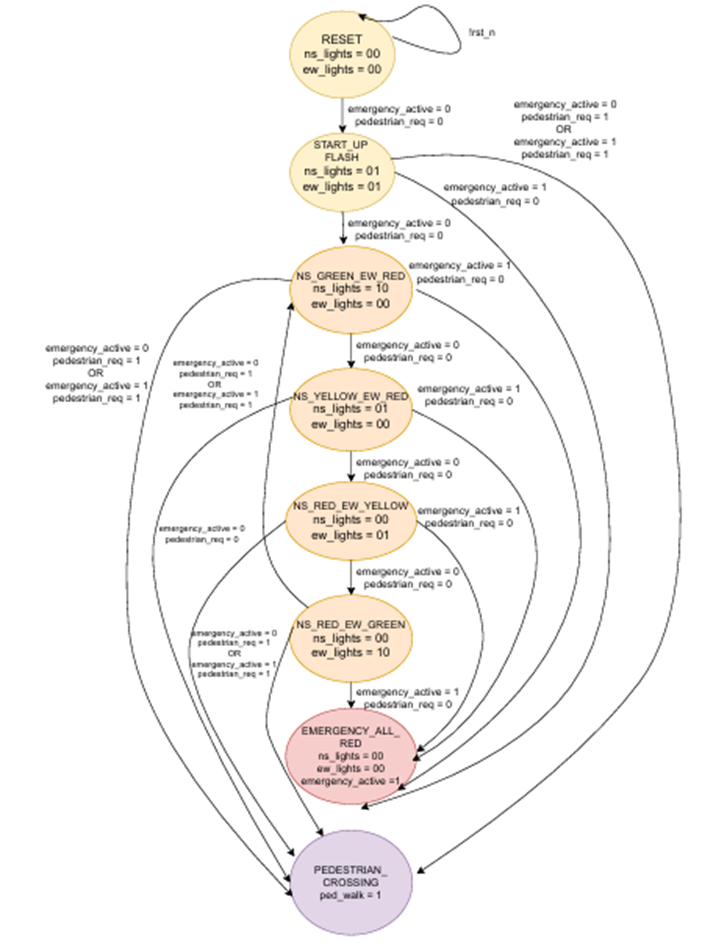

# Lab 4: Finite State Machines

## Lab 4A: Traffic Light Controller

### Module: `traffic_controller`

**Purpose:**  
The purpose of the `traffic_controller` module is to design and implement a traffic light control system for a four-way intersection using a **finite state machine (FSM)**. The controller manages the timing and sequencing of green, yellow, and red lights for both north-south and east-west directions, while also handling pedestrian crossing requests and emergency overrides.  

By using an FSM, the design ensures:
- Safe, predictable, and efficient traffic flow under normal conditions.  
- Immediate response to emergency situations.  

---

### Interface Signals

- `clk` *(input)*: 1 Hz system clock used for timing and FSM transitions.  
- `rst_n` *(input)*: Active-low asynchronous reset; initializes the controller to all-red safe state.  
- `emergency` *(input)*: Emergency override signal; when high, forces all lights to red (flashing).  
- `pedestrian_req` *(input)*: Pedestrian crossing request; triggers pedestrian walk cycle.  
- `ns_lights [1:0]` *(output)*: North-South traffic lights. Encoded as:  
  - `2’b01 = Red`  
  - `2’b10 = Yellow`  
  - `2’b11 = Green`  
- `ew_lights [1:0]` *(output)*: East-West traffic lights. Encoded same as above.  
- `ped_walk` *(output)*: Pedestrian walk signal; high when it is safe to cross.  
- `emergency_active` *(output)*: Indicates when FSM is in emergency mode.  

---

### 4.1 State Machine

#### 4.1.1 States
- **IDLE** – Reset/initial state, system inactive.  
- **STARTUP_FLASH** – Startup sequence, lights flash red for initialization.  
- **NS_GREEN_EW_RED** – North-South green, East-West red.  
- **NS_YELLOW_EW_RED** – North-South yellow, East-West red.  
- **NS_RED_EW_GREEN** – North-South red, East-West green.  
- **NS_RED_EW_YELLOW** – North-South red, East-West yellow.  
- **EMERGENCY_ALL_RED** – Emergency override, all signals red (flashing).  
- **PEDESTRIAN_CROSSING** – Pedestrian walk phase, all vehicle lights red.  

#### 4.1.2 Transitions
- `IDLE → STARTUP_FLASH` : Automatically after reset release.  
- `STARTUP_FLASH → NS_GREEN_EW_RED` : If no emergency and no pedestrian request.  
- `NS_GREEN_EW_RED → NS_YELLOW_EW_RED` : After 30 cycles.  
- `NS_YELLOW_EW_RED → NS_RED_EW_GREEN` : After 5 cycles.  
- `NS_RED_EW_GREEN → NS_RED_EW_YELLOW` : After 30 cycles.  
- `NS_RED_EW_YELLOW → NS_GREEN_EW_RED` : After 5 cycles.  
- **Any state → EMERGENCY_ALL_RED** : If `emergency = 1`.  
- **Any state → PEDESTRIAN_CROSSING** : If `pedestrian_req = 1`.  
- `EMERGENCY_ALL_RED → prev_state` : After 30 cycles or when `emergency = 0`.  
- `PEDESTRIAN_CROSSING → prev_state` : After 30 cycles or when `pedestrian_req = 0`.  

## Transition Table  

| Current State        | Inputs (emergency, pedestrian_req, timer_done) | Outputs (ns_lights, ew_lights, ped_walk, emergency_active) | Next State |
|----------------------|-----------------------------------------------|------------------------------------------------------------|------------|
| **RESET**            | rst_n=0 → reset                               | ns=00, ew=00, ped=0, em=0                                  | RESET      |
| **RESET**            | rst_n=1                                       | ns=00, ew=00, ped=0, em=0                                  | STARTUP_FLASH |
| **STARTUP_FLASH**    | timer_done=0                                  | ns=01, ew=01, ped=0, em=0                                  | STARTUP_FLASH |
| **STARTUP_FLASH**    | timer_done=1                                  | ns=01, ew=01, ped=0, em=0                                  | NS_GREEN_EW_RED |
| **NS_GREEN_EW_RED**  | emergency=1                                   | ns=10, ew=00, ped=0, em=0                                  | EMERGENCY_ALL_RED |
| **NS_GREEN_EW_RED**  | ped_req=1                                     | ns=10, ew=00, ped=0, em=0                                  | PEDESTRIAN_CROSSING |
| **NS_GREEN_EW_RED**  | timer_done=1                                  | ns=10, ew=00, ped=0, em=0                                  | NS_YELLOW_EW_RED |
| **NS_YELLOW_EW_RED** | emergency=1                                   | ns=01, ew=00, ped=0, em=0                                  | EMERGENCY_ALL_RED |
| **NS_YELLOW_EW_RED** | ped_req=1                                     | ns=01, ew=00, ped=0, em=0                                  | PEDESTRIAN_CROSSING |
| **NS_YELLOW_EW_RED** | timer_done=1                                  | ns=01, ew=00, ped=0, em=0                                  | NS_RED_EW_YELLOW |
| **NS_RED_EW_GREEN**  | emergency=1                                   | ns=00, ew=10, ped=0, em=0                                  | EMERGENCY_ALL_RED |
| **NS_RED_EW_GREEN**  | ped_req=1                                     | ns=00, ew=10, ped=0, em=0                                  | PEDESTRIAN_CROSSING |
| **NS_RED_EW_GREEN**  | timer_done=1                                  | ns=00, ew=10, ped=0, em=0                                  | NS_RED_EW_YELLOW |
| **NS_RED_EW_YELLOW** | emergency=1                                   | ns=00, ew=01, ped=0, em=0                                  | EMERGENCY_ALL_RED |
| **NS_RED_EW_YELLOW** | ped_req=1                                     | ns=00, ew=01, ped=0, em=0                                  | PEDESTRIAN_CROSSING |
| **NS_RED_EW_YELLOW** | timer_done=1                                  | ns=00, ew=01, ped=0, em=0                                  | NS_GREEN_EW_RED |
| **EMERGENCY_ALL_RED**| emergency=1                                   | ns=00, ew=00, ped=0, em=1                                  | EMERGENCY_ALL_RED |
| **EMERGENCY_ALL_RED**| emergency=0 (timer_done=1)                    | ns=00, ew=00, ped=0, em=1                                  | prev_state |
| **PEDESTRIAN_CROSSING** | timer_done=0                               | ns=00, ew=00, ped=1, em=0                                  | PEDESTRIAN_CROSSING |
| **PEDESTRIAN_CROSSING** | timer_done=1                               | ns=00, ew=00, ped=1, em=0                                  | prev_state |

#### 4.1.3 Reset State
- On reset (`rst_n = 0`), FSM initializes to **IDLE** with all outputs inactive.  

#### 4.1.4 Timing Relationships
- **Green:** 30 cycles (30s)  
- **Yellow:** 5 cycles (5s)  
- **Pedestrian crossing:** 30 cycles (30s)  
- **Emergency red:** 30 cycles (30s)

**Note:**  
`PREVIOUS_STATE` means the FSM resumes from the interrupted state instead of always restarting from NS side.  

## Testing and Verification
A testbench was written in order to test the working of the vending machine. Both the code and testbench were compiled and simulated in **QuestaSim**.The output was verified from the waveform window.
