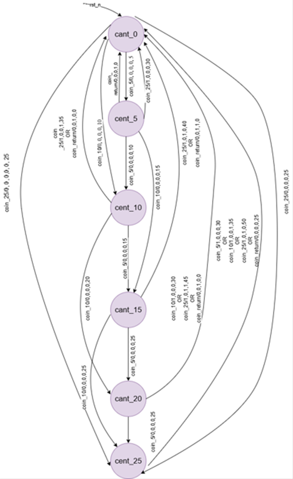

## Lab 4B: Vending Machine Controller

**Purpose:**  
The `vending_machine` module accepts coins of **5¢, 10¢, and 25¢**, tracks the total inserted amount, and dispenses an item when the cost is reached. It also supports a **coin return** feature to refund balance in proper denominations.  

The FSM ensures:  
- Correct coin handling  
- Accurate balance display  
- Proper control signals for dispense/return  
- User-friendly operation  

---

### Interface Signals

- `clk` *(input)*: System clock driving FSM.  
- `rst_n` *(input)*: Active-low reset; sets machine to idle and clears balance.  
- `coin_5` *(input)*: Insert 5¢ coin.  
- `coin_10` *(input)*: Insert 10¢ coin.  
- `coin_25` *(input)*: Insert 25¢ coin.  
- `coin_return` *(input)*: Coin return button.  
- `dispense_item` *(output)*: High when required cost is reached; triggers item release.  
- `return_5` *(output)*: Return a 5¢ coin.  
- `return_10` *(output)*: Return a 10¢ coin.  
- `return_25` *(output)*: Return a 25¢ coin.  
- `amount_display [5:0]` *(output)*: Shows inserted balance in cents.  

---

### 4.2 State Machine

#### 4.2.1 States
Each state corresponds to the current balance:  
- **IDLE** (0¢), **cent_5** (5¢), **cent_10** (10¢), **cent_15** (15¢), **cent_20** (20¢), **cent_25** (25¢)  

#### 4.2.2 Transitions
- `coin_5` → Add 5¢, move to next state.  
- `coin_10` → Add 10¢, move to next state.  
- `coin_25` → Add 25¢, move to next state.  

#### 4.2.3 Reset State
- On reset (`rst_n = 0`), FSM goes to **IDLE** with balance = 0.  

#### 4.2.4 FSM Type
- **Mealy FSM**: Outputs depend on both **current state** and **inputs** (e.g., dispense/return happens immediately on coin insertion).  

---

### State Transition Table

| Current State | Input Condition | Next State | Outputs (dispense, return_25, return_10, return_5, amount_display) |
|---------------|----------------|------------|--------------------------------------------------------------------|
| **IDLE (0¢)** | `coin_5=1` | cent_5 | 0,0,0,0,5 |
| | `coin_10=1` | cent_10 | 0,0,0,0,10 |
| | `coin_25=1` | cent_25 | 0,0,0,0,25 |
| | `coin_return=1` | IDLE | 0,0,0,0,0 |
| | no input | IDLE | 0,0,0,0,0 |
| **cent_5 (5¢)** | `coin_5=1` | cent_10 | 0,0,0,0,10 |
| | `coin_10=1` | cent_15 | 0,0,0,0,15 |
| | `coin_25=1` | IDLE | 1,0,0,0,30 |
| | `coin_return=1` | IDLE | 0,0,0,1,0 |
| | no input | cent_5 | 0,0,0,0,5 |
| **cent_10 (10¢)** | `coin_5=1` | cent_15 | 0,0,0,0,15 |
| | `coin_10=1` | cent_20 | 0,0,0,0,20 |
| | `coin_25=1` | IDLE | 1,0,0,1,35 |
| | `coin_return=1` | IDLE | 0,0,1,0,0 |
| | no input | cent_10 | 0,0,0,0,10 |
| **cent_15 (15¢)** | `coin_5=1` | cent_20 | 0,0,0,0,20 |
| | `coin_10=1` | cent_25 | 0,0,0,0,25 |
| | `coin_25=1` | IDLE | 1,0,1,0,40 |
| | `coin_return=1` | IDLE | 0,0,1,1,0 |
| | no input | cent_15 | 0,0,0,0,15 |
| **cent_20 (20¢)** | `coin_5=1` | cent_25 | 0,0,0,0,25 |
| | `coin_10=1` | IDLE | 1,0,0,0,30 |
| | `coin_25=1` | IDLE | 1,0,1,1,45 |
| | `coin_return=1` | IDLE | 0,0,1,0,0 |
| | no input | cent_20 | 0,0,0,0,20 |
| **cent_25 (25¢)** | `coin_5=1` | IDLE | 1,0,0,0,30 |
| | `coin_10=1` | IDLE | 1,0,0,1,35 |
| | `coin_25=1` | IDLE | 1,0,1,0,50 |
| | `coin_return=1` | IDLE | 0,1,0,0,0 |
| | no input | cent_25 | 0,0,0,0,25 |

---

## 4.3 Design Review Checklist

### Pre-Implementation
- Specification completely understood  
- State diagram complete with all transitions  

### Code Quality
- Consistent naming conventions. 
- No unintended latches (synchronous FSM design)  
-  Reset strategy consistent (asynchronous active-low `rst_n`)  

## Testing and Verification
A testbench was written in order to test the working of the vending machine. Both the code and testbench were compiled and simulated in **QuestaSim**.The output was verified from the waveform window.

