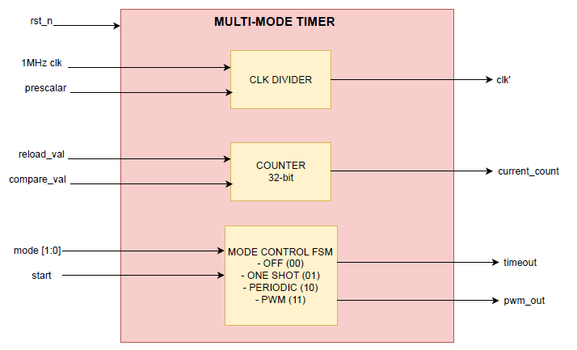

# LAB 05: Counters and Timers  
## Lab 5A: Multi-Mode Timer  

---

## Introduction  
A **multi-mode timer** is a versatile digital module capable of operating in multiple modes depending on system requirements.  
The timer designed here supports **four modes of operation**:  

- **Off Mode (00):** Timer disabled, no counting occurs.  
- **One-shot Mode (01):** Counts down once from reload value → 0, asserts timeout, then stops.  
- **Periodic Mode (10):** Continuously counts down, asserts timeout at zero, then automatically reloads for the next cycle.  
- **PWM Mode (11):** Generates a **Pulse Width Modulated (PWM)** signal based on reload value (period) and compare value (duty cycle).  

---

## Architecture  

The multi-mode timer architecture consists of the following blocks:  

1. **Clock and Prescaler**  
   - Input clock (e.g., 1 MHz).  
   - Prescaler divides input frequency to achieve longer timing intervals.  
   - Prescaler value is **programmable**.  

2. **Counter Register**  
   - 32-bit counter loaded with `reload_val` at start/reset.  
   - Decrements on each prescaler tick.  
   - Current counter value is available for monitoring.  

3. **Mode Control Logic**  
   - Determines operation based on mode input.  
   - Resets counter/prescaler when mode changes.  
   - Handles enable/disable.  

4. **Timeout Generator**  
   - **One-shot mode:** Generates a single timeout pulse when counter reaches zero.  
   - **Periodic mode:** Generates a timeout pulse at every rollover.  

5. **PWM Generator**  
   - Compares counter with `compare_val` to produce `pwm_out`.  
   - `reload_val` → PWM period.  
   - `compare_val` → duty cycle.  

6. **Control Signals**  
   - **start** → Initializes counter and activates mode.  
   - **timeout** → Asserted (1 cycle) when countdown completes.  
   - **pwm_out** → PWM waveform output in PWM mode.  

---

## Working Principle  

1. **Initialization**  
   - On reset (`rst_n = 0`): Registers cleared.  
   - On `start = 1`: Counter loads `reload_val`, prescaler resets, mode activates.  

2. **Counting**  
   - Each clock cycle: Prescaler increments.  
   - When prescaler == prescaler_val: Prescaler resets, counter decrements.  

3. **Mode-specific behavior**  
   - **Off Mode (00):** Counter holds.  
   - **One-shot Mode (01):** Counter decrements → 0, asserts timeout, stops.  
   - **Periodic Mode (10):** Counter decrements → 0, asserts timeout, reloads automatically.  
   - **PWM Mode (11):** Counter decrements, reloads on rollover. `pwm_out = 1` if counter < compare_val, else `0`.  

4. **Mode Change Handling**  
   - On mode change: Counter reloads, prescaler resets, PWM clears.  
   - Ensures clean start of new mode (no glitches).  

---

## Module Diagram  

  

  

## Testing and Verification
To test the SystemVerilog code, a **testbench** was written that includes different test cases to verify all possible conditions. The testbench was **compiled and simulated** using **QuestaSim**. During simulation, the behavior of signals was observed and verified through the **waveform window**. This waveform verification ensured that the design produced the expected outputs and functioned correctly under all scenarios.

## Conclusion  

The **multi-mode timer** provides flexible timing functionality by supporting **off, one-shot, periodic, and PWM modes**.  
It offers:  
- Accurate timeouts.  
- Continuous periodic signals.  
- Programmable PWM waveforms with prescaler + reload values.  
