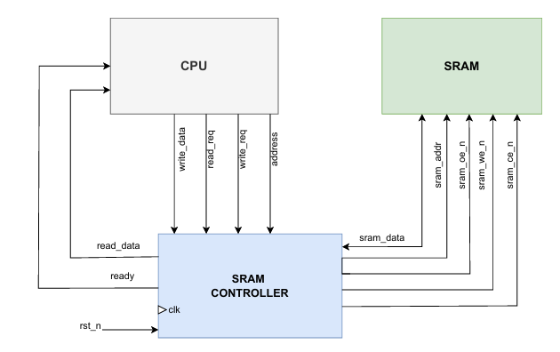
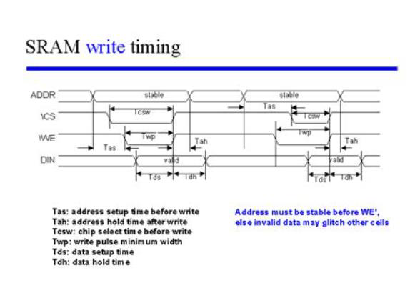
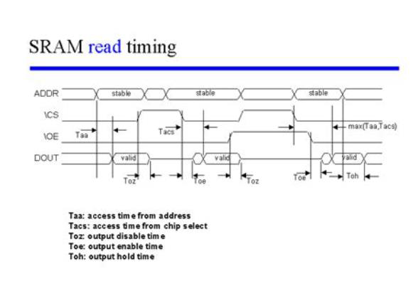

# LAB 06: Synchronous SRAM Controller  
## Lab 6A: Synchronous SRAM Controller  

## Introduction  
**Static Random Access Memory (SRAM)** is a fast, volatile memory technology.  
Unlike DRAM, SRAM does not require refresh; it retains data as long as power is applied.  

The device considered here is a **32K × 16 synchronous SRAM**:  
- **32,768 word locations** addressed by `A[14:0]`.  
- **16-bit data bus** `sram_data[15:0]`.  
- As a synchronous memory, it samples address + control signals on a clock edge.  
- Produces read data after a defined **clock-to-out delay**.  

Since the raw SRAM interface lacks sequencing or bus-direction management, a **dedicated controller** is required.  
This controller:  
- Ensures correct sequencing of `CE`, `OE`, `WE` signals.  
- Manages the **bidirectional bus** to prevent contention (only one driver at a time).  

---

## Interface Overview  

### System-Side Interface  
- `read_req`: Pulse to initiate a read request.  
- `write_req`: Pulse to initiate a write request.  
- `addr[14:0]`: Address of the word to access.  
- `write_data[15:0]`: Data to write.  
- `read_data[15:0]`: Data returned on a read.  
- `ready`: High when controller can accept a new request.  

 **Usage Rule**:  
- A request is accepted **only when `ready = 1`**.  
- Pulse **exactly one** of `read_req` or `write_req` for one clock cycle.  
- Wait for `ready = 1` again before issuing the next command.  
- This makes every access **atomic**.  

### Memory-Side Interface  
- `sram_addr[14:0]` → Address bus.  
- `sram_ce_n` → Active-low chip enable.  
- `sram_oe_n` → Active-low output enable.  
- `sram_we_n` → Active-low write enable.  
- `sram_data[15:0]` → **Bidirectional data bus**.  

Bus Direction Rules:  
- During **writes** → Controller drives `sram_data`.  
- During **reads** → SRAM drives `sram_data`.  
- Between transactions → Bus left in **High-Z** for safe turnaround.  

  

 

## Write Operation  
1. `write_req = 1` (with `ready = 1`).  
2. Controller latches `addr` and `write_data`.  
3. Performs **one-cycle write**:  
   - `sram_ce_n = 0`, `sram_we_n = 0`, `sram_oe_n = 1`.  
   - Controller drives `sram_data`.  
4. On next clock:  
   - Bus released to **High-Z**.  
   - Write controls deasserted.  
   - `ready` reasserted.  
  

  

 

## Read Operation  
1. `read_req = 1` (with `ready = 1`).  
2. Controller latches `addr`.  
3. Performs **one-cycle read**:  
   - `sram_ce_n = 0`, `sram_oe_n = 0`, `sram_we_n = 1`.  
   - Controller **tri-states** its drivers (SRAM drives the bus).  
4. Data appears on `sram_data` after **clock-to-out delay**.  
5. Controller captures into `read_data`.  
6. On next clock:  
   - Output path disabled.  
   - `ready` reasserted.  

  

 

## Data Bus Direction and High-Impedance  

Since `sram_data` is **shared**:  
- Controller drives only during writes.  
- SRAM drives only during reads.  
- Between operations → bus left **high-impedance (Z)**.  

This ensures **no contention** and clean **read/write turnaround**.  

---
## Testing and Verification
To test the SystemVerilog code, a **testbench** was written. The testbench was **compiled and simulated** using **QuestaSim**. During simulation, the behavior of signals was observed and verified through the **waveform window**. This waveform verification ensured that the design produced the expected outputs and functioned correctly.

## Conclusion  
The **Synchronous SRAM Controller** provides a clean, single-cycle bridge between system logic and a **32K × 16 memory device**.  

It:  
- Correctly sequences CE/WE/OE signals.  
- Manages the **bidirectional data bus** safely.  
- Exposes a **simple request/ready interface**.  

### Reference
- https://youtu.be/pX1shTOYw8I?si=1gDrNWVzAsm9Kyx8
- I had a confusion regarding deciding the states of the SRAM controller so I discussed wih AI and then wrote the code.
