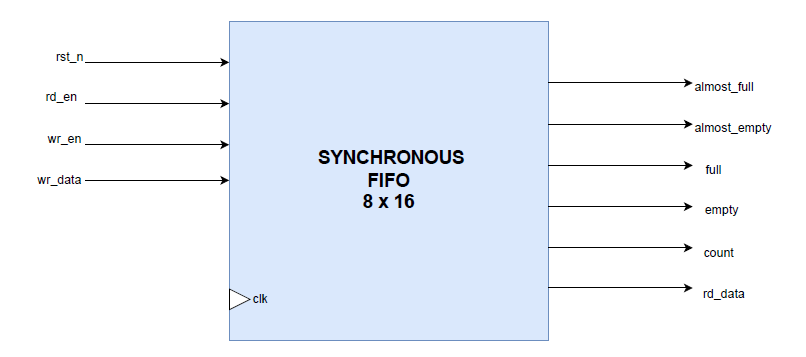
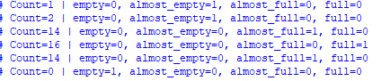

# Lab 07: FIFO Design  

## Lab 7A: Synchronous FIFO  

### Introduction  
A **First-In-First-Out (FIFO)** buffer is a sequential memory structure that stores data in the order it is written and allows data to be read in the same order.  

In this lab, a **parameterizable synchronous FIFO** was implemented with configurable:  
- Data width  
- Depth  
- Almost-full / Almost-empty thresholds  

---

### Synchronous FIFO Architecture  

A **synchronous FIFO** operates entirely within a single clock domain. Its main components are:  

- **Memory Array**  
  - The FIFO stores data in an array of registers or block RAMs.  
  - In our implementation:  
    ```verilog
    logic [DATA_WIDTH-1 : 0] mem [0 : FIFO_DEPTH-1];
    ```  

- **Write and Read Pointers**  
  - Two binary counters track the **write (wr_ptr)** and **read (rd_ptr)** positions.  
  - These pointers increment modulo FIFO depth and control where data is written or read:  
    1. Write pointer increments when `wr_en` is asserted and the FIFO is not full.  
    2. Read pointer increments when `rd_en` is asserted and the FIFO is not empty.  

- **Count Register**  
  - Keeps track of the number of elements currently stored in the FIFO.  
  - Incremented on writes, decremented on reads.  
  - Simplifies the generation of **full/empty** flags and **almost-full/almost-empty** thresholds.  

- **Flags**  
  1. **Empty** → Asserted when `count == 0`.  
  2. **Almost-empty** → Asserted when `count > 0 && count <= ALMOST_EMPTY_THRESHOLD`.  
  3. **Full** → Asserted when `count == FIFO_DEPTH`.  
  4. **Almost-full** → Asserted when `count >= ALMOST_FULL_THRESHOLD && count < FIFO_DEPTH`.  

---

### FIFO Operation  

- **Write Operation**  
  - Data is written at the location indicated by `wr_ptr`.  
  - After writing, `wr_ptr` is incremented modulo FIFO depth.  
  - `count` is incremented, unless the FIFO is full.  

- **Read Operation**  
  - Data is read from the location indicated by `rd_ptr`.  
  - After reading, `rd_ptr` is incremented modulo FIFO depth.  
  - `count` is decremented, unless the FIFO is empty.  

- **Flag Logic**  
  - Flags are generated **combinationally** using simple comparisons on `count`.  
  - Almost-full and almost-empty thresholds allow the system to take preemptive actions before the FIFO reaches critical conditions.  

---

### Design Considerations  

- **Binary vs Gray Code Pointers**  
  - Binary counters are sufficient in a single-clock synchronous FIFO.  

- **Parameterizable Design**  
  - The FIFO supports variable data widths, depths, and threshold levels for flexibility in different applications.  

---

### Diagram  


### Testing and Verification 
To test the SystemVerilog code, a **testbench** was written that includes different test cases. The testbench was **compiled and simulated** using **QuestaSim**. During simulation, the behavior of signals was observed and verified through the **waveform window**. This waveform verification ensured that the design produced the expected outputs and functioned correctly.
- Simulation was performed to verify **write/read operations**, **pointer updates**, and **flag logic**.  
- The FIFO responded correctly to boundary conditions such as full and empty states. 
- The testing results are shown as:
  
<p align="center">
  
</p>

### Conclusion  
The **synchronous FIFO** provides a reliable and efficient method for buffering and sequencing data within a single clock domain.  

By using **parameterizable counters** and **memory arrays**, it supports flexible data widths and depths for a variety of applications.  
