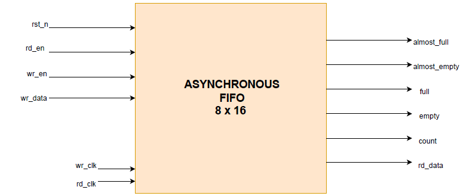
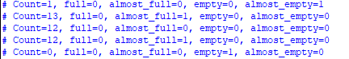

# Lab 07: FIFO Design  

## Lab 7B: Asynchronous FIFO  

### Introduction  
An **asynchronous FIFO** is designed to transfer data between two different clock domains.  
Unlike a synchronous FIFO, the **write** and **read** operations occur on independent clocks (`wr_clk`, `rd_clk`).  

---

### Architecture  

- **Memory Array**  
  - Stores FIFO data.  
  - Indexed by **write** and **read** pointers.  

- **Write Pointer (Binary and Gray Code)**  
  - `wr_ptr_bin` tracks the write location in binary.  
  - `wr_ptr_gray` converts `wr_ptr_bin` to **Gray code** for safe synchronization across clock domains.  

- **Read Pointer (Binary and Gray Code)**  
  - `rd_ptr_bin` tracks the read location in binary.  
  - `rd_ptr_gray` converts `rd_ptr_bin` to **Gray code**.  

- **Pointer Synchronization**  
  - Multi-flop synchronizers ensure Gray-coded pointers are safely sampled in the opposite clock domain.  
  - Example:  
    ```
    rd_ptr_gray_sync1 ---> rd_ptr_gray_sync2  (in the write domain)
    ```

- **Binary Conversion**  
  - Synchronized Gray-coded pointers are converted back to **binary** using a combinational Gray-to-Binary conversion function.  
  - This enables counting and accurate flag generation.  

- **Counters and Flags**  
  - Write and read counts are computed to generate:  
    - **Full**  
    - **Almost-Full**  
    - **Empty**  
    - **Almost-Empty**  
  - Thresholds are parameterizable to provide early warnings.  

---

### Design Considerations  

- **Gray Code Pointer**  
  - Only **one bit changes** at a time when incrementing.  
  - Prevents metastability when crossing clock domains.  
  - Converted back to binary to calculate FIFO occupancy and generate accurate flags.  

- **Multi-Flop Synchronizers**  
  - Used to safely bring pointers from one clock domain to another.  

- **Flag Generation**  
  - Flags are based on the **count difference** between synchronized pointers.  
  - Full / Almost-Full → determined in the **write domain**.  
  - Empty / Almost-Empty → determined in the **read domain**.  

- **Reset Handling**  
  - Both domains must handle **asynchronous reset** properly.  
  - Reset values of pointers and flags must be consistent to avoid spurious writes or reads.  

---

### FIFO Operation  

- **Write Domain**  
  - On `wr_en` and if not full:  
    - Data is written at `wr_ptr_bin`.  
    - `wr_ptr_bin` is incremented.  
    - Gray code is updated.  
  - The synchronized **read pointer** is used to calculate occupancy.  

- **Read Domain**  
  - On `rd_en` and if not empty:  
    - Data is read at `rd_ptr_bin`.  
    - `rd_ptr_bin` is incremented.  
    - Gray code is updated.  
  - The synchronized **write pointer** is used to calculate occupancy.  

- **Cross-Domain Synchronization**  
  - Each domain samples the opposite pointer via multi-flop synchronizers.  
  - Gray-to-Binary conversion produces reliable counts for **flag logic**.  

---

### Diagram  

### Testing and Verification 
To test the SystemVerilog code, a **testbench** was written. The testbench was **compiled and simulated** using **QuestaSim**. During simulation, the behavior of signals was observed and verified through the **waveform window**. This waveform verification ensured that the design produced the expected outputs and functioned correctly.
- Simulation was performed to validate:  
  - Cross-domain synchronization  
  - Read / Write operations  
  - Flag generation accuracy  
  - Reset behavior  
- FIFO successfully managed data transfer between two independent clock domains.  
- The output is shown below:
<p align="center">
  
</p>

### Conclusion  

The **asynchronous FIFO** is essential for systems with **independent clock domains**.  

By using:  
- **Gray-coded pointers**  
- **Multi-flop synchronizers**  
- **Careful flag generation**  

it ensures **reliable data transfer** and **accurate occupancy tracking** across domains.  

Proper design of **resets**, **thresholds**, and **pointer synchronization** is critical to avoid **data corruption** and **false flags**. 

### Reference
Understood the whole working of asynchronous FIFO fro chatgpt. Also asked to give the idea about how to write its code. The function automatic part is copied from AI but I have its understanding.

