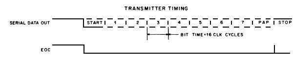
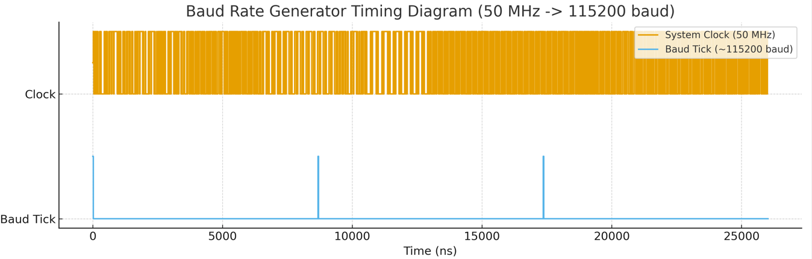
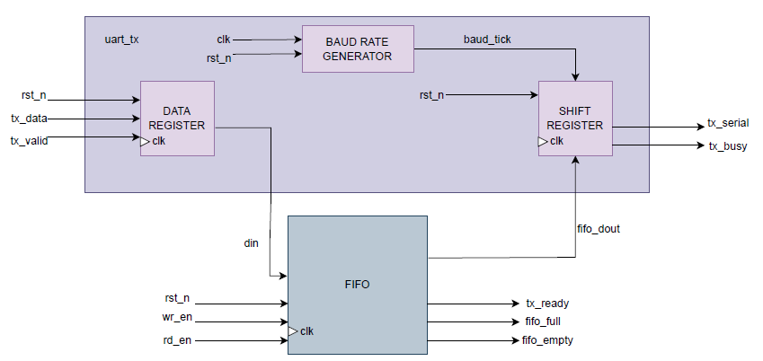
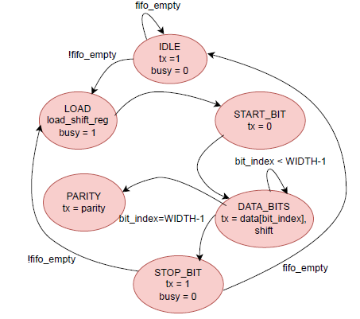

# LAB 08: UART Controller  
## Lab 8A: UART Transmitter  

---

## Introduction  
In this design, the **UART transmitter** is implemented with:  
- Configurable baud rate  
- FIFO buffering  
- Status flags  

This enables smooth and controlled data transmission. The design uses a **state machine (FSM)** and **shift register** to handle serial bit transmission.  

---

## Baud Rate Generation  
The baud rate tick is generated using the formula:  

\[
div = \frac{clk\_freq}{baud\_rate}
\]  

- A counter produces one tick per bit duration.  
- Ensures accurate timing for each **start**, **data**, **parity**, and **stop** bit.  

---

## UART Frame Format  
- **Start bit:** 1 bit low (0)  
- **Data bits:** 8 bits, LSB first  
- **Parity bit:** Even/Odd  
- **Stop bit:** 1 bit high (1)  

---

## Transmit State Machine (FSM)  

| **State**     | **Description** |
|---------------|-----------------|
| **Idle**      | Wait for data in FIFO; `tx_serial = 1` |
| **Load**      | Read byte from FIFO into shift register |
| **Start_bit** | Transmit start bit (0) |
| **Data_bits** | Transmit 8 data bits LSB first; shift register shifts |
| **Parity**    | Transmit parity bit if enabled |
| **Stop_bit**  | Transmit stop bit (1), return to **Idle** |

---

## Integration with FIFO  
- Internal **data register** buffers external input (`tx_data`) before FIFO write.  
- **FIFO depth** is configurable; provides temporary storage for multiple bytes.  
- **tx_ready** indicates that Data Register and FIFO can accept new data.  
- **FIFO read (`rd_en`)** asserted only when FSM enters **Load** state.  
- FSM ensures correct UART frame generation **bit-by-bit**.  
- **Shift register** outputs **LSB first**.  
- **Baud generator** ensures correct bit timing.  
- **Status flags** allow external modules to manage flow control.  

---

## Timing Diagram

  

  

## Module Diagram  

## State Table and Diagram  

| **Current State** | **Input**       | **Next State** | **Output** |
|--------------------|-----------------|----------------|------------|
| Idle              | !fifo_empty     | Load           | tx = 1, busy = 0 |
| Idle              | fifo_empty      | Idle           | tx = 1, busy = 0 |
| Load              | always          | Start_bit      | busy = 1 |
| Start_bit         | baud_tick       | Data_bits      | tx = 0 |
| Data_bits         | bit_index < WIDTH-1 | Data_bits | tx = data[bit_index], shift |
| Data_bits         | bit_index = WIDTH-1 | Parity/Stop | tx = data[bit_index] |
| Parity_bit        | baud_tick       | Stop_bit       | tx = parity_bit |
| Stop_bit          | !fifo_empty     | Load           | tx = 1, busy = 0 |
| Stop_bit          | fifo_empty      | Idle           | tx = 1, busy = 0 |

  

## Verification and Testing
To test the SystemVerilog code, a **testbench** was written. The testbench was **compiled and simulated** using **QuestaSim**. During simulation, the behavior of signals was observed and verified through the **waveform window**. This waveform verification ensured that the design produced the expected outputs and functioned correctly.

##  Conclusion  
The **UART Transmitter** reliably converts parallel data into serial form with:  
- Configurable baud rates  
- 8-bit data  
- Start/Stop bits  
- Parity support  

Its **FIFO buffer** and internal data register ensure smooth data flow, while **status flags (`tx_busy`, `tx_ready`)** provide clear flow control. The design’s **FSM and shift register** guarantee correct bit timing and sequencing, making it efficient and easy to integrate into digital systems.  

### References
We designed UART in Computer Architecture Lab, so I took the basic idea from there and just change the states according to the states given in the manual.
The timing diagrams are taken from an online source.