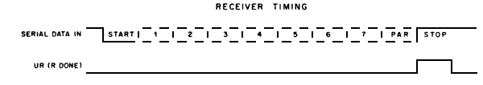
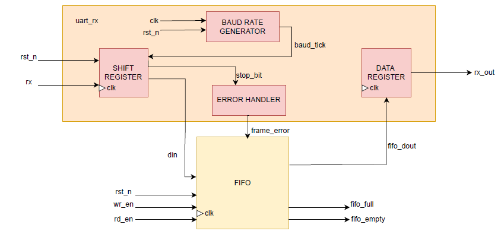
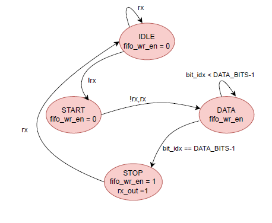

# LAB 08: UART Controller  
## Lab 8B: UART Receiver  

---

## Introduction  
The **UART (Universal Asynchronous Receiver/Transmitter) Receiver** is a digital module that converts a **serial input signal (`rx`)** into parallel data.  

Since UART has **no shared clock** between transmitter and receiver, synchronization is achieved using a **baud rate generator**.  

To prevent **data loss** when the CPU/system is busy, a **FIFO buffer** is included to store received characters until they are read.  

---

## UART Frame Structure  
A standard UART frame consists of:  
- **Start bit (1 bit):** Always `0` (low), indicates the beginning of transmission.  
- **Data bits (5–9 bits):** User-configurable, typically `8 bits` (LSB first).  
- **Stop bit(s) (1–2 bits):** Always `1` (high), indicates end of frame.  

---

## Design Components  

### Baud Rate Generator  
- Converts the **system clock** into baud ticks.  
- Example: If system clock = `50 MHz`, baud rate = `115200`:  

\[
BAUD\_TICK\_COUNT = \frac{50 \times 10^6}{115200} \approx 434
\]  

---

### Receiver FSM (Finite State Machine)  
Implements four states:  
1. **IDLE** – Wait for the line to go low (start bit).  
2. **START** – Confirm valid start bit.  
3. **DATA** – Shift in data bits one by one at baud ticks.  
4. **STOP** – Verify stop bit; if valid, push data into FIFO.  

---

### FIFO Buffer  
- A synchronous FIFO stores received data until the system reads it.  
- Prevents **data loss** when CPU cannot immediately service UART.  
- Implements standard signals: `full`, `empty`, `wr_en`, `rd_en`.  
- Read data is presented on `rx_out` when `rd_en` is asserted.  

---

### Data Register  
- The received word is latched into `data_reg` upon a successful read (`rd_en && !empty`).  
- **`rx_valid`** is asserted to indicate new valid data is available.  

---

## Key Design Points  
1. **Start Bit Detection** – Distinguish between real start bits and line glitches.  
2. **Frame Error Detection** – Missing/incorrect stop bit can be flagged as a framing error.  
3. **FIFO Integration** – Handles bursts of data and decouples receiver from CPU read timing.  

---

## Timing Diagram  

  

## Module Diagram  

## State Table and Diagram  

| **Current State** | **rx (serial input)** | **Output**             | **Next State** |
|--------------------|------------------------|------------------------|----------------|
| Idle              | 1                      | fifo_wr_en = 0         | Idle           |
| Idle              | 0                      | fifo_wr_en = 0         | Start          |
| Start             | 0                      | fifo_wr_en = 0         | Data           |
| Start             | 1                      | fifo_wr_en = 0         | Idle           |
| Data              | 0/1                    | fifo_wr_en = 0         | Data/Stop      |
| Stop              | 1                      | Shift_reg, fifo_wr_en=1| Idle           |
| Stop              | 0                      | fifo_wr_en = 0         | Idle           |

  

## Testing and Verification 
To test the SystemVerilog code, a **testbench** was written. The testbench was **compiled and simulated** using **QuestaSim**. During simulation, the behavior of signals was observed and verified through the **waveform window**. This waveform verification ensured that the design produced the expected outputs and functioned correctly.

##  Conclusion  
This **UART Receiver** design demonstrates a practical asynchronous communication system. By combining:  
- **Baud rate generation**  
- **Receiver FSM**  
- **FIFO buffering**  

the design ensures reliable reception of serial data, correct frame decoding, and efficient handling of CPU read timing.  

## Reference
We designed UART in our Computer Architecture Lab so took the core idea from there.
