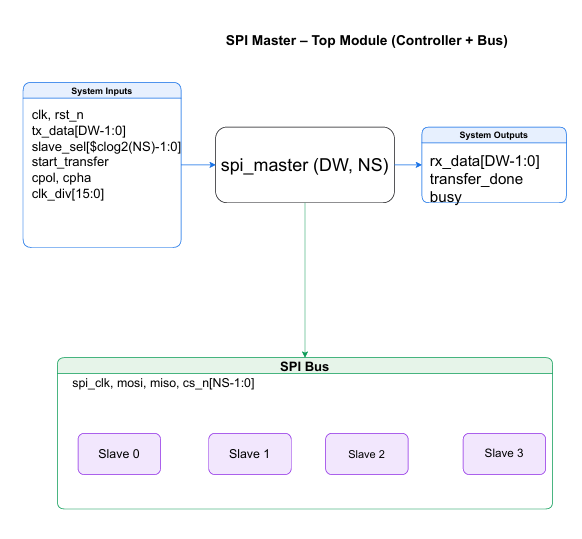
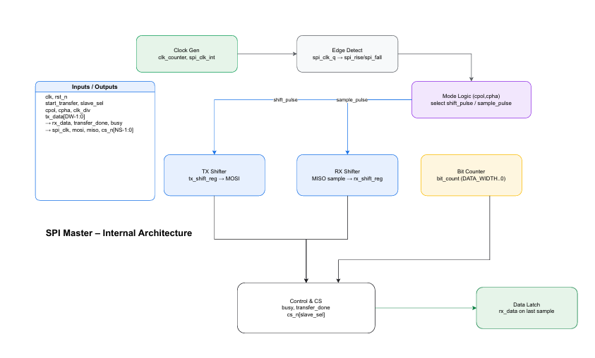
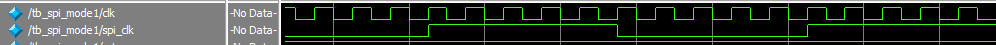
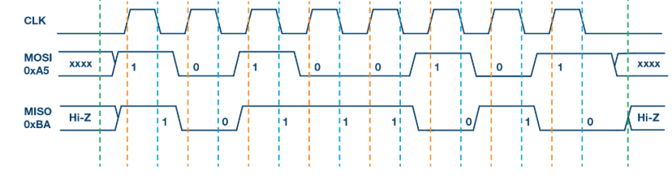
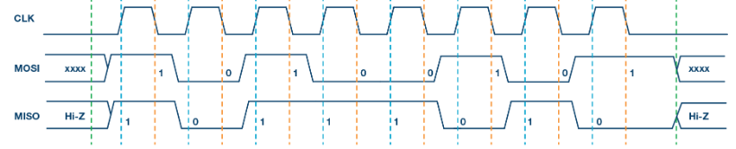
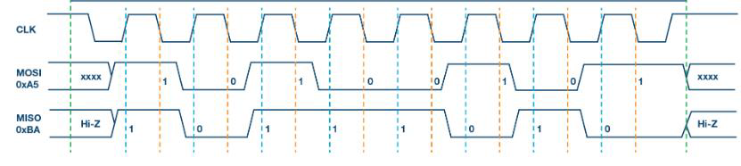
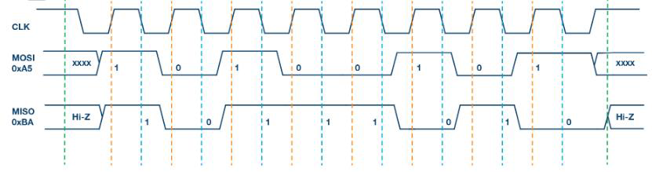

# LAB 09: SPI Controller

## SPI Master Controller

**Purpose:**  
Provides serial communication with SPI slave devices by generating clock (**SCLK**), controlling slave select (**SS**), and managing full-duplex data transfer (**MOSI/MISO**).

## Diagrams
- **Top Diagram**
  
  

- **Module Diagram**
  

## Interface Signals

### Inputs
- **clk**: System clock input  
- **rst_n**: Active-low reset  
- **tx_data[DATA_WIDTH-1:0]**: Parallel transmit data from master  
- **slave_sel[$clog2(NUM_SLAVES)-1:0]**: Selects which slave to communicate with  
- **start_transfer**: Signal to start SPI transfer  
- **cpol**: Clock polarity configuration (`0 = idle low`, `1 = idle high`)  
- **cpha**: Clock phase configuration (`0 = sample on leading edge`, `1 = sample on trailing edge`)  
- **clk_div[15:0]**: Clock divider to generate SPI clock frequency  
- **spi_miso**: Serial data input from slave  

### Outputs
- **rx_data[DATA_WIDTH-1:0]**: Received parallel data from slave  
- **transfer_done**: Indicates transfer is completed  
- **busy**: Indicates SPI is currently transferring data  
- **spi_clk**: Generated SPI clock signal  
- **spi_mosi**: Serial data output to slave  
- **spi_cs_n[NUM_SLAVES-1:0]**: Active-low chip select signals for slaves  

---

## Timing Diagrams

### Clock Relationship
The SPI clock (**spi_clk**) is generated by dividing down the system clock (**sys_clk**) using the clock divider parameter.  

\[
T_{SPI} = 2 \times (clk\_div + 1) \times T_{sys}
\]

- **Example:** With `clk_div = 4`, one complete cycle of `spi_clk` (rising edge to rising edge) corresponds to **10 cycles of the system clock**, with each half-cycle lasting **5 cycles of sys_clk**.

### SPI Timing Modes

The timing behavior of SPI depends on **CPOL** and **CPHA** settings:

- **Mode 0 (CPOL=0, CPHA=0):** Clock idles low. Data launched on **falling edge**, sampled on **rising edge**.
  
- **Mode 1 (CPOL=0, CPHA=1):** Clock idles low. Data launched on **rising edge**, sampled on **falling edge**. 
 
- **Mode 2 (CPOL=1, CPHA=0):** Clock idles high. Data launched on **rising edge**, sampled on **falling edge**.
  
- **Mode 3 (CPOL=1, CPHA=1):** Clock idles high. Data launched on **falling edge**, sampled on **rising edge**.
  

In all modes, the **chip select (spi_cs_n)** must be:
- Asserted **low** before communication begins  
- De-asserted **high** after the final clock edge to complete the transfer  

---
### Verification and Testing
To test the SystemVerilog code, **testbenches** were written for all the four modes. The testbench was **compiled and simulated** using **QuestaSim**. During simulation, the behavior of signals was observed and verified through the **waveform window**. This waveform verification ensured that the design produced the expected outputs and functioned correctly.
## Design Review Checklist

### Pre-Implementation Review
- Specification completely understood – SPI protocol (modes 0–3, CPOL/CPHA, data order, clocking) studied and implemented.  
- Block diagrams drawn and reviewed – Including clock divider, shift registers, and control logic.  
- Interface timing analyzed – Verified `spi_clk` vs. system clock relationship; setup/hold times checked.  
- Clock domain strategy defined – SPI clock derived from system clock using divider, avoiding unsafe domain crossings.  

### Code Quality Checklist
- Consistent naming conventions – Standard SPI naming (`mosi`, `miso`, `sclk`, `ss_n`).  
- Proper module hierarchy – SPI Master, SPI Slave (test), and testbench kept separate and organized.  
- All outputs driven – Verified no floating or undefined outputs.  
- Reset strategy consistent – Active-low reset (`rst_n`) used across all modules.  

### Reference
The timing diagrams were taken from an online source.
My code was not working correctly(one extra bit was getting shifted) so I gave the code to chatgpt and it corrected it.
