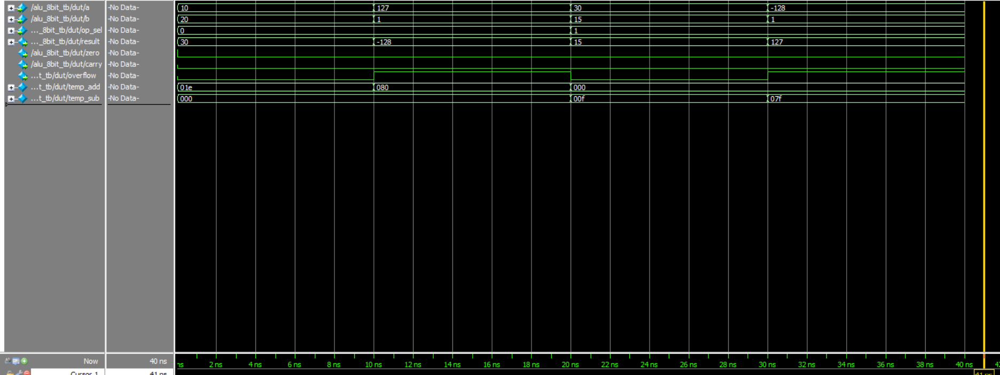
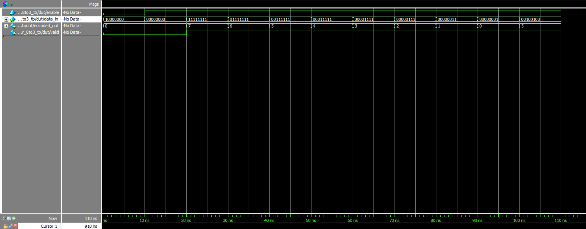

# Lab #1

## Overview

This repository contains four essential digital logic components implemented in SystemVerilog:
1. **8-bit ALU** - Arithmetic Logic Unit with multiple operations
2. **Priority Encoder (8-to-3)** - Encodes the highest priority input
3. **Barrel Shifter** - 32-bit shifter with multiple modes
4. **Binary to BCD Converter** - Converts 8-bit binary to 3-digit BCD

## 1. 8-bit ALU (Arithmetic Logic Unit)

### Problem
The goal was to design an 8-bit ALU that performs various arithmetic and logical operations with proper flag generation for use in processor designs and digital systems.

### Approach
The ALU implements 8 different operations using a case statement structure with dedicated logic for arithmetic flag generation (carry, overflow, zero).

**Operations Supported:**
| Op Code | Operation | Description |
|---------|-----------|-------------|
| 3'b000 | ADD | Addition with carry/overflow detection |
| 3'b001 | SUB | Subtraction with carry/overflow detection |
| 3'b010 | AND | Bitwise AND operation |
| 3'b011 | OR | Bitwise OR operation |
| 3'b100 | XOR | Bitwise XOR operation |
| 3'b101 | NOT | Bitwise complement |
| 3'b110 | SLL | Shift Left Logical |
| 3'b111 | SRL | Shift Right Logical |

**Flag Generation:**
- **Zero**: Result equals zero
- **Carry**: Arithmetic carry out
- **Overflow**: Signed arithmetic overflow

### Simulation Results

**Test Cases:**
- ADD: 10 + 20 = 30 (no flags)
- ADD: 127 + 1 = -128 (overflow detected)
- SUB: 30 - 15 = 15 (no flags)
- SUB: -128 - 1 = 127 (overflow detected)

## 2. Priority Encoder (8-to-3)

### Problem
Design a priority encoder that identifies the highest priority active input from 8 inputs and encodes it into a 3-bit binary value with valid signal indication.

### Approach
The encoder uses a casez statement with priority encoding where higher bits have higher priority. The valid signal indicates when at least one input is active.

**Priority Table:**
| Input Pattern | Output | Valid |
|---------------|--------|-------|
| 1xxxxxxx | 111 | 1 |
| 01xxxxxx | 110 | 1 |
| 001xxxxx | 101 | 1 |
| 0001xxxx | 100 | 1 |
| 00001xxx | 011 | 1 |
| 000001xx | 010 | 1 |
| 0000001x | 001 | 1 |
| 00000001 | 000 | 1 |
| 00000000 | 000 | 0 |

### Simulation Results

**Key Test Cases:**
- All zeros: valid = 0
- Multiple active bits: highest priority encoded
- Single active bits: correct encoding
- Disabled mode: outputs zero, valid = 0

## AI Used
- for writing testbenches