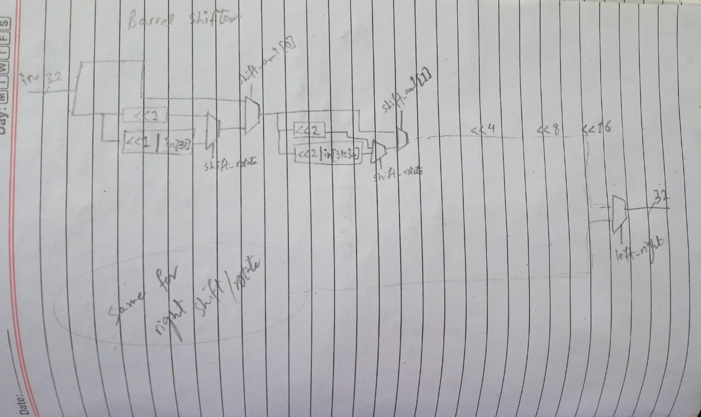
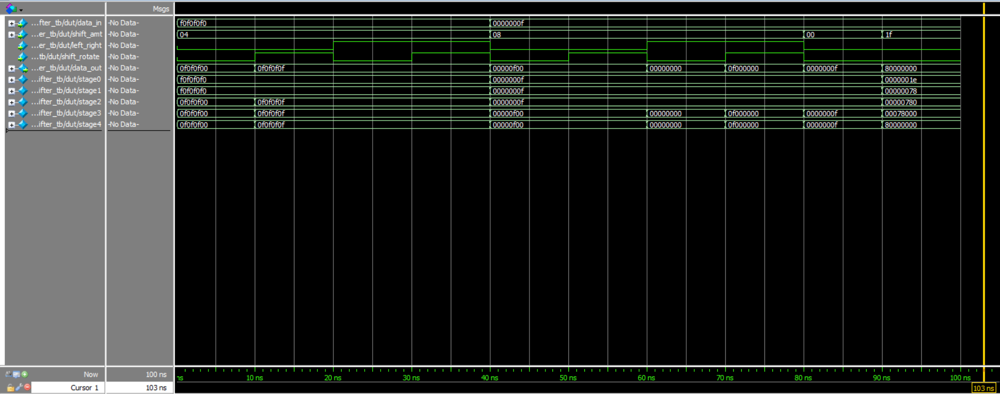

# Barrel Shifter

## Problem

The goal of this project is to design and implement a versatile 32-bit barrel shifter in SystemVerilog that supports multiple shifting and rotating operations. Barrel shifters are essential components in digital systems, particularly in processors and DSP units, for performing fast bit manipulation operations without requiring multiple clock cycles.

The shifter needed to support four distinct operations:
- Logical left shift (zero fill)
- Logical right shift (zero fill)
- Left rotation (circular shift)
- Right rotation (circular shift)

## Approach

The barrel shifter was implemented using a combinational logic approach with a multi-stage architecture that can perform shifts of up to 31 bits in a single operation.

### Design Architecture

1. **32-bit Data Path**: Handles 32-bit input and output data
2. **5-bit Shift Amount**: Supports shift values from 0 to 31
3. **Control Logic**: Manages shift direction and type (shift vs rotate)
4. **Multi-stage Implementation**: Five stages corresponding to each bit of the shift amount

### Key Features

- **Configurable Direction**: Supports both left and right operations
- **Shift/Rotate Mode**: Can perform either logical shifts or circular rotations
- **Single-Cycle Operation**: All shifts complete in zero time (combinational logic)
- **Full 32-bit Support**: Handles the complete range of shift amounts (0-31)

### Implementation Details

The design uses a staged approach where each stage handles a power-of-two shift:
- Stage 0: Shift by 1 bit (controlled by shift_amt[0])
- Stage 1: Shift by 2 bits (controlled by shift_amt[1])
- Stage 2: Shift by 4 bits (controlled by shift_amt[2])
- Stage 3: Shift by 8 bits (controlled by shift_amt[3])
- Stage 4: Shift by 16 bits (controlled by shift_amt[4])

This binary decomposition allows any shift amount from 0 to 31 to be achieved by enabling the appropriate combination of stages.

## Simulation Results

The testbench verifies the shifter functionality through multiple test cases:

### Test Cases

1. **Left Shift by 4**: `0xF0F0F0F0` becomes `0x0F0F0F00`
2. **Left Rotate by 4**: `0xF0F0F0F0` becomes `0x0F0F0F0F`
3. **Right Shift by 4**: `0xF0F0F0F0` becomes `0x0F0F0F0F`
4. **Right Rotate by 4**: `0xF0F0F0F0` becomes `0x0F0F0F0F`
5. **Edge Cases**: Shift by 0 (no change) and shift by 31 (maximum shift)

### Simulation Waveform

