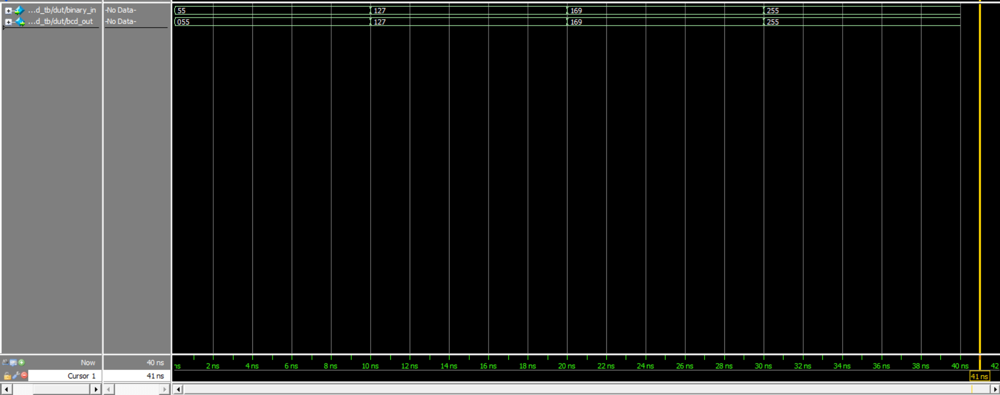

# Binary to BCD Converter

## Problem

The goal of this project is to design and implement an 8-bit binary to Binary-Coded Decimal (BCD) converter in SystemVerilog. BCD representation is essential for applications that need to display numeric values on seven-segment displays or other digital readouts, as it encodes each decimal digit separately using 4 bits.

The converter needed to:
- Convert 8-bit binary numbers (0-255) to 3-digit BCD format
- Use an efficient algorithm suitable for hardware implementation
- Provide output in a format easily usable for display purposes

## Approach

The converter implements the **Double Dabble algorithm**, which is an efficient method for binary to BCD conversion using only shift and add operations. This algorithm is particularly well-suited for hardware implementation as it avoids division and multiplication operations.

### Design Architecture

1. **8-bit Binary Input**: Accepts values from 0 to 255
2. **12-bit BCD Output**: Produces 3 BCD digits (4 bits each)
3. **Pipelined Stages**: 8 stages of shift-and-adjust operations
4. **Combinational Logic**: Pure combinational implementation (no clock required)

### Key Features

- **Efficient Algorithm**: Uses the Double Dabble method with O(n) complexity
- **Combinational Design**: Provides output in zero time (after propagation delay)
- **Full Range Support**: Handles all 8-bit values (0-255) correctly
- **Hardware Optimized**: Uses only shift and compare/add operations

### Implementation Details

The design uses a generate block to create 8 identical stages:
- **Stage Initialization**: Starts with 12 zeros + 8-bit input = 20-bit working register
- **Adjustment Phase**: For each 4-bit BCD digit, add 3 if the digit is ≥ 5
- **Shift Phase**: Left shift the entire 20-bit register
- **Final Output**: After 8 stages, the upper 12 bits contain the 3-digit BCD result

## Simulation Results

The testbench verifies the converter functionality through multiple test cases:

### Test Cases

1. **Value 55**: Binary `00110111` → BCD `0101 0101` (5 and 5)
2. **Value 127**: Binary `01111111` → BCD `0001 0010 0111` (1, 2, and 7)
3. **Value 169**: Binary `10101001` → BCD `0001 0110 1001` (1, 6, and 9)
4. **Value 255**: Binary `11111111` → BCD `0010 0101 0101` (2, 5, and 5)

### Expected Output Format

```
BCD: [hundreds][tens][units]
Where each digit is 4 bits:
- bcd_out[11:8] = hundreds digit
- bcd_out[7:4] = tens digit  
- bcd_out[3:0] = units digit
```

### Simulation Waveform



## AI used
- For implementing double dabble using generate for loop
- testbench
