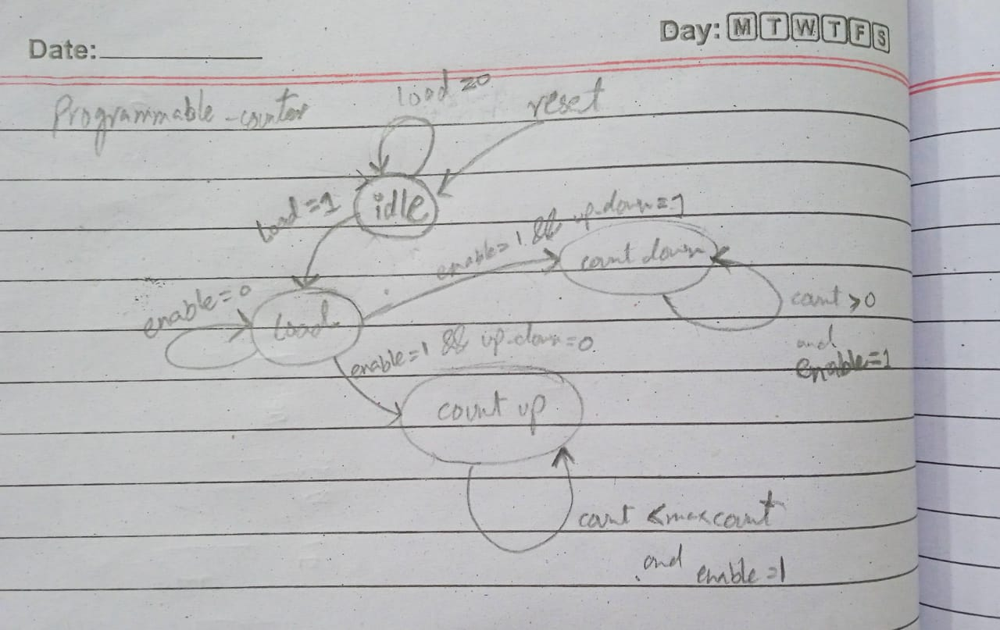
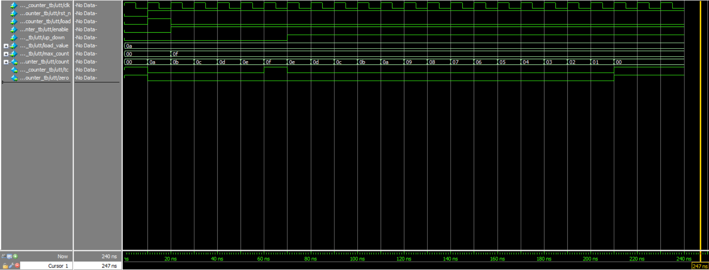

# Programmable Counter

## Problem

The goal of this project is to design and implement a versatile 8-bit programmable counter in SystemVerilog. The counter should support multiple operational modes including:
- Synchronous counting with configurable direction (up/down)
- Programmable maximum count value
- Parallel loading capability
- Terminal count and zero detection flags
- Asynchronous active-low reset

This type of counter is essential in digital systems for various applications including timing control, frequency division, and event counting.

## Approach

The counter was implemented using a synchronous design methodology with the following key features:

### Design Architecture

1. **8-bit Counter Register**: Stores the current count value
2. **Control Logic**: Manages counting direction, loading, and enabling
3. **Flag Generation**: Produces terminal count and zero detection signals

### Key Features

- **Configurable Direction**: Supports both up-counting and down-counting modes
- **Programmable Limits**: Maximum count value can be set dynamically
- **Parallel Load**: Allows loading any initial value through the load_value input
- **Synchronous Operation**: All state changes occur on the positive clock edge
- **Asynchronous Reset**: Active-low reset for initialization

### Implementation Details

The design uses:
- `always_ff` block for sequential logic (counter register)
- `always_comb` block for combinational logic (terminal count detection)
- Continuous assignment for zero detection

## State Diagram

## Simulation Results

The testbench verifies the counter functionality through the following sequence:

1. **Reset**: Initializes the counter to 0
2. **Load Operation**: Loads the value 10 into the counter
3. **Up Counting**: Counts from 10 to 15 (max_count set to 15)
4. **Direction Change**: Switches to down counting mode
5. **Down Counting**: Counts from 15 down to 0

### Simulation Waveform

