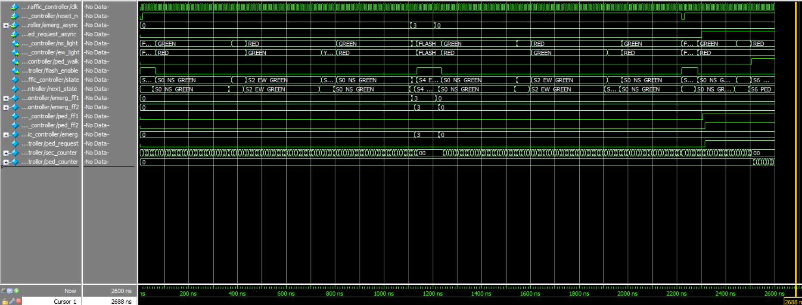

# Traffic Light Finite State Machine (FSM)

## Problem Description

This project implements a traffic light controller using a Finite State Machine (FSM) in SystemVerilog. The controller manages traffic flow at a North-South (NS) and East-West (EW) intersection with the following features:

- Normal traffic light cycles (green, yellow, red)
- Pedestrian crossing request handling
- Emergency vehicle priority handling (both immediate and safe modes)
- Startup flashing mode
- All-red flashing emergency mode

## Approach

The design uses a synchronous FSM with 7 distinct states:
1. **S5_STARTUP**: Initial state with all lights flashing for 5 seconds
2. **S0_NS_GREEN**: North-South green, East-West red
3. **S1_NS_YELLOW**: North-South yellow, East-West red
4. **S2_EW_GREEN**: North-South red, East-West green
5. **S3_EW_YELLOW**: North-South red, East-West yellow
6. **S6_PED**: Pedestrian crossing mode (all red, walk signal)
7. **S4_EMERG**: Emergency mode (all red flashing)

## State Machine

                          +----------------+
                          |    S5          |
                          | STARTUP_FLASH  |
                          |  (5s flashing) |
                          +----------------+
                                |
            emerg==11 ----------+-------> S4 (IMMEDIATE emergency)
                                |
                                v
                          +----------------+
                          |    S0          |
                          | NS_GREEN       |
                          | EW_RED         |
                          +----------------+
                                |
        emerg==11 --------------+-------> S4
        green_count==15 && ped  +-------> S1 (short green)
        green_count==30 --------+-------> S1 (full green)
                                |
                                v
                          +----------------+
                          |    S1          |
                          | NS_YELLOW      |
                          | EW_RED         |
                          +----------------+
                                |
        emerg==11 --------------+-------> S4
        SAFE emergency (at end) +-------> S4
        ped_request (at end) ---+-------> S6
        else (end of yellow) ---+-------> S2
                                |
                                v
                          +----------------+
                          |    S2          |
                          | NS_RED         |
                          | EW_GREEN       |
                          +----------------+
                                |
        emerg==11 --------------+-------> S4
        green_count==15 && ped  +-------> S3
        green_count==30 --------+-------> S3
                                |
                                v
                          +----------------+
                          |    S3          |
                          | NS_RED         |
                          | EW_YELLOW      |
                          +----------------+
                                |
        emerg==11 --------------+-------> S4
        SAFE emergency (at end) +-------> S4
        ped_request (at end) ---+-------> S6
        else (end of yellow) ---+-------> S0
                                |
                                v
                          +----------------+
                          |    S6          |
                          | PEDESTRIAN     |
                          | CROSSING       |
                          | (max 15s)      |
                          +----------------+
                                |
        emerg==11 --------------+-------> S4
        ped_request==0 ---------+-------> S0 (exit early)
        T_ped==15 --------------+-------> S0 (timeout)
        SAFE emergency (at end) +-------> S4
                                |
                                v
                          +----------------+
                          |    S4          |
                          | EMERGENCY_ALL  |
                          | RED (flashing) |
                          +----------------+
                                |
        emerg != 00 ------------+-------> stay S4
        emerg == 00 ------------+-------> S0 (restart cycle)

### Key Design Elements

- **Synchronizers**: All asynchronous inputs (emergency and pedestrian requests) are synchronized using double flip-flops to prevent metastability
- **Timers**: Separate counters for second timing (up to 60s) and pedestrian crossing (up to 15s)
- **Emergency Handling**: 
  - `emerg == 2'b11`: Immediate emergency transition from any state
  - `emerg == 2'b01` or `2'b10`: Safe emergency (honored at the end of yellow or pedestrian states)
- **Pedestrian Handling**: Pedestrian requests can shorten green phases and trigger the pedestrian crossing state

### Simulation Waveform

### Assumptions & Edge Cases

1. **Timing**: Assumes 1 clock cycle = 1 second for simplicity in simulation
2. **Input Synchronization**: All asynchronous inputs are synchronized to prevent metastability
3. **Emergency Priority**: Emergency signals have the highest priority and can interrupt any state
4. **Pedestrian Requests**: Can shorten green phases but are only serviced at the end of yellow phases
5. **State Recovery**: After emergency, the system returns to S0_NS_GREEN regardless of previous state

## Attribution/References

- AI Prompts Used:
  - "Implement my design in system verilog"
  - "Generate a README"