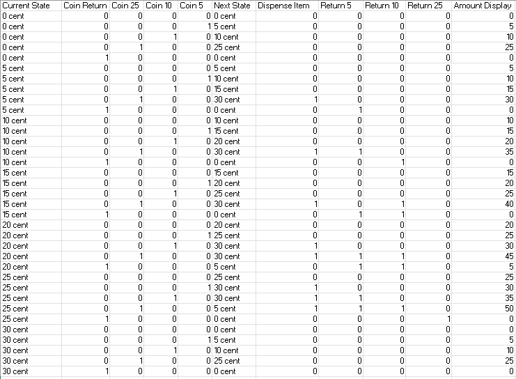
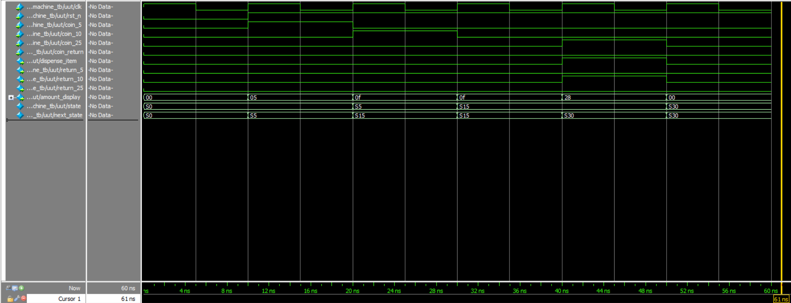

# Vending Machine Controller

## Problem Description

This project implements a finite state machine (FSM) controller for a vending machine that accepts 5, 10, and 25 cent coins. The machine dispenses an item when the total amount reaches or exceeds 30 cents, providing appropriate change when necessary. The system includes coin return functionality and displays the current accumulated amount.

## Key Features

- **Coin Inputs**: Accepts 5¢, 10¢, and 25¢ coins
- **Item Dispensing**: Automatically dispenses item when ≥30¢ is inserted
- **Change Return**: Returns appropriate change for overpayments
- **Coin Return**: Returns all inserted coins upon request
- **Amount Display**: Shows current accumulated amount on 6-bit LED display

## State Transition Table

## Design Approach

The implementation uses a Moore finite state machine with:

1. **State Register**: Synchronous state transitions with active-low reset
2. **Combinational Logic**: Next state determination and output generation
3. **Priority Encoding**: Mutually exclusive coin input handling
4. **Change Calculation**: Automatic change return for overpayments

## Simulation Waveform

The waveform shows a typical transaction sequence:
1. System reset
2. Insertion of 5¢ coin (state transitions from S0 to S5)
3. Insertion of 10¢ coin (state transitions from S5 to S15)
4. Insertion of 25¢ coin (state transitions from S15 to S30 with item dispensing and 10¢ change return)

## Module Interface

### Inputs
- `clk`: Clock signal
- `rst_n`: Active-low reset
- `coin_5`: 5-cent coin inserted
- `coin_10`: 10-cent coin inserted
- `coin_25`: 25-cent coin inserted
- `coin_return`: Coin return request

### Outputs
- `dispense_item`: Dispense item signal
- `return_5`: Return 5-cent coin
- `return_10`: Return 10-cent coin
- `return_25`: Return 25-cent coin
- `amount_display`: 6-bit LED display for current amount

## Testing

The testbench verifies:
- Reset functionality
- Basic coin insertion sequences
- State transitions
- Item dispensing logic
- Change return calculations
- Coin return functionality
