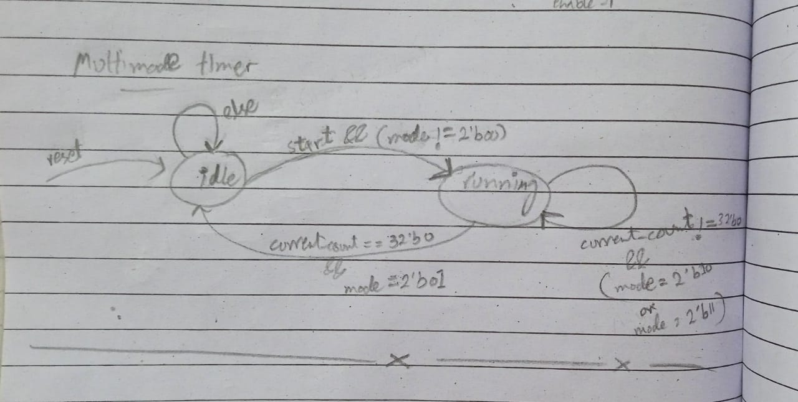
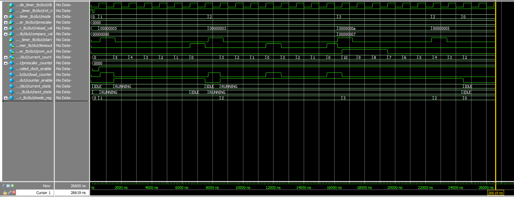

# Multi-Mode Timer Design

## Overview

This project implements a versatile multi-mode timer module in SystemVerilog that supports four operational modes: off, one-shot, periodic, and PWM. The timer features a programmable prescaler, configurable reload value, and PWM duty cycle control.

## Features

- **Four Operating Modes**:
  - Off (00): Timer is disabled
  - One-shot (01): Counts down once and stops
  - Periodic (10): Continuously reloads and counts down
  - PWM (11): Generates PWM signal with configurable duty cycle

- **Programmable Prescaler**: Divides the 1MHz input clock by (prescaler + 1)
## Design Architecture

### Block Diagram

```
                      +---------------------------+
                      |   Multi-Mode Timer        |
                      +---------------------------+
                      |                           |
Clk (1MHz) ---------->| clk                       |
Reset_n ------------->| rst_n                     |
Mode [1:0] ---------->| mode              timeout |---> Output pulse
Prescaler [15:0] ---->| prescaler         pwm_out |---> PWM signal
Reload_val [31:0] --->| reload_val  current_count |--> [31:0]
Compare_val [31:0] -->| compare_val               |
Start --------------->| start                     |
                      +---------------------------+
```

### State Machine



The timer uses a simple two-state FSM:
- **IDLE**: Waiting for start signal
- **RUNNING**: Actively counting down

## Simulation Results

### Testbench Waveform



The waveform shows:
1. Reset sequence initialization
2. One-shot mode operation with timeout
3. Periodic mode with auto-reload
4. PWM generation with configurable duty cycle
5. Mode change during operation


### Expected Output
The testbench will execute five test sequences and display status messages:
- Reset test
- One-shot mode test
- Periodic mode test
- PWM mode test
- Mode change during operation test

## Design Notes

### Key Implementation Details

1. **Prescaler Logic**: Divides the 1MHz clock by (prescaler + 1) to generate enable pulses
2. **Mode Change Detection**: Registers the mode input to detect changes during operation
3. **Counter Control**: Loads and decrements based on FSM state and prescaler enable
4. **Output Generation**:
   - Timeout pulse for one-shot and periodic modes
   - PWM output based on compare value in PWM mode

## Assumptions & Edge Cases

1. **Clock Frequency**: Assumes 1MHz input clock
2. **Reset**: Active-low asynchronous reset
3. **Start Signal**: Must be pulsed to begin counting in non-off modes
4. **Mode Changes**: Changing to off mode immediately stops the timer
5. **Counter Rollover**: No special handling for counter reaching 0 except in defined modes
6. **Input Stability**: Assumes stable inputs during operation


## AI Prompts Used
- "Fix logic in timer module"
- "Add comments to my multi_mode_timer.sv"
- "Generate a comprehensive testbench for the timer module"
- "Create a README"
