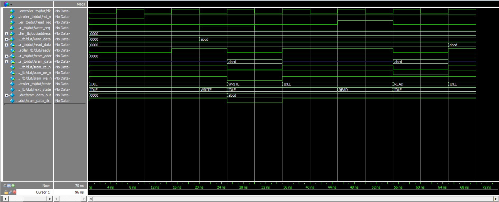

# SRAM Controller Design

## Problem
The goal is to design a synchronous SRAM controller that interfaces with a 32Kx16 SRAM module. The controller should handle single-cycle read and write operations with proper timing for address and data buses, including chip enable and output enable control.

## Approach
The design implements a finite state machine (FSM) with three states: IDLE, READ, and WRITE. The controller manages the bidirectional data bus using a direction control signal and ensures proper timing for all SRAM control signals (CE_N, OE_N, WE_N).

### Key Components:
1. **State Machine**: Controls the flow of read/write operations
2. **Bidirectional Data Bus**: Handled through a tristate buffer with direction control
3. **Registered Outputs**: All control signals are registered to meet timing requirements
4. **Single-Cycle Operations**: Both read and write complete in one clock cycle

## State Transition Logic

The controller uses a three-state finite state machine:

1. **IDLE State**: The default state where the controller waits for operation requests
   - If a read request is detected, transitions to READ state
   - If a write request is detected, transitions to WRITE state
   - Otherwise, remains in IDLE state

2. **READ State**: Performs a single-cycle read operation
   - Always transitions back to IDLE state after one cycle
   - This ensures single-cycle operation as specified

3. **WRITE State**: Performs a single-cycle write operation  
   - Always transitions back to IDLE state after one cycle
   - Maintains the single-cycle operation requirement

The state transitions are synchronous to the clock edge and respect the reset signal. The design uses registered outputs to ensure all control signals change synchronously, meeting timing requirements.

## Output Logic

The output logic generates all control signals for the SRAM interface based on the current and next states:

### IDLE State Outputs:
- All SRAM control signals are deasserted (CE_N=1, OE_N=1, WE_N=1)
- Data bus is configured as input (high-impedance mode)
- Ready signal is asserted indicating controller is available

### READ State Outputs:
- Address is driven to SRAM
- Chip Enable (CE_N=0) and Output Enable (OE_N=0) are asserted
- Write Enable remains deasserted (WE_N=1)
- Data bus is configured as input to receive data from SRAM
- Ready signal is deasserted during operation
- Read data is captured from the bus at the end of the cycle

### WRITE State Outputs:
- Address and write data are driven to SRAM
- Chip Enable (CE_N=0) and Write Enable (WE_N=0) are asserted
- Output Enable remains deasserted (OE_N=1)
- Data bus is configured as output to drive data to SRAM
- Ready signal is deasserted during operation

### Bidirectional Data Bus Handling:
The controller uses a direction signal to manage the bidirectional data bus:
- Direction = 1: Input mode (read operations) - controller reads from SRAM
- Direction = 0: Output mode (write operations) - controller drives data to SRAM
- This is implemented using a tristate buffer that either drives the bus or presents high impedance

### Simulation Waveform:

The waveform shows:
1. Reset sequence initialization
2. Write operation to address 0x0 with data 0xABCD
3. Read operation from address 0x0 returning data 0xABCD
4. Proper timing of control signals (CE_N, OE_N, WE_N)

## Design Notes

### Key Design Features:
1. **Single-Cycle Operations**: Both read and write complete in one clock cycle as specified
2. **Registered Outputs**: All control signals are registered to ensure proper timing
3. **Synchronous Design**: All state transitions and output changes are synchronized to clock edges
4. **Bidirectional Bus Management**: Proper handling of the bidirectional data bus with direction control

### AI Prompts Used:
1. "Implement a synchronous SRAM controller for 32Kx16 SRAM"
3. "Explain sram_oe_n functionality"
4. "Fix SRAM write issues in testbench"
5. "Create a README for the SRAM controller project"
