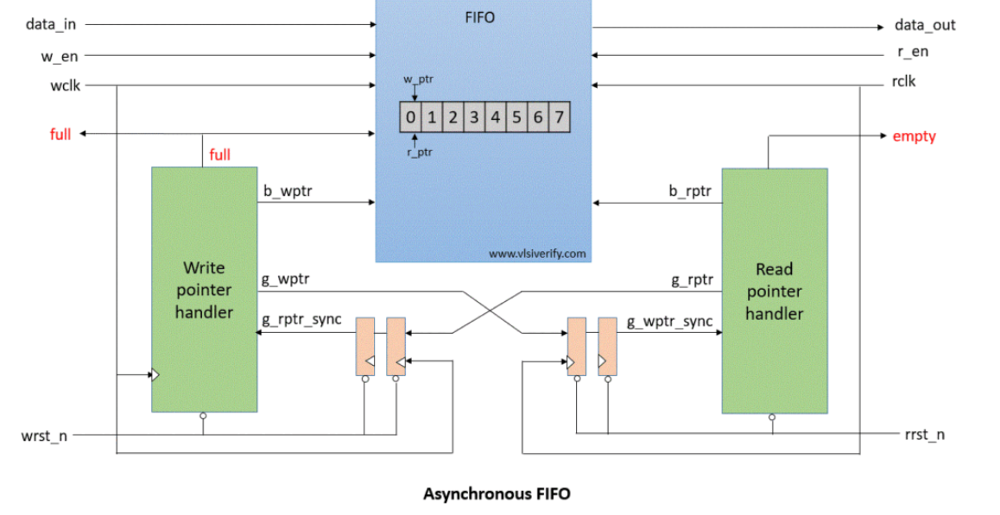
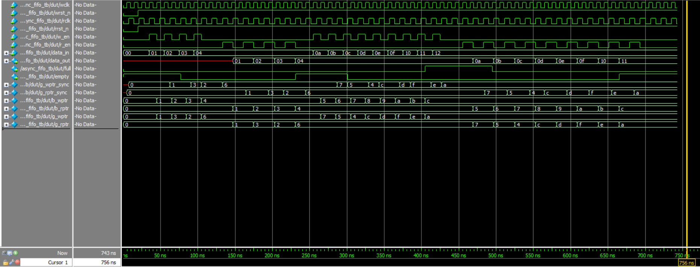

# Asynchronous FIFO Design

## Problem

The goal was to design an asynchronous FIFO (First-In-First-Out) buffer that safely transfers data between two independent clock domains. The main challenge was generating accurate `full` and `empty` flags without causing metastability when comparing pointers from different clock domains.

## Block Diagram



## Approach

### Clock Domain Crossing Solution
The design uses a sophisticated approach to handle clock domain crossing:

1. **Gray Code Encoding**: All pointers are converted to Gray code before crossing clock domains. Gray code ensures only one bit changes between consecutive values, making synchronization safe and reliable.

2. **Dual-Flop Synchronizers**: Two-stage synchronizers safely pass Gray code pointers between clock domains, preventing metastability from propagating to the control logic.

3. **Binary Comparison for Flags**: After synchronization, Gray code pointers are converted back to binary for clear and intuitive full/empty detection.

### Full and Empty Calculation

#### Empty Condition
The FIFO is empty when the read pointer has caught up to the write pointer:
```systemverilog
// Convert synchronized Gray write pointer to binary
g2b_converter g2b_rd(g_wptr_sync, b_wptr_sync);

// Empty when binary pointers are equal
rempty = (b_wptr_sync == b_rptr_next);
```
This is intuitive - when both pointers are equal, no data is available to read.

#### Full Condition
The FIFO is full when the write pointer has wrapped around one more time than the read pointer:
```systemverilog
// Convert synchronized Gray read pointer to binary  
g2b_converter g2b_wr(g_rptr_sync, b_rptr_sync);

// Check if MSBs differ (wrap-around difference)
wrap_around = b_rptr_sync[PTR_WIDTH] ^ b_wptr[PTR_WIDTH];

// Full when wrap-around detected AND lower address bits match
wfull = wrap_around & (b_wptr[PTR_WIDTH-1:0] == b_rptr_sync[PTR_WIDTH-1:0]);
```
This works because:
- The pointers are one bit wider than needed for addressing (e.g., 4 bits for 8-depth FIFO)
- The MSB acts as a "wrap-around" indicator
- When the MSBs differ but the lower bits match, the write pointer has lapped the read pointer exactly once

### Pointer Management
- **Binary Pointers**: Used for memory addressing and clear flag calculation
- **Gray Pointers**: Used for safe clock domain crossing
- **Pointer Width**: N+1 bits for N-depth FIFO to distinguish full vs empty states

## Design Notes

### Key Features:
- Parameterizable data width and depth
- Safe clock domain crossing using Gray codes and synchronizers
- Clear full/empty detection using binary pointer comparison
- Separate clock domains for read and write operations

### Implementation Details:
The design consists of five main modules:
1. `asynchronous_fifo`: Top-level integration
2. `wptr_handler`: Write pointer management with full detection
3. `rptr_handler`: Read pointer management with empty detection  
4. `fifo_mem`: Dual-port memory array
5. `synchronizer`: Two-flop clock domain crossing
6. `g2b_converter`: Gray-to-binary conversion for clear comparison

### Edge Cases Handled:
- Reset conditions initialize all pointers and flags correctly
- Write operations are ignored when FIFO is full
- Read operations are ignored when FIFO is empty  
- Pointer synchronization handles metastability safely
- Wrap-around conditions are properly detected


### Testbench Operations:
The testbench verifies:
1. Basic write and read operations
2. Full condition detection
3. Empty condition detection  
4. Simultaneous read/write operations
5. Data integrity across clock domains

## Simulation Waveforms



The waveform shows:
- Write clock (wclk) and read clock (rclk) at different frequencies
- Write operations with data_in values
- Read operations with data_out values
- full and empty flags changing appropriately
- Proper synchronization between clock domains

## Attribution/References

### AI Prompts Used:
- "explain me the working" of the original FIFO design
- "write a simple testbench to check my fifo"
- "make a README.md file for this" with specific formatting requirements

### Original Reference:
Design inspired by the asynchronous FIFO from [VLSI Verify](https://vlsiverify.com/verilog/verilog-codes/asynchronous-fifo/)

### Changes Made:
1. Simplified full/empty detection logic using binary pointer comparison
2. Added Gray-to-binary converter module for clear flag calculation

