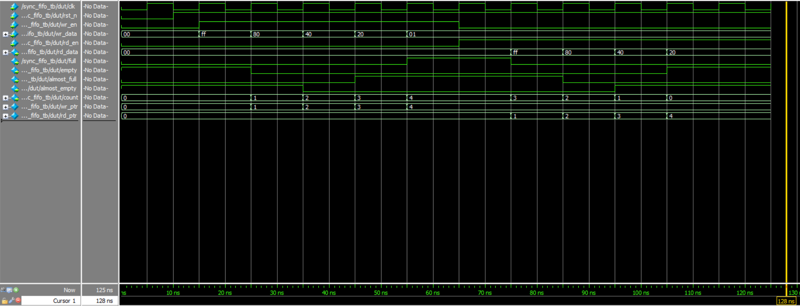

# Synchronous FIFO (First-In-First-Out) Design

## Overview

This repository contains a synchronous FIFO (First-In-First-Out) buffer implementation in SystemVerilog. A FIFO is a fundamental digital circuit used for data buffering between two clock-synchronous systems where the producer and consumer may operate at different rates.

## Features

- **Synchronous operation**: All operations synchronized to a single clock
- **Configurable parameters**:
  - `DATA_WIDTH`: Width of data words (default: 8 bits)
  - `FIFO_DEPTH`: Number of entries in the FIFO (default: 16)
  - `ALMOST_FULL_THRESH`: Threshold for almost full flag (default: 14)
  - `ALMOST_EMPTY_THRESH`: Threshold for almost empty flag (default: 2)
- **Status flags**:
  - Full: Indicates FIFO is completely full
  - Empty: Indicates FIFO is completely empty
  - Almost Full: Indicates FIFO is approaching full capacity
  - Almost Empty: Indicates FIFO is approaching empty state
  - Count: Current number of elements in the FIFO

## Design Approach

The FIFO uses a dual-pointer approach with a circular buffer implementation:

1. **Memory Array**: Stores the FIFO data elements
2. **Write Pointer**: Points to the next location to write
3. **Read Pointer**: Points to the next location to read
4. **Pointer Comparison**: Determines full/empty status using an extra bit technique

### Key Implementation Details

```systemverilog
// Extra bit technique for full/empty detection
localparam ADDR_WIDTH = $clog2(FIFO_DEPTH);
localparam PTR_WIDTH = ADDR_WIDTH + 1; // Extra bit for full/empty detection

// Full condition: When pointers differ only in the MSB but have same lower bits
assign full = (wr_ptr[PTR_WIDTH-1] != rd_ptr[PTR_WIDTH-1]) && 
              (wr_ptr[ADDR_WIDTH-1:0] == rd_ptr[ADDR_WIDTH-1:0]);

// Empty condition: When both pointers are identical
assign empty = (wr_ptr == rd_ptr);
```


## Simulation Waveform

The testbench demonstrates:
1. Reset initialization
2. Sequential write operations until FIFO is full
3. Attempted write when full (should be ignored)
4. Sequential read operations until FIFO is empty
5. Status flag behavior throughout the operation



*Note: The waveform image shows the FIFO being filled with values 255, 128, 64, 32 and then read out in the same order. The full flag asserts after 4 writes, and the empty flag asserts after 4 reads.*

## Design Notes

### Assumptions
- Single clock domain operation
- Read and write operations occur on rising clock edges
- Reset is active low and asynchronous

### Edge Cases Handled
- Write attempts when FIFO is full are ignored
- Read attempts when FIFO is empty are ignored
- Pointer wrap-around is properly handled using the extra bit technique
- Almost full/empty thresholds are configurable parameters

### Non-Trivial Logic
The full/empty detection uses the extra bit technique which is more efficient than alternative approaches:
- When write pointer and read pointer are equal: FIFO is empty
- When write pointer and read pointer differ only in the MSB: FIFO is full
- This allows distinguishing between full and empty conditions without additional logic

## Attribution

This implementation follows standard FIFO design practices commonly used in digital design. The testbench provides basic functionality verification but could be extended for more comprehensive testing.
