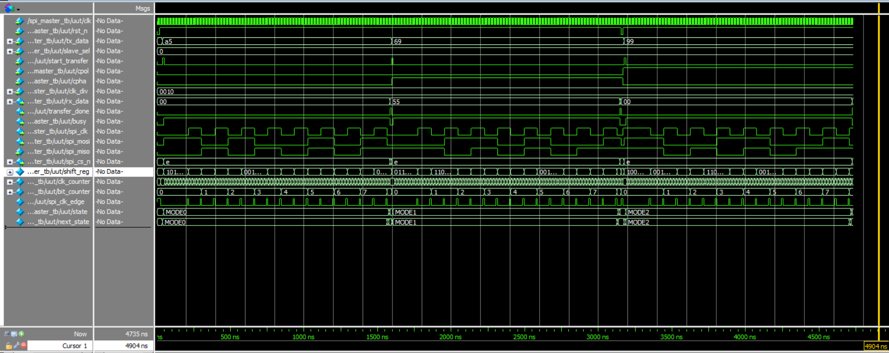

# SPI Master

## SPI Master Controller State Table

| State | Description | Key Actions | Next State |
| :--- | :--- | :--- | :--- |
| **IDLE** | The controller is waiting for a command. The SPI bus is inactive. | - The busy signal is low. - The SPI clock is held at its idle state. - All slave select lines are deactivated. - If a start command is received, the transmit data is loaded. | Waits for a start command. Then moves to the mode specified by CPOL and CPHA. |
| **MODE0** (CPOL=0, CPHA=0) | Active data transfer for SPI Mode 0. | - Asserts the selected slave's chip select line. - Generates the SPI clock (idles low, toggles). - On the clock's rising edge: Reads data from the slave. - On the clock's falling edge: Sends next bit to the slave and counts it. | Remains until all bits are transferred. Then moves to DONE. |
| **MODE1** (CPOL=0, CPHA=1) | Active data transfer for SPI Mode 1. | - Asserts the selected slave's chip select line. - Generates the SPI clock (idles low, toggles). - On the clock's rising edge: Sends next bit to the slave. - On the clock's falling edge: Reads data from the slave and counts it. | Remains until all bits are transferred. Then moves to DONE. |
| **MODE2** (CPOL=1, CPHA=0) | Active data transfer for SPI Mode 2. | - Asserts the selected slave's chip select line. - Generates the SPI clock (idles high, toggles). - On the clock's falling edge: Reads data from the slave. - On the clock's rising edge: Sends next bit to the slave and counts it. | Remains until all bits are transferred. Then moves to DONE. |
| **MODE3** (CPOL=1, CPHA=1) | Active data transfer for SPI Mode 3. | - Asserts the selected slave's chip select line. - Generates the SPI clock (idles high, toggles). - On the clock's falling edge: Sends next bit to the slave. - On the clock's rising edge: Reads data from the slave and counts it. | Remains until all bits are transferred. Then moves to DONE. |
| **DONE** | The transfer is complete. This state finalizes the operation. | - De-activates all slave select lines. - Saves the received data into the output register. - Pulses the 'transfer done' signal high. - The busy signal remains high. | Always moves back to the IDLE state on the next clock cycle. |

## Summary of Controller Outputs:

| Output | Description |
| :--- | :--- |
| **busy** | Is high when a transaction is active (from leaving IDLE until returning to it). |
| **transfer_done** | A quick pulse that signals the received data is valid and ready to be read. |
| **spi_clk** | The serial clock signal sent to slaves. Its behavior is set by the SPI mode. |
| **spi_cs_n** | A bundle of lines for each slave. Only the chosen one is active during a transaction. |
| **spi_mosi** | The data line for sending bits from the Master to the Slave. |
| **rx_data** | The received data from the slave. It is valid when the transfer_done signal pulses. |

## Simulation Waveform

## Important Implementation Details
- Mater sends data bit by bit from MSB side of shift register
- Incoming bits from slave are stored from LSB side

## AI Usage
- Assistance in designing the SPI Master
- Comments in code
- Documentation