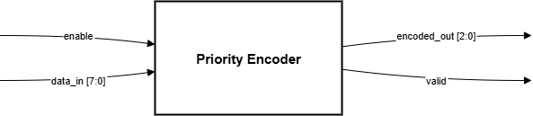
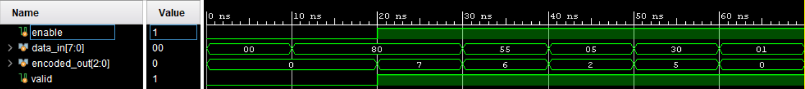

# Lab 1B: Priority Encoder with Enable

## Problem Statement

Design and implement an 8-to-3 priority encoder with input enable functionality. The encoder should identify the highest priority active input and encode its position into a 3-bit binary output, with MSB having the highest priority.

### Requirements
- 8-to-3 priority encoder with input enable
- Active-high inputs with MSB (bit 7) having highest priority
- Enable input to control encoder operation
- Valid output signal to indicate successful encoding
- Handle all-zero input case properly
- Optimize logic using don't-care conditions

### Specifications
- **Input Signals**: 
  - `enable`: Active-high enable control
  - `data_in[7:0]`: 8-bit input data with priority
- **Output Signals**: 
  - `encoded_out[2:0]`: 3-bit encoded position (7→111, 6→110, ..., 0→000)
  - `valid`: High when encoding is valid (enable=1 and data_in≠0)
- **Target Device**: Xilinx Artix-7 family
- **Implementation**: Pure combinational logic

## Approach

### Design Methodology
1. **Priority Analysis**: MSB (data_in[7]) has highest priority, LSB (data_in[0]) has lowest
2. **Truth Table Development**: Created complete truth table for all input combinations
3. **Logic Optimization**: Used `casez` with don't-care patterns for efficient implementation
4. **Enable Logic**: Integrated enable control with proper output handling

### Key Design Decisions
- **Priority Encoding**: Used `casez` statement with don't-care patterns (?) for optimal synthesis
- **Valid Signal**: Generated using reduction OR (`|data_in`) combined with enable
- **Output Default**: All outputs default to 0 when disabled or no input active
- **Don't Care Optimization**: Leveraged SystemVerilog `casez` for hardware-efficient implementation

### Block Diagram


### Simulation


### Synthesis
[Synthesis](docs/Synthesis.txt)

### Truth Table (Key Cases)
| enable | data_in[7:0] | encoded_out[2:0] | valid |
|--------|--------------|------------------|-------|
| 0      | xxxxxxxx     | 000              | 0     |
| 1      | 00000000     | 000              | 0     |
| 1      | 1xxxxxxx     | 111              | 1     |
| 1      | 01xxxxxx     | 110              | 1     |
| 1      | 00000001     | 000              | 1     |

## Implementation

### File Structure
```
lab-1b-priority-encoder/
├── rtl/
│   └── Priority_Encoder.sv       # Main encoder implementation
|   └── Priority_Encoder_tb.sv
├── docs/
│   ├── pEncoder.png
│   └── simulation.png
|
└── README.md
```

### Key Code Sections

#### Priority Encoding Logic
```systemverilog
always_comb begin
    if (!enable) begin
        encoded_out = 3'b000;
        valid       = 1'b0;
    end
    else begin
        valid = |data_in;   // Reduction OR for any active input
        casez (data_in)     // casez handles don't-care patterns
            8'b1???????: encoded_out = 3'b111; // data_in[7] highest priority
            8'b01??????: encoded_out = 3'b110; // data_in[6]
            8'b001?????: encoded_out = 3'b101; // data_in[5]
            8'b0001????: encoded_out = 3'b100; // data_in[4]
            8'b00001???: encoded_out = 3'b011; // data_in[3]
            8'b000001??: encoded_out = 3'b010; // data_in[2]
            8'b0000001?: encoded_out = 3'b001; // data_in[1]
            8'b00000001: encoded_out = 3'b000; // data_in[0] lowest priority
            default:     encoded_out = 3'b000; // All zeros case
        endcase
    end
end
```

## How to Run

### Prerequisites
- QuestaSim (ModelSim) for simulation
- Xilinx Vivado for synthesis
- SystemVerilog support enabled

### Simulation
```bash
# Navigate to lab directory
cd lab-1b-priority-encoder/

# Compile and run
vlog -sv rtl/Priority_Encoder.sv rtl/Priority_Encoder_tb.sv
vsim -c Priority_Encoder_tb
run -all

# GUI simulation
vsim Priority_Encoder_tb
do sim/wave.do
run -all
```


### Test Cases Covered
- Disabled encoder with various inputs
- All priority levels (`data_in[7]` to `data_in[0]`)
- Multiple bits set (priority resolution)
- All-zero input condition
- Enable/disable transitions
- Edge cases and corner conditions

## Assumptions and Edge Cases

### Assumptions Made
- MSB has highest priority as specified
- Enable signal is synchronous with data inputs
- All-zero input with enable=1 produces valid=0

### Edge Cases Handled
- Disabled encoder state (enable=0)
- All-zero input condition
- Multiple active bits (priority resolution)

### Known Limitations
- Fixed 8-input configuration (not parameterizable)
- No output registration (pure combinational)

### Sources & AI Usage
**AI Tools Used**: Documentation  

### What I Verified
- Functional correctness through comprehensive priority testing
- Proper casez pattern optimization
- Enable control functionality
- Valid signal generation accuracy
- All edge cases handled correctly

---
