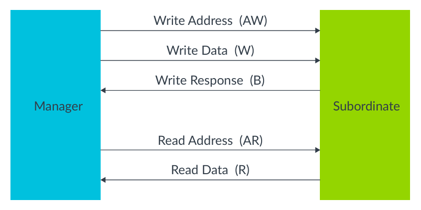
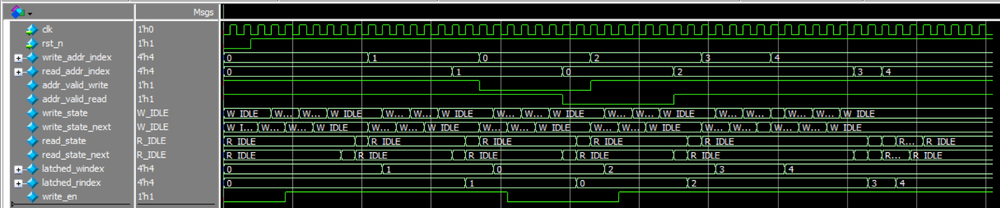
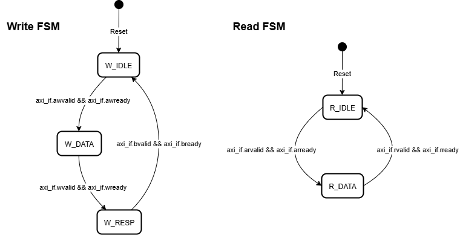

# Lab 10: AXI4-Lite Interface Design

## Problem Statement

Design and implement an AXI4-Lite slave interface following ARM's AMBA AXI protocol specification. The interface must provide register-based communication with proper handshake protocols, address decoding, error handling, and support for partial writes using write strobes.

### Requirements
- AXI4-Lite slave interface implementation
- 16 x 32-bit register bank with read/write access
- Proper AXI4-Lite handshake protocol compliance
- Address decoding with error responses for invalid addresses
- Write strobe support for partial (byte-level) writes
- Independent read and write channel state machines
- Protocol violation detection and error reporting

### Specifications
- **Interface Signals**: 
  - **Write Address Channel**: `awaddr[31:0]`, `awvalid`, `awready`
  - **Write Data Channel**: `wdata[31:0]`, `wstrb[3:0]`, `wvalid`, `wready`
  - **Write Response Channel**: `bresp[1:0]`, `bvalid`, `bready`
  - **Read Address Channel**: `araddr[31:0]`, `arvalid`, `arready`
  - **Read Data Channel**: `rdata[31:0]`, `rresp[1:0]`, `rvalid`, `rready`
- **Address Range**: 0x00000000 to 0x0000003C (16 registers × 4 bytes)
- **Response Types**: OKAY (00), DECERR (11) for address errors
- **Implementation**: Separate FSMs for read and write channels

### Channels


### Timing Diagrams

### Write Single


### Read Single


## Approach

### Design Methodology
1. **Modular Interface Design**: SystemVerilog interface with master/slave modports
2. **Separate Channel FSMs**: Independent state machines for read and write operations
3. **Address Decoding**: Range checking with word alignment validation
4. **Write Strobe Handling**: Byte-level write enable control
5. **Error Response Generation**: Proper DECERR for invalid addresses

### Key Design Decisions
- **Interface Abstraction**: SystemVerilog interface for clean module connectivity
- **Independent Channels**: Separate FSMs allow concurrent read/write operations
- **Address Latching**: Store address during handshake for stable operation
- **Byte-Level Writes**: Write strobe implementation for partial register updates
- **Protocol Compliance**: Strict adherence to AXI4-Lite timing requirements

### System Block Diagram


### Read & Write FSM



### AXI4-Lite Protocol Overview
```
Write Transaction:
Master → AW (Address) → Slave
Master → W (Data)     → Slave  
Slave  → B (Response) → Master

Read Transaction:
Master → AR (Address) → Slave
Slave  → R (Data)     → Master
```

## Implementation

### File Structure
```
lab10_axi4_lite/
├── rtl/
│   ├── axi4_lite_if.sv          # AXI4-Lite interface definition
│   ├── axi4_lite_slave.sv       # AXI4-Lite slave implementation
│   └── tb_axi4_lite_salve.sv    # Testbench (note: filename typo)
├── docs/
│   └── [documentation files]
└── README.md
```

### Key Code Sections

#### Interface Definition
```systemverilog
interface axi4_lite_if;
    // Write address channel
    logic [31:0] awaddr;
    logic        awvalid;
    logic        awready;
    
    // Write data channel  
    logic [31:0] wdata;
    logic [3:0]  wstrb;    // Write strobes for byte-level writes
    logic        wvalid;
    logic        wready;
    
    // Write response channel
    logic [1:0]  bresp;    // Response: OKAY(00) or ERROR(11)
    logic        bvalid;
    logic        bready;
    
    // Read address channel
    logic [31:0] araddr;
    logic        arvalid;
    logic        arready;
    
    // Read data channel
    logic [31:0] rdata;
    logic [1:0]  rresp;    // Response: OKAY(00) or ERROR(11)
    logic        rvalid;
    logic        rready;
```

#### Write Channel State Machine
```systemverilog
typedef enum logic [1:0] {
    W_IDLE, W_DATA, W_RESP
} write_state_t;

always_comb begin
    unique case (write_state)
        W_IDLE: begin
            axi_if.awready = 1'b1; // Accept address
            if (axi_if.awvalid && axi_if.awready)
                write_state_next = W_DATA;
        end

        W_DATA: begin
            axi_if.wready = 1'b1;  // Accept data
            if (axi_if.wvalid && axi_if.wready) begin
                write_en = addr_valid_write;
                write_state_next = W_RESP;
            end
        end

        W_RESP: begin
            axi_if.bvalid = 1'b1;
            axi_if.bresp = addr_valid_write ? 2'b00 : 2'b11; // OKAY/DECERR
            if (axi_if.bvalid && axi_if.bready)
                write_state_next = W_IDLE;
        end
    endcase
end
```

#### Address Decoding Logic
```systemverilog
parameter HIGH_ADDR = 'h0000_003C;  // Last valid address
parameter BASE_ADDR = 'h0000_0000;  // First valid address

always_comb begin : decoder
    write_addr_index = axi_if.awaddr[5:2];  // Extract register index
    addr_valid_write = (axi_if.awaddr[1:0] == 2'b00) &&     // Word aligned
                       (axi_if.awaddr >= BASE_ADDR) &&       // Above base
                       (axi_if.awaddr <= HIGH_ADDR);         // Below limit

    read_addr_index = axi_if.araddr[5:2];
    addr_valid_read = (axi_if.araddr[1:0] == 2'b00) &&
                      (axi_if.araddr >= BASE_ADDR) &&
                      (axi_if.araddr <= HIGH_ADDR);
end
```

#### Register Bank with Write Strobes
```systemverilog
always_ff @(posedge clk or negedge rst_n) begin
    if (!rst_n) begin
        for (int i = 0; i < 16; i++)
            register_bank[i] <= 32'h0;
    end else if (write_en) begin
        // Byte-level write enable using write strobes
        for (int i = 0; i < 4; i++) begin
            if (axi_if.wstrb[i]) begin
                register_bank[latched_windex][8*i +: 8] <= axi_if.wdata[8*i +: 8];
            end
        end
    end
end
```

## How to Run

### Prerequisites
- QuestaSim (ModelSim) for simulation
- Xilinx Vivado for synthesis
- SystemVerilog support enabled

### Simulation
```bash
# Navigate to lab directory
cd lab10_axi4_lite/

# Compile and run
vlog -sv rtl/axi4_lite_if.sv rtl/axi4_lite_slave.sv rtl/tb_axi4_lite_salve.sv
vsim -c tb_axi4_lite_slave
run -all

# GUI simulation
vsim tb_axi4_lite_slave
run -all
```

### Synthesis
Used GUI in VIVADO

## Test Cases and Examples

### Test Cases Covered
- Simple word write and read operations
- Partial write operations using write strobes
- Invalid address testing (DECERR response)
- Write strobe = 0 testing
- Back-to-back write and read operations
- Protocol handshake verification
- Address alignment checking

### Example Transactions
1. **Full Word Write**: Address=0x00000000, Data=0xDEADBEEF, WSTRB=4'b1111
2. **Partial Write**: Address=0x00000004, Data=0xAAAABBBB, WSTRB=4'b1100 (upper 2 bytes)
3. **Invalid Address**: Address=0x00001000, Expected Response=DECERR
4. **Read Operation**: Address=0x00000000, Expected Data=0xDEADBEEF


### **Strengths of Implementation**
1. **Clean Interface Design**: Proper SystemVerilog interface with modports
2. **Protocol Compliance**: Correct AXI4-Lite handshake implementation
3. **Address Validation**: Comprehensive address range and alignment checking
4. **Write Strobe Support**: Proper byte-level write implementation
5. **Error Handling**: Appropriate DECERR responses for invalid accesses

## Verification Strategy

### Testbench Features
- Master task implementation for write/read operations
- Comprehensive transaction testing
- Protocol timing verification
- Error condition testing
- Write strobe functionality validation


## Assumptions and Edge Cases

### Assumptions Made
- Master follows AXI4-Lite protocol correctly
- Clock is stable and appropriate frequency
- Reset is properly synchronized
- No outstanding transaction limits needed

### Edge Cases Handled
- Invalid address ranges (DECERR response)
- Unaligned addresses (word boundary requirement)
- Write strobe combinations (including all zeros)
- Concurrent channel operations
- Protocol handshake timing

### Known Limitations
- Fixed 16-register configuration
- No protection or security features
- No outstanding transaction support
- Single master assumption

## AXI4-Lite Protocol Compliance

### Handshake Rules Implemented
1. **VALID Independence**: VALID signals don't depend on READY
2. **READY Dependence**: READY can depend on VALID
3. **Data Stability**: Data held stable while VALID asserted
4. **Response Requirement**: All transactions receive responses

### Address Decoding Rules
- **Word Alignment**: All addresses must be 4-byte aligned
- **Range Checking**: Addresses must be within 0x00000000-0x0000003C
- **Error Response**: Invalid addresses return DECERR (2'b11)

## Sources & AI Usage

**AI Tools Used**: Documentation assistance  
**Code Development**: Manual implementation following AXI4-Lite specification

### What I Verified
- AXI4-Lite protocol compliance and handshake implementation
- Proper address decoding and error response generation
- Write strobe functionality for byte-level writes
- State machine design for independent read/write channels
- Register bank implementation with proper write enables

---