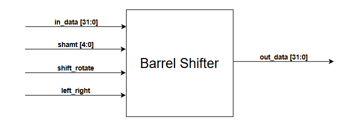
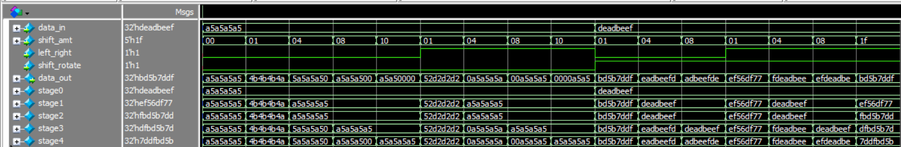

# Lab 2A: 32-bit Barrel Shifter

## Problem Statement

Design and implement a 32-bit barrel shifter capable of performing left/right shifts and rotations by any amount from 0 to 31 positions in a single clock cycle. The design must be optimized for FPGA implementation with minimal delay and efficient resource utilization.

### Requirements
- 32-bit data input/output paths
- 5-bit shift amount (0-31 positions)
- Direction control (left/right)
- Mode control (shift/rotate)
- Single cycle combinational operation
- Optimized for FPGA LUT utilization

### Specifications
- **Input Signals**: 
  - `data_in[31:0]`: 32-bit input data
  - `shift_amt[4:0]`: Shift amount (0-31)
  - `left_right`: Direction (0=left, 1=right)
  - `shift_rotate`: Mode (0=shift, 1=rotate)
- **Output Signals**: 
  - `data_out[31:0]`: 32-bit shifted/rotated result
- **Implementation**: Multi-stage combinational logic

## Approach

### Key Design Decisions
- **5-Stage Pipeline**: Binary decomposition (1+2+4+8+16 = 31 max shift)
- **Stage-by-Stage Processing**: Each stage handles one bit of shift_amt
- **Fill Logic**: Shifts fill with zeros, rotates preserve all bits
- **Multiplexer Efficiency**: Optimized for 6-input LUT mapping

### Block Diagram


### Architecture Overview
```
data_in[31:0] → Stage0 → Stage1 → Stage2 → Stage3 → Stage4 → data_out[31:0]
                  ↑        ↑        ↑        ↑        ↑
                 [0]      [1]      [2]      [3]      [4]
                     shift_amt[4:0] control bits
```

## Implementation

### File Structure
```
lab2a_barrel_shifter/
├── barrel_shifter.sv             # Main shifter implementation
├── barrel_shifter_tb.sv          # Self-checking testbench
├── Block_Diagram.png             # Architecture diagram
├── Questa_Simulation.png         # Simulation waveform
├── Report.pdf                    # Design report
└── Synthesis_Report.txt          # Synthesis results
```

### Key Code Sections

#### Stage Implementation Pattern
```systemverilog
// Stage 1: shift/rotate by 1 bit
always_comb begin
    if (shift_amt[0]) begin
        if (left_right) begin                               // Right operation
            stage1 = shift_rotate ? {stage0[0], stage0[31:1]}     // Rotate right
                                  : {1'b0, stage0[31:1]};         // Shift right
        end else begin                                      // Left operation
            stage1 = shift_rotate ? {stage0[30:0], stage0[31]}    // Rotate left
                                  : {stage0[30:0], 1'b0};         // Shift left
        end
    end else stage1 = stage0;  // No shift for this bit
end
```

#### Multi-Stage Architecture
```systemverilog
// Five stages for 32-bit barrel shifter
logic [31:0] stage0, stage1, stage2, stage3, stage4;

// Stage progression: 1 → 2 → 4 → 8 → 16 bit shifts
// Each stage controlled by corresponding shift_amt bit
// Final result: data_out = stage4
```

## How to Run

### Prerequisites
- QuestaSim (ModelSim) for simulation
- Xilinx Vivado for synthesis
- SystemVerilog support enabled

### Simulation
```bash
# Navigate to lab directory
cd lab2a_barrel_shifter/

# Compile and run
vlog -sv barrel_shifter.sv barrel_shifter_tb.sv
vsim -c barrel_shifter_tb
run -all

# GUI simulation
vsim barrel_shifter_tb
run -all
```

### Synthesis
Use GUI to Run Synthesis.

## Test Cases and Examples

### Test Cases Covered
- Shift left operations (various amounts)
- Shift right operations (various amounts)
- Rotate left operations
- Rotate right operations
- Zero shift amount (pass-through)
- Maximum shift amounts (31 positions)
- Pattern preservation verification
- Boundary condition testing

## Verification Strategy

### Testbench Features
- Self-checking test tasks with expected value comparison
- Comprehensive coverage of all shift/rotate combinations
- Pattern-based testing for bit preservation
- Performance verification for all 32 shift amounts

### Simulation Results


### Synthesis Results
[Synthesis Report](Synthesis_Report.txt)

## Assumptions and Edge Cases

### Assumptions Made
- Single-cycle operation requirement
- All control signals stable during operation
- No need for output registration

### Edge Cases Handled
- Zero shift amount (data passes through unchanged)
- Maximum shift amount (31 positions)
- Shift right by 31 (results in single bit or zero)
- Rotate by 32 (equivalent to no rotation)

### Known Limitations
- Pure combinational (no pipelining option)
- Fixed 32-bit width (not parameterizable)
- Relatively deep logic for high-speed operation

## Sources & AI Usage

**AI Tools Used**: Documentation assistance  r
**Google**: to read more about barrel shifte
**Code Development**: Manual implementation based on binary decomposition principles

### What I Verified
- Functional correctness for all shift/rotate operations
- Proper direction control (left/right)
- Mode selection accuracy (shift/rotate)
- Resource optimization for FPGA implementation
- Critical path analysis and timing verification

---