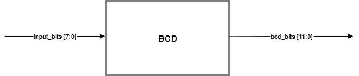
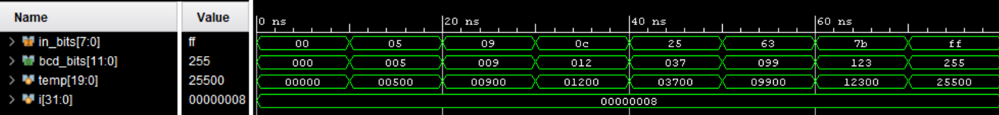

# Lab 2B: Binary Coded Decimal (BCD) Converter

## Problem Statement

Design and implement a combinational circuit that converts 8-bit binary numbers to 3-digit Binary Coded Decimal (BCD) format using the Double-Dabble algorithm. The converter must handle the full range of 8-bit inputs (0-255) and produce valid BCD output.

### Requirements
- Convert 8-bit binary (0-255) to 3-digit BCD
- Purely combinational implementation
- Use Double-Dabble algorithm methodology
- Output range: 000 to 255 in BCD format
- Optimize for FPGA synthesis

### Specifications
- **Input Signals**: 
  - `input_bits[7:0]`: 8-bit binary input (0 to 255)
- **Output Signals**: 
  - `bcd_bits[11:0]`: 12-bit BCD output (3 × 4-bit BCD digits)
    - `bcd_bits[11:8]`: Hundreds digit (0-2)
    - `bcd_bits[7:4]`: Tens digit (0-9)  
    - `bcd_bits[3:0]`: Units digit (0-9)
- **Implementation**: Combinational Double-Dabble algorithm

## Approach

### Key Design Decisions
- **Double-Dabble Algorithm**: Industry-standard method for binary-to-BCD conversion
- **Combinational Loop**: Used `for` loop in `always_comb` for iterative processing
- **20-bit Working Register**: Accommodates 8-bit input + 12-bit BCD output
- **Add-3 Correction**: Applied when BCD digit ≥ 5 before left shift

### Block Diagram


### Algorithm Flow
```
1. Load 8-bit binary into lower bits of 20-bit register
2. For each of 8 iterations:
   a. Check each BCD digit (hundreds, tens, units)
   b. If digit ≥ 5, add 3 to that digit
   c. Shift entire register left by 1 bit
3. Extract final BCD result from upper 12 bits
```

## Implementation

### File Structure
```
lab2b_bcd_conv/
├── bcd_converter.sv              # Main converter implementation
├── tb_bcd_converter.sv           # Testbench
├── bcd.drawio.png                # Block diagram
├── Simulation.png                # Simulation waveform
└── Synthesis.txt                 # Synthesis results
```

### Key Code Sections

#### Double-Dabble Algorithm Implementation
```systemverilog
always_comb begin 
    temp = 20'b0;
    temp[7:0] = input_bits;  // Load input into lower 8 bits
    
    // 8 iterations for 8-bit input
    for (i = 0; i < 8; i++) begin
        // Add 3 to any BCD digit that is >= 5
        if(temp[11:8] >= 5)   // Units digit
            temp[11:8] = temp[11:8] + 4'b0011;
        
        if(temp[15:12] >= 5)  // Tens digit  
            temp[15:12] = temp[15:12] + 4'b0011;
        
        if(temp[19:16] >= 5)  // Hundreds digit
            temp[19:16] = temp[19:16] + 4'b0011;
        
        temp = temp << 1;  // Shift left to process next bit
    end
    
    bcd_bits = temp[19:8];  // Extract three 4-bit BCD digits
end
```

#### Variable Declarations
```systemverilog
logic [19:0] temp;     // Working register for algorithm
int i;                 // Loop iterator for 8 iterations
```

## How to Run

### Prerequisites
- QuestaSim (ModelSim) for simulation
- Xilinx Vivado for synthesis
- SystemVerilog support enabled

### Simulation
```bash
# Navigate to lab directory
cd lab2b_bcd_conv/

# Compile and run
vlog -sv bcd_converter.sv tb_bcd_converter.sv
vsim -c tb_bcd_converter
run -all

# GUI simulation
vsim tb_bcd_converter
run -all
```

### Synthesis
Used GUI in VIVADO

## Test Cases and Examples

### Test Cases Covered
- Binary 0 → BCD 000
- Single digit numbers (1-9)
- Maximum single digit (9)
- Two-digit numbers (10-99)
- Three-digit numbers (100-255)
- Edge cases: 255 (maximum 8-bit value)
- Mid-range values for algorithm verification

### Expected Results Table
| Binary Input | Decimal | BCD Output (Hex) | BCD Digits |
|--------------|---------|------------------|------------|
| 00000000     | 0       | 000              | 000        |
| 00000101     | 5       | 005              | 005        |
| 00001001     | 9       | 009              | 009        |
| 00001100     | 12      | 012              | 012        |
| 00100101     | 37      | 037              | 037        |
| 01100011     | 99      | 099              | 099        |
| 01111011     | 123     | 123              | 123        |
| 11111111     | 255     | 255              | 255        |

## Verification Strategy

### Testbench Features
- Comprehensive test vectors covering input range
- Self-checking with expected vs actual comparison
- Display format shows binary, decimal, and BCD
- Coverage of boundary conditions

### Algorithm Correctness
Verified Double-Dabble algorithm implementation by:
- Manual calculation tracing for key test cases
- Boundary condition verification
- Pattern verification across input range

### Simulation Results


### Synthesis Results
[Synthesis Report](docs/Synthesis.txt)

## Assumptions and Edge Cases

### Assumptions Made
- Input always valid 8-bit binary number
- No need for input validation
- Combinational implementation acceptable (no clock required)

### Edge Cases Handled
- Input 0 produces valid BCD 000
- Maximum input 255 produces valid BCD 255
- All intermediate values properly converted

### Known Limitations
- Fixed 8-bit input width (not parameterizable)
- Relatively deep combinational logic
- No input range validation

## Sources & AI Usage

**AI Tools Used**: Documentation assistance
 **Google**: to read/see examples  
**Code Development**: Manual implementation of Double-Dabble algorithm

### What I Verified
- Double-Dabble algorithm correctness through manual calculation
- Proper BCD digit formation and validation
- Full input range coverage (0-255)
- Combinational synthesis compatibility
- Resource optimization for FPGA implementation

---