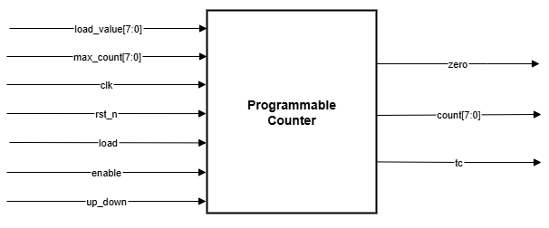
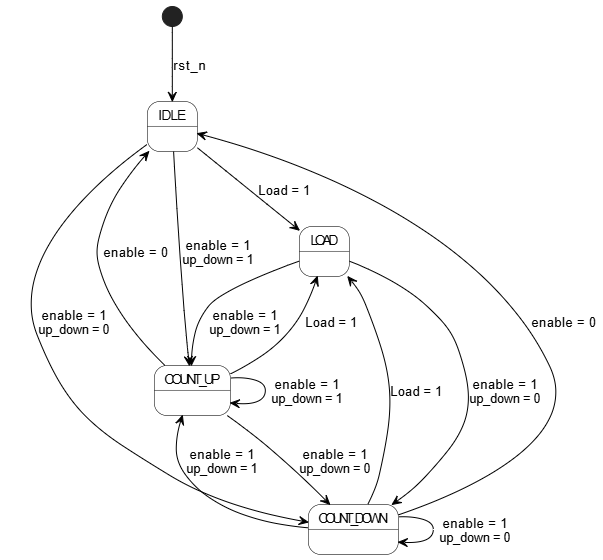
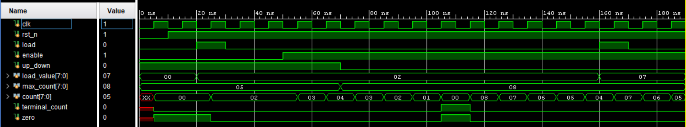

# Lab 3A: Programmable Counter

## Problem Statement

Design and implement an 8-bit programmable counter with up/down counting capability, programmable limits, and comprehensive control inputs. The counter must handle dynamic configuration changes and provide proper status flag generation.

### Requirements
- 8-bit up/down counter with programmable limits
- Control inputs: load, enable, up/down direction, reset
- Programmable load value and maximum count
- Status outputs: terminal count and zero detect
- Synchronous operation with proper reset methodology
- Handle runtime changes to max_count

### Specifications
- **Input Signals**: 
  - `clk`: System clock
  - `rst_n`: Active-low asynchronous reset
  - `load`: Load control (loads load_value into counter)
  - `enable`: Counter enable control
  - `up_down`: Direction control (1=up, 0=down)
  - `load_value[7:0]`: Value to load into counter
  - `max_count[7:0]`: Maximum count limit
- **Output Signals**: 
  - `count[7:0]`: Current counter value
  - `terminal_count`: High when counter reaches terminal condition
  - `zero`: High when counter equals zero
- **Implementation**: Finite State Machine with synchronous counter

## Approach

### Key Design Decisions
- **State-Based Control**: Used FSM to manage counter operations and transitions
- **Load Value Clamping**: Ensures load_value never exceeds max_count
- **Wraparound Logic**: Up-counting wraps to 0, down-counting wraps to max_count
- **Runtime Protection**: Handles max_count changes during operation
- **Separate State Logic**: Next-state logic separated from state register

### Block Diagram


### State Diagram


*States: IDLE → LOAD → COUNT_UP/COUNT_DOWN with transitions based on control inputs*

## Implementation

### File Structure
```
lab3a_prog_counter/
├── rtl/
│   ├── Programmable_Counter.sv   # Main counter implementation
│   └── Programmable_Counter_tb.sv # Testbench
├── docs/
│   ├── prog_counter.drawio.png   # Block diagram
│   ├── prog_counter.fsm.png      # State diagram
│   ├── Simulation.png            # Simulation waveform
│   └── Synthesis.txt             # Synthesis results
└── README.md
```

### Key Code Sections

#### State Machine Implementation
```systemverilog
typedef enum logic [2:0] {
    IDLE,
    LOAD,
    COUNT_UP,
    COUNT_DOWN
} state_t;

// State register with reset
always_ff @(posedge clk or negedge rst_n) begin
    if (!rst_n) begin
        current_state <= IDLE;
        count <= 8'd0;
    end else begin
        current_state <= next_state;
        // State-specific counter operations
    end
end
```

#### Load Value Clamping Logic
```systemverilog
LOAD: begin
    // Ensure load_value is not greater than max_count
    if (load_value <= max_count)
        count <= load_value;
    else
        count <= max_count;  // Clamp to max_count
end
```

#### Wraparound and Terminal Count Logic
```systemverilog
// Terminal count logic
assign terminal_count = (up_down && (count == max_count)) ||
                       (!up_down && (count == 8'd0));

// Zero detection
assign zero = (count == 8'd0);
```

## How to Run

### Prerequisites
- QuestaSim (ModelSim) for simulation
- Xilinx Vivado for synthesis
- SystemVerilog support enabled

### Simulation
```bash
# Navigate to lab directory
cd lab3a_prog_counter/

# Compile and run
vlog -sv rtl/Programmable_Counter.sv rtl/Programmable_Counter_tb.sv
vsim -c Programmable_Counter_tb
run -all

# GUI simulation
vsim Programmable_Counter_tb
run -all
```

### Synthesis
Used GUI in VIVADO

## Test Cases and Examples

### Test Cases Covered
- Reset functionality and initialization
- Load operation with various values
- Up-counting with wraparound
- Down-counting with wraparound
- Terminal count detection
- Zero flag functionality
- Runtime max_count changes
- Priority handling (load vs count)
- Enable/disable transitions

## Verification Strategy

### Testbench Features
- Comprehensive state transition testing
- Dynamic max_count change verification
- Load operation priority validation
- Wraparound condition testing
- Flag generation verification

### Simulation Results


### Synthesis Results
[Synthesis Report](docs/Synthesis.txt)

## Assumptions and Edge Cases

### Assumptions Made
- All control inputs are synchronous with clock
- max_count can change during operation
- Load operation has highest priority

### Edge Cases Handled
- Load value greater than max_count (clamped)
- Runtime max_count reduction below current count
- Simultaneous control signal assertions
- Terminal count conditions for both directions

### Known Limitations
- No input synchronizers (assumes clean control signals)
- Fixed 8-bit width (not parameterizable)

## Sources & AI Usage

**AI Tools Used**: Documentation assistance  
**Code Development**: Manual implementation following FSM design principles

### What I Verified
- Complete FSM functionality with all state transitions
- Proper counter arithmetic and wraparound logic
- Load value clamping and runtime max_count handling
- Status flag generation accuracy
- Synchronous design with proper reset methodology

---