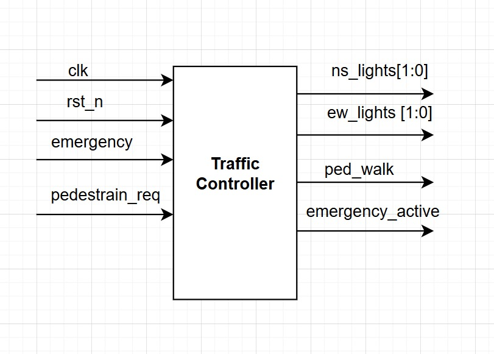
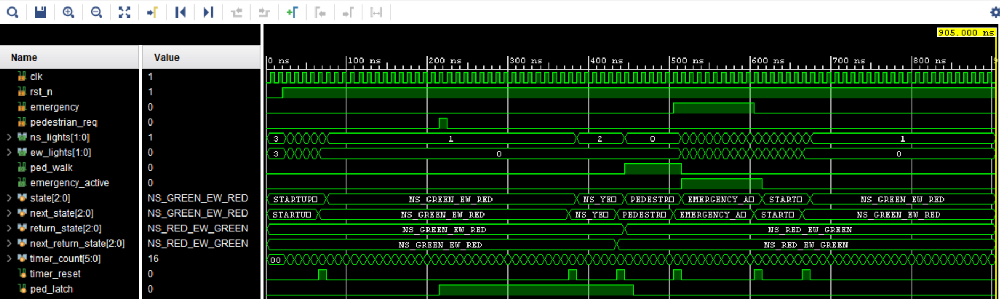

# Lab 4A: Traffic Light Controller

## Problem Statement

Design and implement a comprehensive traffic light controller for a 4-way intersection with North-South and East-West directions. The controller must handle normal traffic cycles, emergency override, pedestrian crossing requests, and startup sequences with proper timing and safety considerations.

### Requirements
- 4-way intersection control (North-South and East-West)
- Normal cycle: Green(30s) → Yellow(5s) → Red
- Emergency override with flashing red lights
- Pedestrian crossing request handling with priority logic
- Startup sequence with flashing initialization
- Safety interlocks preventing conflicting green lights
- 1 Hz clock input with integrated timer

### Specifications
- **Input Signals**: 
  - `clk`: 1 Hz system clock
  - `rst_n`: Active-low asynchronous reset
  - `emergency`: Emergency override signal
  - `pedestrian_req`: Pedestrian crossing request button
- **Output Signals**: 
  - `ns_lights[1:0]`: North-South light encoding (RED=00, GREEN=01, YELLOW=10, OFF=11)
  - `ew_lights[1:0]`: East-West light encoding
  - `ped_walk`: Pedestrian walk signal
  - `emergency_active`: Emergency mode status
- **Timing Requirements**: All delays in seconds (1 Hz clock)

## Approach

### Key Design Decisions
- **State Encoding**: 7 distinct states covering all operational modes
- **Priority Hierarchy**: Emergency > Pedestrian > Normal Traffic Flow
- **Safety Transitions**: Green lights MUST transition through yellow before red
- **Pedestrian Timing**: 10-second crossing window with all-red condition
- **Emergency Recovery**: Startup flash sequence after emergency clearance

### Block Diagram


### State Diagram


### State Table


*States: STARTUP_FLASH → Normal Cycle (NS_GREEN → NS_YELLOW → EW_GREEN → EW_YELLOW) with Emergency and Pedestrian interrupts*

## Implementation

### File Structure
```
lab4a_traffic_light_cntrlr/
├── rtl/
│   ├── traffic_controller.sv      # Main controller FSM
│   ├── timer.sv                   # Timer module
│   └── traffic_controller_tb.sv   # Comprehensive testbench
├── docs/
│   ├── Traffic_controller.drawio.png        # Block diagram
│   ├── Traffic Controller_fsm.drawio.png    # State diagram
│   ├── State Table.png                      # State transition table
│   ├── Simulation.png                       # Simulation waveform
│   └── Synthesis_Report.txt                 # Synthesis results
└── README.md
```

### Key Code Sections

#### State Machine with Safety Logic
```systemverilog
typedef enum logic [2:0] {
    STARTUP_FLASH,
    NS_GREEN_EW_RED,
    NS_YELLOW_EW_RED,
    NS_RED_EW_GREEN,
    NS_RED_EW_YELLOW,
    PEDESTRIAN_CROSSING,
    EMERGENCY_ALL_RED
} state_t;

// Safety transitions - green must go through yellow
NS_GREEN_EW_RED: begin
    ns_lights = GREEN;
    ew_lights = RED;
    if (timer_count >= 30) begin
        next_state = NS_YELLOW_EW_RED;  // MUST transition through yellow
        timer_reset = 1'b1;
    end
end
```

#### Pedestrian Request Latching
```systemverilog
// Pedestrian latch to prevent missed requests
logic ped_latch;
always_ff @(posedge clk or negedge rst_n) begin
    if (!rst_n)
        ped_latch <= 1'b0;
    else if (pedestrian_req)
        ped_latch <= 1'b1;
    else if (state == PEDESTRIAN_CROSSING)
        ped_latch <= 1'b0;  // Clear after service starts
end
```

#### Emergency Override Logic
```systemverilog
EMERGENCY_ALL_RED: begin
    ns_lights = (timer_count[0]) ? RED : OFF;  // Flashing red
    ew_lights = (timer_count[0]) ? RED : OFF;
    emergency_active = 1'b1;
    if (!emergency) begin
        next_state = STARTUP_FLASH;  // Safe recovery sequence
        timer_reset = 1'b1;
    end
end
```

## How to Run

### Prerequisites
- QuestaSim (ModelSim) for simulation
- Xilinx Vivado for synthesis
- SystemVerilog support enabled

### Simulation
```bash
# Navigate to lab directory
cd lab4a_traffic_light_cntrlr/

# Compile all modules
vlog -sv rtl/timer.sv rtl/traffic_controller.sv rtl/traffic_controller_tb.sv
vsim -c traffic_controller_tb
run -all

# GUI simulation with debug
vsim traffic_controller_tb
run -all
```


### Synthesis
Used GUI in VIVADO

## Test Cases and Examples

### Test Cases Covered
- Power-on reset and startup sequence
- Normal traffic light cycling
- Emergency activation and recovery
- Pedestrian request during various states
- Simultaneous emergency and pedestrian requests
- Emergency priority over pedestrian
- Proper yellow transition safety
- Timer accuracy and state transitions
- Edge case combinations

## Verification Strategy

### Testbench Features
- Real-time state monitoring with string conversion
- Comprehensive scenario testing
- Emergency interrupt testing
- Pedestrian request timing verification
- Safety violation detection
- Debug output formatting

### Simulation Results


### Synthesis Results
[Synthesis Report](docs/Synthesis_Report.txt)

## Assumptions and Edge Cases

### Assumptions Made
- 1 Hz clock accurately represents real-time seconds
- Emergency signal is clean and synchronous
- Pedestrian button provides proper debounced pulses

### Edge Cases Handled
- Emergency during pedestrian crossing
- Multiple pedestrian requests (latched until served)
- Emergency release during any state
- Power-on initialization sequence
- Rapid emergency on/off transitions

### Known Limitations
- Fixed timing values (not programmable)
- Single pedestrian crossing (no directional control)
- No vehicle detection sensors

## Sources & AI Usage

**AI Tools Used**: Documentation assistance  
**Code Development**: Manual implementation following traffic safety standards

### What I Verified
- All safety transitions properly implemented
- Emergency priority and recovery sequences
- Pedestrian request latching and fair scheduling
- Proper timing for all states and transitions
- No conflicting light states possible
- Complete state coverage and reachability

---