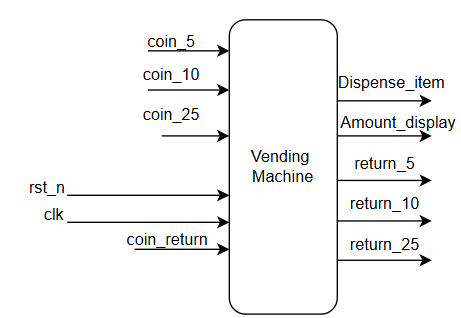
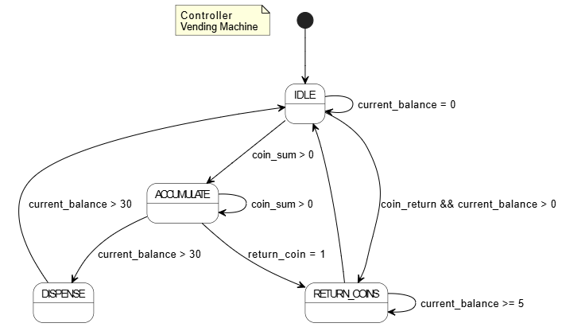
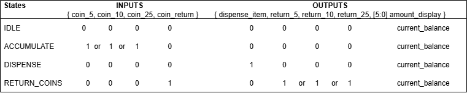
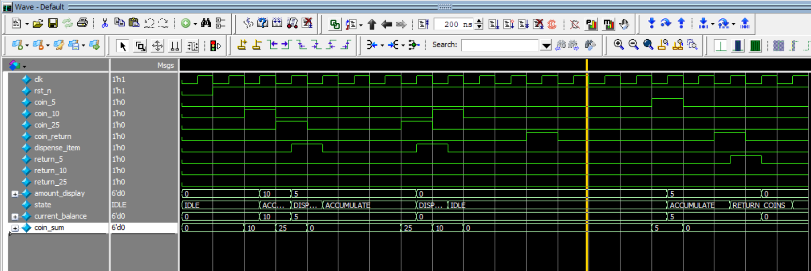

# Lab 4B: Vending Machine Controller

## Problem Statement

Design and implement a vending machine controller that accepts multiple coin denominations, tracks accumulated balance, dispenses items when sufficient payment is received, and provides correct change. The system must handle coin returns and various transaction scenarios while maintaining accurate financial tracking.

### Requirements
- Accept 5, 10, and 25 cent coins
- Dispense 30-cent item when sufficient funds accumulated
- Provide correct change using optimal coin combinations
- Handle coin return requests at any time
- Display current accumulated amount
- Robust state management for all transaction scenarios

### Specifications
- **Input Signals**: 
  - `clk`: System clock
  - `rst_n`: Active-low asynchronous reset
  - `coin_5`: 5-cent coin insertion pulse
  - `coin_10`: 10-cent coin insertion pulse
  - `coin_25`: 25-cent coin insertion pulse
  - `coin_return`: Coin return button
- **Output Signals**: 
  - `dispense_item`: Item dispensing signal
  - `return_5`: Return 5-cent coin
  - `return_10`: Return 10-cent coin
  - `return_25`: Return 25-cent coin
  - `amount_display[5:0]`: Current balance display (0-63 cents)
- **Constants**: Item price = 30 cents

## Approach

### Key Design Decisions
- **State Architecture**: IDLE, ACCUMULATE, DISPENSE, RETURN_COINS states
- **Coin Processing**: Combinational logic to sum simultaneous coin inputs
- **Change Algorithm**: Greedy algorithm returning largest coins first
- **Balance Management**: Integrated balance update with state transitions
- **Reset Behavior**: Safe return to IDLE with balance preservation

### Block Diagram


### State Diagram


### FSM State Diagram


### State Table


*States: IDLE ↔ ACCUMULATE → DISPENSE → ACCUMULATE/IDLE and RETURN_COINS handling*

## Implementation

### File Structure
```
lab4b_vending_mach/
├── rtl/
│   ├── vending_mach.sv           # Main vending machine controller
│   └── tb_vending_mach.sv        # Comprehensive testbench
├── docs/
│   ├── Block_diagram.png         # System block diagram
│   ├── vending.drawio.png        # State diagram
│   ├── Vending_Machine_FSM .drawio # FSM diagram source
│   ├── StateTable.drawio.png     # State transition table
│   ├── vending_machine_output.png # Simulation output
│   └── Synthesis.txt             # Synthesis results
└── README.md
```

### Key Code Sections

#### Coin Input Processing
```systemverilog
// Combinational logic to sum all coin inputs
always_comb begin
    coin_sum = 6'd0;
    if (coin_5)   coin_sum += 6'd5;
    if (coin_10)  coin_sum += 6'd10;
    if (coin_25)  coin_sum += 6'd25;
end
```

#### State-Synchronized Balance Management
```systemverilog
// Balance update integrated with state transitions
case (next_state)
    IDLE: begin
        balance <= 6'd0; // Clear balance
    end
    ACCUMULATE: begin
        balance <= balance + coin_sum; // Add coin value
    end
    DISPENSE: begin
        balance <= (balance + coin_sum) - ITEM_PRICE; // Subtract item cost
    end
    RETURN_COINS: begin
        // Decrement based on returned coin
        if (return_25)      balance <= balance - 6'd25;
        else if (return_10) balance <= balance - 6'd10;
        else if (return_5)  balance <= balance - 6'd5;
    end
endcase
```

#### Optimal Change Logic
```systemverilog
RETURN_COINS: begin
    // Return largest possible coin denomination
    if (balance >= 6'd25)
        return_25 = 1'b1;
    else if (balance >= 6'd10)
        return_10 = 1'b1;
    else if (balance >= 6'd5)
        return_5 = 1'b1;
end
```

## How to Run

### Prerequisites
- QuestaSim (ModelSim) for simulation
- Xilinx Vivado for synthesis
- SystemVerilog support enabled

### Simulation
```bash
# Navigate to lab directory
cd lab4b_vending_mach/

# Compile and run
vlog -sv rtl/vending_mach.sv rtl/tb_vending_mach.sv
vsim -c tb_vending_mach
run -all

# GUI simulation
vsim tb_vending_mach
run -all
```

### Synthesis
Used GUI in VIVADO

## Test Cases and Examples

### Test Cases Covered
- Basic exact payment scenarios (30 cents)
- Overpayment with change return
- Underpayment accumulation
- Coin return before purchase
- Multiple coin combinations
- Simultaneous coin insertion
- State transition verification
- Balance accuracy testing
- Change-making algorithm verification

### Transaction Examples
| Scenario | Coins Inserted | Expected Behavior |
|----------|---------------|-------------------|
| Exact Payment | 25¢ + 5¢ | Dispense item, return to IDLE |
| Overpayment | 25¢ + 10¢ | Dispense item, return 5¢ change |
| Underpayment | 25¢ only | Accumulate, wait for more coins |
| Early Return | 10¢ → return | Return 10¢, back to IDLE |

## Verification Strategy

### Testbench Features
- Complete transaction flow testing
- Data integrity verification
- Multiple address testing
- Control signal timing verification
- Ready flag functionality validation

### Simulation Results


### Synthesis Results
[Synthesis Report](docs/Synthesis.txt)

## Assumptions and Edge Cases

### Assumptions Made
- Coin inputs are clean, debounced pulses
- Only one coin type inserted per clock cycle (testbench violates this intentionally)
- Item dispensing completes in one clock cycle
- Change return mechanism reliable

### Edge Cases Handled
- Exact payment scenarios
- Overpayment requiring change
- Coin return with partial payment
- Multiple coins inserted simultaneously
- Rapid coin insertion sequences
- Balance overflow prevention (6-bit limit)

### Known Limitations
- Fixed item price (not programmable)
- Single item type only
- No inventory tracking
- No bill acceptor support

## Sources & AI Usage

**AI Tools Used**: Documentation assistance  
**Code Development**: Manual implementation following FSM design principles and vending machine operational requirements

### What I Verified
- Complete transaction flow functionality
- Accurate balance tracking and arithmetic
- Proper change-making algorithm implementation
- All state transitions and edge cases
- Financial accuracy (no money creation/loss)
- Robust coin return functionality

---