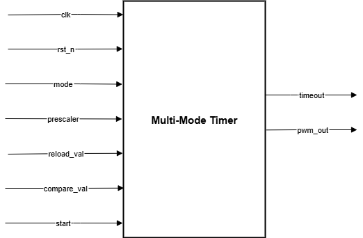
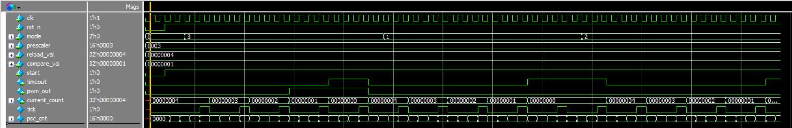

# Lab 5A: Multi-Mode Timer

## Problem Statement

Design and implement a versatile 32-bit programmable timer supporting multiple operating modes including one-shot, periodic, and PWM generation. The timer must include a programmable prescaler for flexible timing resolution and provide comprehensive control and status outputs.

### Requirements
- 32-bit programmable timer with multiple modes
- Operating modes: Off, One-shot, Periodic, PWM
- Programmable prescaler for clock division (1 MHz base clock)
- Configurable reload and compare values
- PWM duty cycle control
- Timeout interrupt generation capability

### Specifications
- **Input Signals**: 
  - `clk`: 1 MHz input clock
  - `rst_n`: Active-low asynchronous reset
  - `mode[1:0]`: Mode selection (00=off, 01=one-shot, 10=periodic, 11=PWM)
  - `prescaler[15:0]`: Clock divider value
  - `reload_val[31:0]`: Timer reload value
  - `compare_val[31:0]`: PWM compare value for duty cycle
  - `start`: Timer start/enable signal
- **Output Signals**: 
  - `timeout`: Timeout flag (when counter reaches 0)
  - `pwm_out`: PWM output signal
  - `current_count[31:0]`: Current timer count value
- **Implementation**: Prescaler + Main Timer with mode control

## Approach

### Design Methodology
1. **Dual-Counter Architecture**: Separate prescaler and main timer for flexible timing resolution
2. **Mode-Based Operation**: Distinct behavior for each timer mode with unified control
3. **Tick Generation**: Prescaler generates timing ticks for main counter
4. **PWM Generation**: Compare-based PWM output with configurable duty cycle
5. **Timeout Signaling**: Proper timeout flag generation for interrupt systems

### Key Design Decisions
- **Prescaler Separation**: Independent 16-bit prescaler for clock division flexibility
- **Mode Control**: Binary encoding for clear operation definition
- **Count Direction**: Down-counting for natural timeout at zero
- **PWM Logic**: Duty cycle controlled by current_count vs compare_val comparison
- **Reload Strategy**: Automatic reload in periodic and PWM modes

### Block Diagram


### Mode Operation Summary
| Mode | Binary | Operation | Reload | PWM Output |
|------|--------|-----------|--------|------------|
| Off | 00 | Counter at 0 | No | Low |
| One-shot | 01 | Count down once | No | Low |
| Periodic | 10 | Count down, auto-reload | Yes | Low |
| PWM | 11 | Count down, auto-reload | Yes | Duty cycle |

## Implementation

### File Structure
```
lab5a_multimode_timer/
├── rtl/
│   ├── mutlimode.sv              # Main timer (note: filename typo)
│   └── tb_multimode.sv           # Testbench
├── docs/
│   ├── Multimode_timer.drawio.png      # Block diagram
│   ├── Multi_Mode_Timer_waveform.png   # Simulation waveform
│   └── Synthesis.txt                   # Synthesis results
└── README.md
```

### Key Code Sections

#### Prescaler Implementation
```systemverilog
// Prescaler logic: generates tick based on prescaler value
always_ff @(posedge clk) begin
    if (!rst_n) begin
        psc_cnt <= 16'b0; 
        tick <= 1'b0;
    end
    else if (start) begin
        if (psc_cnt >= prescaler) begin
            psc_cnt <= 16'b0;
            tick <= 1'b1; // Generate tick when prescaler reached
        end
        else begin
            psc_cnt <= psc_cnt + 1;
            tick <= 1'b0;
        end
    end
end
```

#### Mode-Specific Counter Logic
```systemverilog
case (mode) 
    2'b00: begin // Timer off
        current_count <= 32'b0;
    end
    2'b01: begin // One-shot
        if (current_count == 32'b0) begin
            current_count <= 32'b0; // Hold at 0 after countdown
        end
        else begin
            current_count <= current_count - 1;
        end
    end
    2'b10: begin // Periodic
        if (current_count == 32'b0) begin
            current_count <= reload_val; // Auto-reload
        end
        else begin
            current_count <= current_count - 1;
        end
    end
    2'b11: begin // PWM
        if (current_count == 32'b0) begin
            current_count <= reload_val; // Auto-reload for PWM
        end
        else begin
            current_count <= current_count - 1;
        end
    end
endcase
```

#### PWM and Timeout Generation
```systemverilog
// PWM output: high when current_count <= compare_val in PWM mode
assign pwm_out = ((mode == 2'b11) && (current_count <= compare_val));

// Timeout flag: asserted when counter reaches 0 in non-off mode
assign timeout = ((mode != 2'b00) && (current_count == 32'b0));
```

## How to Run

### Prerequisites
- QuestaSim (ModelSim) for simulation
- Xilinx Vivado for synthesis
- SystemVerilog support enabled

### Simulation
```bash
# Navigate to lab directory
cd lab5a_multimode_timer/

# Compile and run
vlog -sv rtl/mutlimode.sv rtl/tb_multimode.sv
vsim -c tb_multimode
run -all

# GUI simulation
vsim tb_multimode
run -all
```

### Synthesis
Used GUI in VIVADO

## Test Cases and Examples

### Test Cases Covered
- Timer off mode operation
- One-shot countdown with hold at zero
- Periodic mode with automatic reload
- PWM mode with duty cycle generation
- Prescaler functionality verification
- Mode transitions during operation
- Timeout flag generation
- PWM duty cycle accuracy

## Verification Strategy

### Testbench Features
- Multi-mode operation verification
- PWM duty cycle measurement
- Timeout flag timing validation
- Prescaler accuracy testing
- Mode transition verification

### Simulation Results


### Synthesis Results
[Synthesis Report](docs/Synthesis.txt)

## Design Notes

### Implementation Challenges
- **Prescaler Coordination**: Ensuring proper tick generation timing with main counter
- **Mode Switching**: Handling mode changes during operation safely
- **PWM Accuracy**: Maintaining precise duty cycle with reload timing
- **Reset Behavior**: Proper initialization of all timer components

### PWM Characteristics
- **Resolution**: 32-bit compare value allows very fine duty cycle control
- **Frequency**: Determined by (CLK_FREQ / prescaler / reload_val)
- **Duty Cycle**: (compare_val / reload_val) × 100%

### Alternative Approaches Considered
- **Up-Counter**: Rejected in favor of down-counter for natural zero timeout
- **Separate PWM Module**: Integrated approach chosen for resource efficiency

## Assumptions and Edge Cases

### Assumptions Made
- Prescaler value > 0 (division by zero prevention)
- Compare value ≤ reload value for valid PWM
- Mode changes occur when timer is stable

### Edge Cases Handled
- Zero prescaler value (timer stops)
- Compare value > reload value (PWM always low)
- Mode change during countdown
- Start signal assertion/deassertion

### Known Limitations
- No input validation for compare_val vs reload_val
- Mode changes take effect immediately (no synchronization)
- Fixed down-counting direction

## Sources & AI Usage

**AI Tools Used**: Documentation assistance  
**Code Development**: Manual implementation following timer design principles

### What I Verified
- All timer modes operate correctly
- Prescaler generates proper timing ticks
- PWM output matches expected duty cycle
- Timeout flag generation timing


---