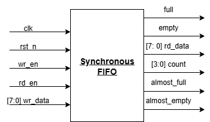

# Lab 7: FIFO Design (Synchronous & Asynchronous)

## Problem Statement

Design and implement both synchronous and asynchronous FIFO (First-In-First-Out) memory systems. The synchronous FIFO operates in a single clock domain with comprehensive flag generation, while the asynchronous FIFO handles clock domain crossing with Gray code pointers and metastability protection.

### Requirements
- **Synchronous FIFO**: Single clock domain operation with configurable depth and width
- **Asynchronous FIFO**: Dual clock domain with safe pointer synchronization  
- Full/empty flag generation with glitch-free operation
- Almost-full/almost-empty thresholds (sync FIFO only)
- Parameterizable data width and depth
- Efficient FPGA block RAM utilization
- Gray code pointers for async FIFO clock domain crossing

### Specifications
- **Synchronous FIFO**:
  - Single clock domain operation
  - Configurable almost-full/almost-empty thresholds
  - Count output for current FIFO occupancy
  - Parameterizable width and depth
- **Asynchronous FIFO**:
  - Independent read and write clock domains
  - Gray code pointer synchronization
  - Metastability protection with 2-FF synchronizers
  - Binary to Gray code conversion
- **Implementation**: Pointer-based architecture with efficient memory usage

## Approach

### Design Methodology
1. **Pointer-Based Architecture**: Binary pointers for addressing, Gray code for async synchronization
2. **Flag Generation Strategy**: Combinational flags for immediate response
3. **Memory Inference**: FPGA-optimized memory array design
4. **Clock Domain Crossing**: Safe Gray code pointer synchronization
5. **Parameterizable Design**: Flexible width and depth configuration

### Key Design Decisions
- **Binary vs Gray Pointers**: Binary for addressing efficiency, Gray for CDC safety
- **Flag Timing**: Combinational flags for zero-latency indication
- **Memory Organization**: Single-port memory with separate read/write pointers
- **Synchronizer Depth**: 2-FF synchronizers for CDC metastability protection
- **Full/Empty Detection**: Pointer comparison with wraparound consideration

### FIFO Overview Block Diagram


## Implementation

### File Structure
```
lab7/
├── lab7a_sync_fifo/
│   ├── rtl/
│   │   ├── sync_fifo.sv              # Synchronous FIFO
│   │   └── tb_sync_fifo.sv           # Sync FIFO testbench
│   ├── docs/
│   │   ├── Synch_Fifo_top.png        # Block diagram
│   │   ├── synch_fifo_output.png     # Simulation output
│   │   └── Synthesis.txt             # Synthesis results
│   └── README.md                     # Sync FIFO specific README
├── lab7b_async_fifo/
│   ├── rtl/
│   │   ├── async_fio.sv              # Async FIFO (filename typo)
│   │   └── tb_async_fifo.sv          # Async FIFO testbench
│   ├── docs/
│   │   ├── asynch_fifo_output.png    # Simulation output
│   │   └── Synthesis.txt             # Synthesis results
│   └── README.md                     # Async FIFO specific README
└── README.md                         # This file - overall lab overview
```

## Lab 7A: Synchronous FIFO

### Design Overview
Single clock domain FIFO with comprehensive status flags and count output.

### Block Diagram


### Key Features
- Parameterizable data width and depth
- Almost-full/almost-empty thresholds
- Simultaneous read/write optimization
- Count output for occupancy monitoring

### Critical Bug Found
**File**: `lab7a_sync_fifo/rtl/sync_fifo.sv`  
**Problem**: Incorrect full flag logic reduces capacity by 1

```systemverilog
// WRONG - Only allows 15 of 16 entries:
assign full = (count == FIFO_DEPTH-1) ? 1 : 0;

// CORRECT - Allows all 16 entries:
assign full = (count == FIFO_DEPTH) ? 1 : 0;
```

### Simulation Results


### Synthesis Results
[Sync FIFO Synthesis](lab7a_sync_fifo/docs/Synthesis.txt)

## Lab 7B: Asynchronous FIFO

### Design Overview
Dual clock domain FIFO with Gray code pointer synchronization for safe clock domain crossing.

### Key Features
- Independent read/write clock domains
- Gray code pointer conversion
- 2-FF synchronizers for metastability protection
- Safe full/empty flag generation

### Simulation Results


### Synthesis Results
[Async FIFO Synthesis](lab7b_async_fifo/docs/Synthesis.txt)

## How to Run

### Prerequisites
- QuestaSim (ModelSim) for simulation
- Xilinx Vivado for synthesis
- SystemVerilog support enabled

### Simulation
```bash
# Navigate to lab directory
cd lab7/

# Test Synchronous FIFO
cd lab7a_sync_fifo/
vlog -sv rtl/sync_fifo.sv rtl/tb_sync_fifo.sv
vsim -c tb_sync_fifo
run -all

# Test Asynchronous FIFO
cd ../lab7b_async_fifo/
vlog -sv rtl/async_fio.sv rtl/tb_async_fifo.sv
vsim -c tb_async_fifo
run -all
```

### Synthesis
Used GUI in VIVADO

## Test Cases and Examples

### Synchronous FIFO Test Cases
- Write until full condition
- Read until empty condition
- Simultaneous read/write operations
- Almost-full/almost-empty flag testing
- Count accuracy verification
- Wraparound pointer testing

### Asynchronous FIFO Test Cases  
- Cross-clock domain write/read operations
- Different clock frequency testing (100MHz vs 71MHz)
- Gray code pointer synchronization
- Metastability protection verification
- Full/empty flag accuracy across domains


## Design Comparison

### Synchronous vs Asynchronous FIFO

| Feature | Sync FIFO | Async FIFO |
|---------|-----------|------------|
| Clock Domains | Single | Dual (independent) |
| Pointer Type | Binary | Gray code |
| Synchronizers | None | 2-FF per domain |
| Flag Latency | Immediate | 2-3 clock cycles |
| Complexity | Lower | Higher |
| Use Case | Same clock | Clock crossing |

## Verification Strategy

### Testbench Features
- **Sync FIFO**: Comprehensive read/write pattern testing
- **Async FIFO**: Different clock frequency testing
- **Flag Verification**: All flag states and transitions tested
- **Data Integrity**: Write-read data comparison
- **CDC Verification**: Cross-domain timing verification

## Assumptions and Edge Cases

### Assumptions Made
- Clock domains are independent and asynchronous (async FIFO)
- Reset signals are properly synchronized to respective domains
- FIFO depth is power of 2 for optimal addressing

### Edge Cases Handled
- **Simultaneous Full/Empty**: Proper priority handling
- **Reset During Operation**: Safe reset across all states
- **Clock Domain Skew**: Gray code provides skew tolerance (async)
- **Rapid Read/Write**: Pointer wraparound handling

### Known Limitations
- **Async FIFO Latency**: 2-clock latency for flag updates across domains
- **Memory Addressing**: Limited to binary address widths
- **No Built-in Overflow Protection**: Application must respect flags

## Sources & AI Usage

**AI Tools Used**: Documentation assistance  
**Code Development**: Manual implementation following FIFO design principles and CDC best practices

### What I Verified
- Synchronous FIFO pointer management concept
- Asynchronous FIFO Gray code conversion and CDC safety
- Memory inference compatibility for FPGA implementation


---