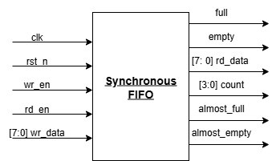
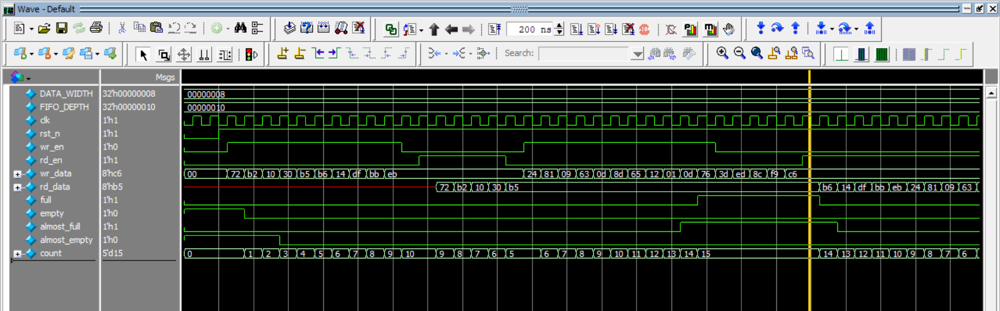

# Lab 7A: Synchronous FIFO

## Problem Statement

Design and implement a synchronous FIFO (First-In-First-Out) memory buffer operating in a single clock domain. The FIFO must provide comprehensive status flags, support simultaneous read/write operations, and offer configurable almost-full/almost-empty thresholds for flow control.

### Requirements
- Single clock domain operation
- Parameterizable data width and depth
- Full/empty flag generation
- Almost-full/almost-empty thresholds
- Count output for occupancy monitoring
- Simultaneous read/write support
- Efficient FPGA memory utilization

### Specifications
- **Input Signals**: 
  - `clk`: System clock
  - `rst_n`: Active-low asynchronous reset
  - `wr_en`: Write enable
  - `wr_data[DATA_WIDTH-1:0]`: Write data
  - `rd_en`: Read enable
- **Output Signals**: 
  - `rd_data[DATA_WIDTH-1:0]`: Read data
  - `full`: FIFO full flag
  - `empty`: FIFO empty flag
  - `almost_full`: Almost full threshold flag
  - `almost_empty`: Almost empty threshold flag
  - `count[$clog2(FIFO_DEPTH)-1:0]`: Current occupancy
- **Parameters**: DATA_WIDTH=8, FIFO_DEPTH=16, configurable thresholds

## Approach

### Key Design Decisions
- **Binary Pointer Architecture**: Efficient addressing with wraparound detection
- **Simultaneous R/W Optimization**: Special handling for concurrent operations
- **Count-Based Flags**: Direct count comparison for flag generation
- **Memory Inference**: FPGA-friendly memory array coding style

### Block Diagram


## Implementation

### File Structure
```
lab7a_sync_fifo/
├── rtl/
│   ├── sync_fifo.sv              # Synchronous FIFO implementation
│   └── tb_sync_fifo.sv           # Testbench
├── docs/
│   ├── Synch_Fifo_top.png        # Block diagram
│   ├── synch_fifo_output.png     # Simulation output
│   └── Synthesis.txt             # Synthesis results
└── README.md
```

### Key Code Sections

#### Pointer and Count Management
```systemverilog
always_ff @(posedge clk or negedge rst_n) begin
    if (!rst_n) begin
        rd_ptr <= 0;
        wr_ptr <= 0;
        count <= 4'b0;
    end
    else begin
        // Simultaneous read and write (most efficient case)
        if (wr_en && !full && rd_en && !empty) begin
            wr_ptr <= (wr_ptr == FIFO_DEPTH-1) ? 0 : wr_ptr + 1; 
            rd_ptr <= (rd_ptr == FIFO_DEPTH-1) ? 0 : rd_ptr + 1;
            // Count remains unchanged
        end    
        else if(rd_en && !empty) begin
            rd_ptr <= (rd_ptr == FIFO_DEPTH-1) ? 0 : rd_ptr + 1;
            count <= count - 1;
        end
        else if (wr_en && !full) begin
            wr_ptr <= (wr_ptr == FIFO_DEPTH-1) ? 0 : wr_ptr + 1; 
            count <= count + 1;
        end
    end
end
```

#### Memory Operations
```systemverilog
// FIFO memory and data output register
always_ff @(posedge clk) begin
    if (wr_en && !full) begin
        fifo[wr_ptr] <= wr_data;  // Write data to current write pointer
    end
    if (rd_en && !empty) begin
        rd_data <= fifo[rd_ptr];  // Read data from current read pointer
    end
end
```

#### Status Flag Generation
```systemverilog
// CRITICAL BUG - Fixed version:
assign full = (count == FIFO_DEPTH) ? 1 : 0;        // NOT FIFO_DEPTH-1
assign empty = (count == 0) ? 1 : 0;
assign almost_empty = (count <= ALMOST_EMPTY_THRESH) ? 1 : 0;
assign almost_full = (count >= ALMOST_FULL_THRESH) ? 1 : 0;
```

## How to Run

### Prerequisites
- QuestaSim (ModelSim) for simulation
- Xilinx Vivado for synthesis
- SystemVerilog support enabled

### Simulation
```bash
# Navigate to sync FIFO directory
cd lab7a_sync_fifo/

# Compile and run
vlog -sv rtl/sync_fifo.sv rtl/tb_sync_fifo.sv
vsim -c tb_sync_fifo
run -all

### Synthesis
Used GUI in VIVADO

## Test Cases and Examples

### Test Cases Covered
- Write until full condition
- Read until empty condition
- Simultaneous read/write operations
- Almost-full/almost-empty flag testing
- Count accuracy verification
- Wraparound pointer testing
- Flag transition timing


## Verification Strategy

### Testbench Features
- Comprehensive write/read pattern testing
- Flag state verification
- Simultaneous operation testing
- Count accuracy validation
- Edge case coverage

### Simulation Results


### Synthesis Results
[Synthesis Report](docs/Synthesis.txt)

## Assumptions and Edge Cases

### Assumptions Made
- Single clock domain operation
- Write/read enables are synchronous
- No metastability concerns

### Edge Cases Handled
- Simultaneous read/write when full/empty
- Wraparound pointer conditions
- Reset during active operations

### Known Limitations
- Fixed parameter configuration
- No overflow/underflow protection beyond flags
- Single clock domain only

## Sources & AI Usage

**AI Tools Used**: Documentation assistance  
**Code Development**: Manual implementation following FIFO design principles

### What I Verified
- ✅ Basic FIFO functionality concept
- ✅ Pointer wraparound logic
- ✅ Simultaneous read/write handling
- ✅ Memory inference coding style

---