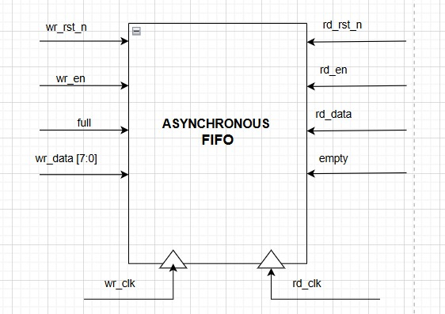

# Lab 7B: Asynchronous FIFO

## Problem Statement

Design and implement an asynchronous FIFO capable of safely transferring data between independent clock domains. The FIFO must use Gray code pointers for metastability protection and provide reliable full/empty flag generation across clock domain boundaries.

### Requirements
- Independent read and write clock domains
- Gray code pointer synchronization
- Metastability protection with multi-flop synchronizers
- Safe full/empty flag generation
- No data corruption during clock domain crossing
- Efficient memory utilization

### Specifications
- **Write Clock Domain**: 
  - `wr_clk`: Write clock
  - `wr_rst_n`: Write domain reset
  - `wr_en`: Write enable
  - `wr_data[DATA_WIDTH-1:0]`: Write data
  - `full`: Full flag output
- **Read Clock Domain**: 
  - `rd_clk`: Read clock  
  - `rd_rst_n`: Read domain reset
  - `rd_en`: Read enable
  - `rd_data[DATA_WIDTH-1:0]`: Read data
  - `empty`: Empty flag output
- **Parameters**: DATA_WIDTH=8, FIFO_DEPTH=16

## Approach

### Key Design Decisions
- **Gray Code Pointers**: Only one bit changes per increment, preventing glitches
- **2-FF Synchronizers**: Minimum depth for metastability protection
- **Binary-to-Gray Conversion**: Safe pointer format for clock domain crossing
- **Extra Pointer Bit**: MSB enables full/empty distinction
- **Domain Isolation**: Only Gray pointers cross clock boundaries

### System Top Module Block Diagram


### Inputs Table


### Clock Domain Crossing Strategy
```
Write Domain:           Read Domain:
wr_bin → wr_gray ----→ wr_gray_synced
         ↑                      ↓
    Binary Logic           Full Detection

rd_gray_synced ←---- rd_gray ← rd_bin
         ↓                      ↑
    Empty Detection       Binary Logic
```

## Implementation

### File Structure
```
lab7b_async_fifo/
├── rtl/
│   ├── async_fio.sv              # Async FIFO (note: filename typo)
│   └── tb_async_fifo.sv          # Testbench
├── docs/
│   ├── asynch_fifo_output.png    # Simulation output
│   └── Synthesis.txt             # Synthesis results
└── README.md
```

### Key Code Sections

#### Binary to Gray Code Conversion
```systemverilog
// Binary to Gray code conversion (critical for CDC)
assign wr_gray = wr_bin ^ (wr_bin >> 1);
assign rd_gray = rd_bin ^ (rd_bin >> 1);
```

#### Write Side Implementation
```systemverilog
// Write side logic
always_ff @(posedge wr_clk or negedge wr_rst_n) begin
    if (!wr_rst_n)
        wr_bin <= '0;
    else if (wr_en && !full) begin
        mem[wr_bin[ADDR_WIDTH-1:0]] <= wr_data;
        wr_bin <= wr_bin + 1'b1;
    end
end

// Sync read Gray pointer to write clock domain
always_ff @(posedge wr_clk or negedge wr_rst_n) begin
    if (!wr_rst_n) begin
        rd_gray_sync1 <= '0;
        rd_gray_sync2 <= '0;
    end else begin
        rd_gray_sync1 <= rd_gray;      // First synchronizer stage
        rd_gray_sync2 <= rd_gray_sync1; // Second synchronizer stage
    end
end
```

#### Full/Empty Detection Logic
```systemverilog
// Full condition: Gray pointers differ only in MSB
assign full = (wr_gray == {~rd_gray_synced[PTR_WIDTH-1], 
                           rd_gray_synced[PTR_WIDTH-2:0]});

// Empty condition: Gray pointers are identical
assign empty = (rd_gray == wr_gray_synced);
```

#### Read Side Implementation
```systemverilog
// Read side logic
always_ff @(posedge rd_clk or negedge rd_rst_n) begin
    if (!rd_rst_n)
        rd_bin <= '0;
    else if (rd_en && !empty)
        rd_bin <= rd_bin + 1'b1;
end

// Read data output
always_ff @(posedge rd_clk or negedge rd_rst_n) begin
    if (!rd_rst_n)
        rd_data <= '0;
    else if (rd_en && !empty)
        rd_data <= mem[rd_bin[ADDR_WIDTH-1:0]];
end
```

## How to Run

### Prerequisites
- QuestaSim (ModelSim) for simulation
- Xilinx Vivado for synthesis
- SystemVerilog support enabled

### Simulation
```bash
# Navigate to async FIFO directory
cd lab7b_async_fifo/

# Compile and run
vlog -sv rtl/async_fio.sv rtl/tb_async_fifo.sv
vsim -c tb_async_fifo
run -all

# GUI simulation
vsim tb_async_fifo
run -all
```

## Test Cases and Examples

### Test Cases Covered
- Different clock frequency operation (100MHz vs 71MHz)
- Cross-clock domain data integrity
- Full/empty flag reliability
- Metastability protection verification
- Gray code pointer transitions
- Reset behavior across domains

### Clock Domain Testing
- **Write Clock**: 100 MHz (10ns period)
- **Read Clock**: ~71 MHz (14ns period)
- **Data Pattern**: Random data with verification
- **CDC Timing**: 2-3 clock cycle latency for flags

## Critical Design Points

### Gray Code Properties
- **Single Bit Change**: Only one bit changes per increment
- **Glitch Prevention**: Eliminates multi-bit transition hazards
- **CDC Safety**: Safe for clock domain crossing

### Synchronizer Design
- **2-FF Minimum**: Required for metastability protection
- **Reset Handling**: Proper reset in each clock domain
- **Latency Trade-off**: 2-3 cycle latency for safety

### Full/Empty Logic
- **Extra Bit**: MSB distinguishes full from empty when pointers equal
- **Domain Crossing**: Only Gray pointers cross domains
- **Flag Latency**: Inherent delay due to synchronization

## Verification Strategy

### Testbench Features
- Independent clock generation with different frequencies
- Cross-domain data integrity checking
- Metastability stress testing
- Flag transition verification
- Write/read pattern validation

### Simulation Results


### Synthesis Results
[Synthesis Report](docs/Synthesis.txt)


## Design Notes

### Best Practices
- **Gray Code Usage**: Proper binary-to-Gray conversion
- **Synchronizer Depth**: 2-FF synchronizers for each domain
- **Reset Isolation**: Independent resets for each domain
- **Flag Generation**: Safe full/empty detection

### Performance Characteristics
- **Latency**: 2-3 clock cycles for flag updates
- **Throughput**: One data item per clock in each domain
- **Capacity**: Full FIFO depth minus synchronizer latency effects

### Alternative Approaches Considered
- **Token-Based**: More complex, rejected for educational clarity
- **Handshaking**: Higher latency, not suitable for streaming data

## Assumptions and Edge Cases

### Assumptions Made
- Clock domains are truly independent and asynchronous
- Reset signals are properly synchronized in each domain
- FIFO depth is power of 2 for addressing efficiency

### Edge Cases Handled
- **Clock Frequency Differences**: Tested with different rates
- **Reset During Operation**: Safe reset in both domains
- **Rapid Fill/Empty**: Proper flag behavior maintained
- **Clock Skew**: Gray code provides skew tolerance

### Known Limitations
- **Flag Latency**: Inherent 2-3 cycle delay across domains
- **No Burst Support**: Single-item transfers only
- **Fixed Depth**: Not runtime configurable

## Sources & AI Usage

**AI Tools Used**: Documentation assistance  
**Code Development**: Manual implementation following CDC design principles

### What I Verified
- ✅ Gray code conversion correctness
- ✅ Synchronizer implementation for metastability protection
- ✅ Full/empty detection logic for dual domains
- ✅ Memory access patterns and timing

---