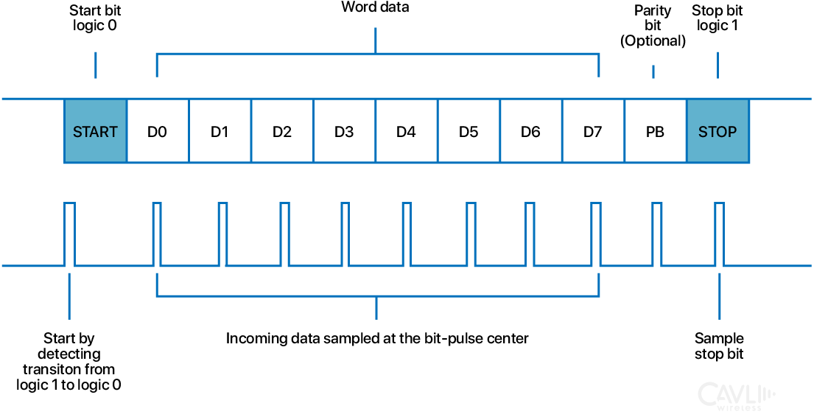
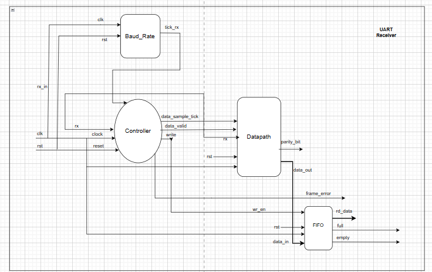
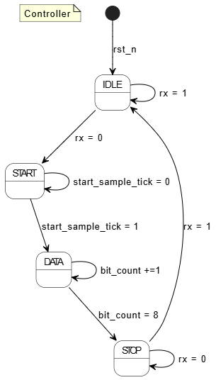
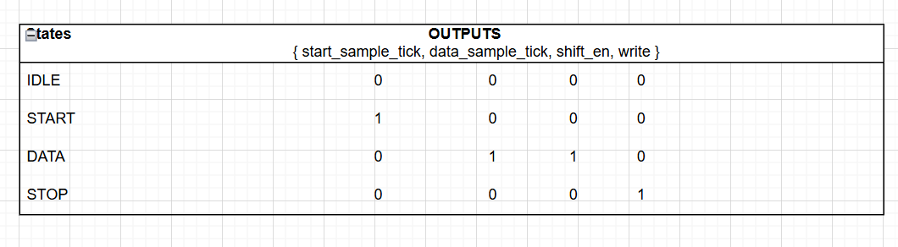
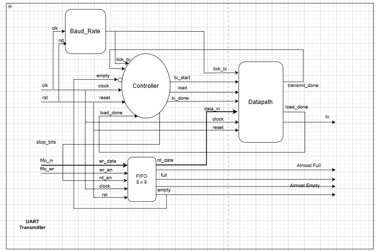
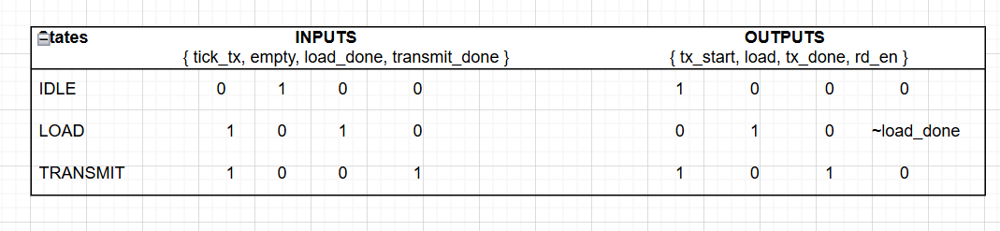
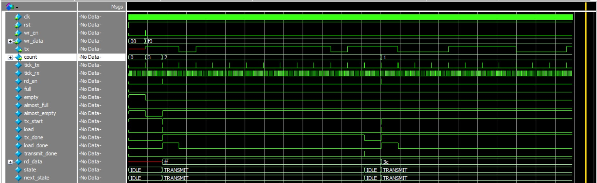
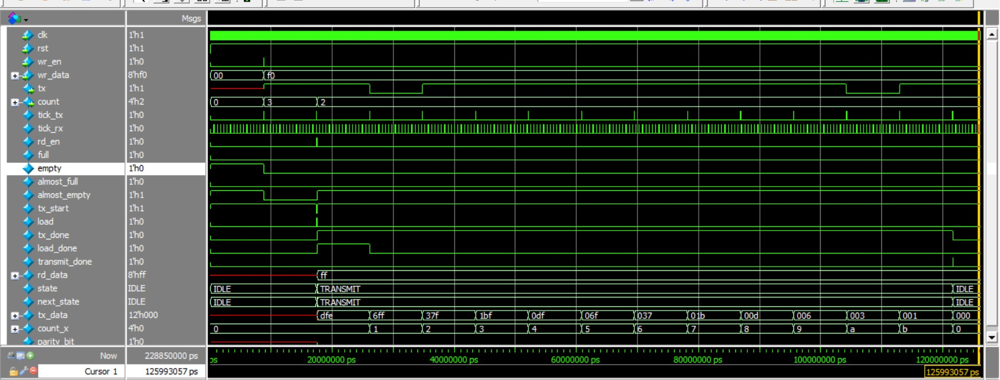

# Lab 8: UART Controller

## Problem Statement

Design and implement a complete UART (Universal Asynchronous Receiver Transmitter) controller with both transmitter and receiver modules, including FIFO buffers, baud rate generation, and comprehensive error detection. The system must support full-duplex communication with configurable parameters.

### Requirements
- Full-duplex UART communication (simultaneous TX/RX)
- Configurable baud rate (default 115200)
- 8-bit data transmission with start/stop bits
- FIFO buffering for both TX and RX paths
- Comprehensive error detection (frame errors, overrun)
- Modular architecture with separate TX/RX components

### Specifications
- **Input Signals**: 
  - `clk`: System clock (50 MHz)
  - `rst`: Active-low reset
  - `tx_wr_en`: Transmit FIFO write enable
  - `tx_wr_data[7:0]`: Data to transmit
  - `rx_rd_en`: Receive FIFO read enable
- **Output Signals**: 
  - `rx_data_out[7:0]`: Received data
  - `rx_data_valid`: Received data valid flag
  - `rx_frame_error`: Frame error detection
  - `tx_fifo_count[3:0]`: TX FIFO occupancy
- **Implementation**: Hierarchical design with separate TX/RX modules

## Approach

### UART Timing Diagram


### Key Design Decisions
- **Modular Architecture**: Separate transmitter and receiver with dedicated controllers
- **FIFO Integration**: Independent FIFO buffers for TX and RX data paths
- **Oversampling**: 16x oversampling for robust reception
- **State Machine Control**: Dedicated FSMs for TX and RX operations
- **Baud Rate Generation**: Shared baud rate generator with separate TX/RX ticks

### UART Receiver






### UART Transmitter  


.png)



## Implementation

### File Structure
```
lab8_UART_contrlr/
│   README.md
│   tb_uart_top.sv
│   uart_top.sv
│
├───Receiver
│   ├───docs
│   │       FSM.png
│   │       FSM_table.png
│   │       uart_rx (1).drawio
│   │       UART_rx_FSM.png
│   │       UART_rx_top_diagram.png
│   │
│   └───rtl
│           baud_rate.sv
│           rx_controller.sv
│           rx_datapath.sv
│           rx_fifo.sv
│           rx_top.sv
│           tb_rx_top.sv
│
├───rtl
└───Transmitter
└───Timing_Dia.png
    ├───docs
    │       fsm.drawio (1).png
    │       FSM_table.png
    │       output_1.jpg
    │       output_2.jpg
    │       uart_tx (3).drawio
    │       UART_tx_top_diagram.png
    │
    └───rtl
            baud_rate.sv
            controller.sv
            fifo.sv
            tb_tx_top.sv
            tx_datapath.sv
            tx_top.sv
```

#### RX Controller State Machine
```systemverilog
// RX FSM for frame detection and data sampling
always_comb begin
    next_state = state;
    frame_error = 0;

    case (state)
        IDLE: begin
            if (rx == 1'b0)   // detect start bit falling edge
                next_state = START;
        end

        START: begin
            if (start_sample_tick) begin
                if (rx == 1'b0)
                    next_state = DATA;
                else
                    next_state = IDLE; // false start
            end
        end

        DATA: begin
            if (bit_count == DATA_BITS && (sample_count == SAMPLES_PER_BIT-1))
                next_state = STOP;
        end

        STOP: begin
            if (sample_count == (SAMPLES_PER_BIT - 1)) begin
                if (rx == 1'b1) begin
                    next_state = IDLE;   // valid stop bit
                end
            end
        end
    endcase
end
```

## How to Run

### Prerequisites
- QuestaSim (ModelSim) for simulation
- Xilinx Vivado for synthesis
- SystemVerilog support enabled

### Simulation
```bash
# Navigate to lab directory
cd lab8_UART_contrlr/

# Test complete UART system
vlog -sv uart_top.sv tb_uart_top.sv
vlog -sv Receiver/rtl/*.sv Transmitter/rtl/*.sv
vsim -c uart_top_tb
run -all

# Test individual modules
cd Receiver/
vlog -sv rtl/*.sv
vsim -c tb_rx_top
run -all

cd ../Transmitter/
vlog -sv rtl/*.sv  
vsim -c tb_tx_top
run -all
```

### Synthesis
Used GUI in VIVADO

## Test Cases

### System-Level Test Cases
- Full-duplex loopback communication
- Multiple character transmission sequences
- Error condition testing (frame errors)
- FIFO overflow/underflow scenarios
- Baud rate accuracy verification

### Receiver Test Cases
- Start bit detection and validation
- Data bit sampling at optimal points
- Stop bit verification
- Frame error detection
- Oversampling accuracy

### Transmitter Test Cases
- FIFO-to-serial conversion
- Proper frame formatting (start/data/stop)
- Baud rate timing accuracy
- Multiple byte transmission
- Empty FIFO handling

## Verification Strategy

### Testbench Features
- Complete loopback testing (TX → RX)
- Character sequence transmission
- Error injection and detection
- Timing verification with real baud rates
- FIFO status monitoring

### Simulation Results





## Assumptions and Edge Cases

### Assumptions Made
- 50 MHz system clock with 115200 baud rate
- 8-bit data format with 1 start bit, 1 stop bit
- 16x oversampling for receiver
- FIFO depth of 16 entries

### Edge Cases Handled
- False start bit detection
- Frame error on invalid stop bit
- FIFO overflow/underflow protection
- Simultaneous read/write operations

### Known Limitations
- Fixed 8-bit data width (not parameterizable)
- No parity bit support implemented
- Single stop bit only
- No break detection

## Sources & AI Usage

**AI Tools Used**: Documentation assistance  
**Code Development**: Manual implementation following UART protocol standards

### What I Verified
- UART protocol compliance for framing
- Baud rate generation accuracy  
- State machine functionality
- FIFO integration concepts


---