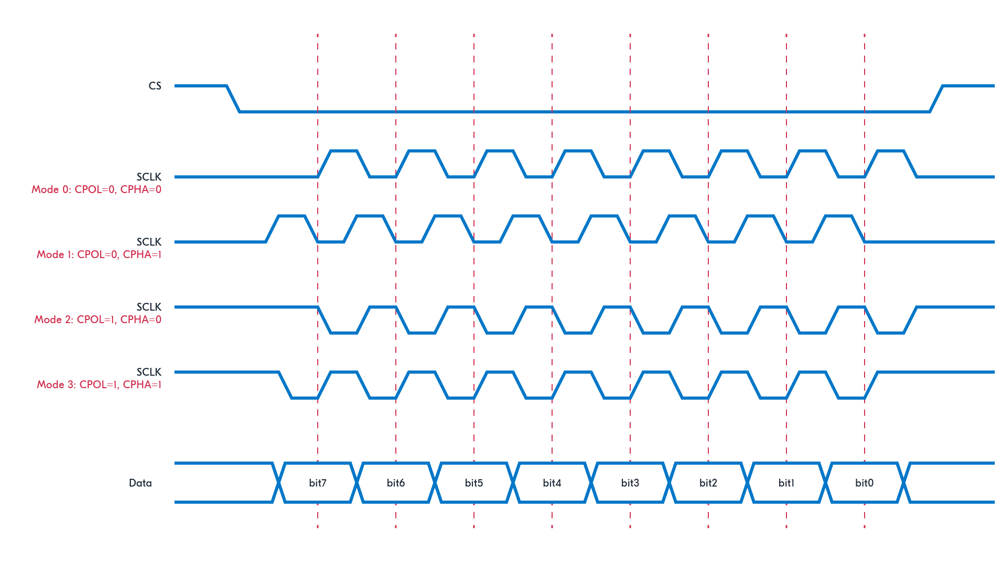
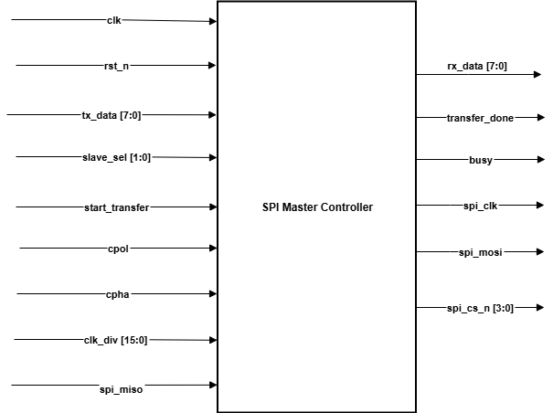
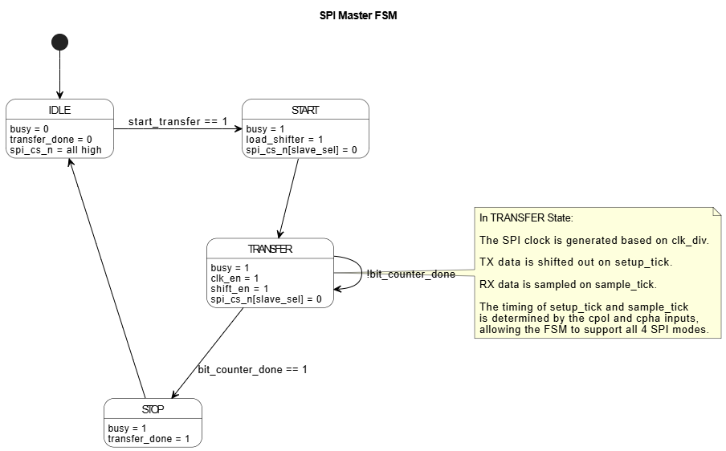
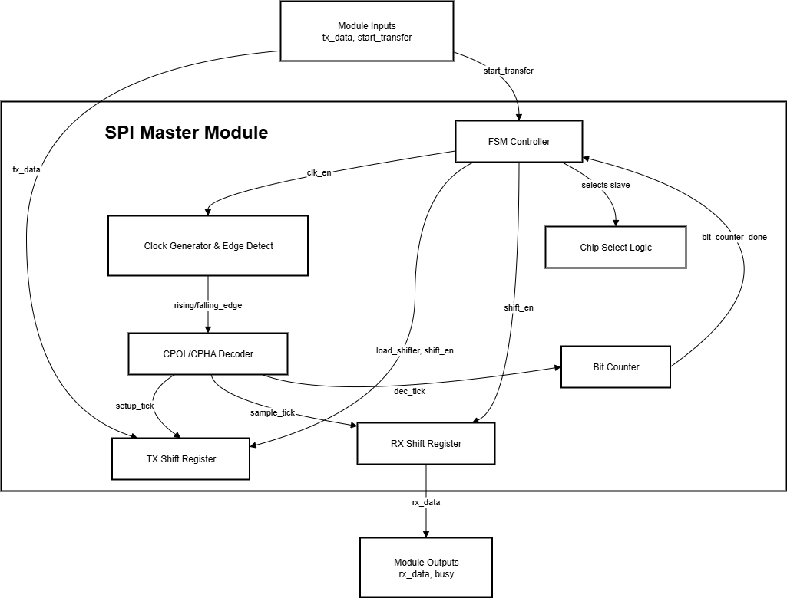
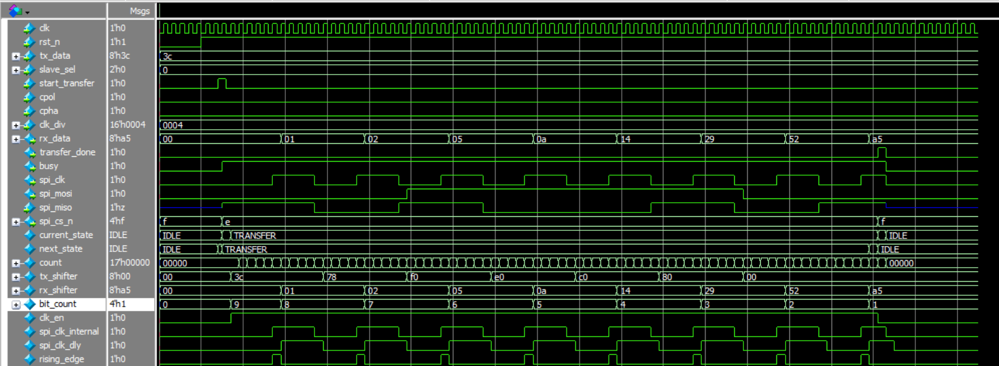
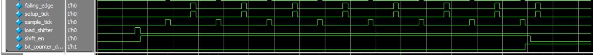

# Lab 9: SPI Controller

## Problem Statement

Design and implement an SPI (Serial Peripheral Interface) master controller supporting configurable clock polarity/phase modes, variable data width, multiple slave selection, and full-duplex communication. The controller must handle all four SPI modes (CPOL/CPHA combinations) with proper timing.

### Requirements
- SPI master controller implementation
- Support for all 4 SPI modes (CPOL/CPHA: 00, 01, 10, 11)
- Variable clock frequency via programmable divider
- Multiple slave support with individual chip selects
- Bidirectional data transfer (full-duplex)
- Configurable data width (default 8-bit)
- Proper setup and hold timing for all modes

### Specifications
- **Input Signals**: 
  - `clk`: System clock
  - `rst_n`: Active-low asynchronous reset
  - `tx_data[DATA_WIDTH-1:0]`: Data to transmit
  - `slave_sel[$clog2(NUM_SLAVES)-1:0]`: Slave selection
  - `start_transfer`: Transfer initiation
  - `cpol`: Clock polarity (0=idle low, 1=idle high)
  - `cpha`: Clock phase (0=sample on first edge, 1=sample on second edge)
  - `clk_div[15:0]`: Clock divider for SPI clock generation
  - `spi_miso`: Master In Slave Out data
- **Output Signals**: 
  - `rx_data[DATA_WIDTH-1:0]`: Received data
  - `transfer_done`: Transfer completion flag
  - `busy`: Controller busy status
  - `spi_clk`: SPI clock output
  - `spi_mosi`: Master Out Slave In data
  - `spi_cs_n[NUM_SLAVES-1:0]`: Chip select outputs (active low)
- **Parameters**: NUM_SLAVES=4, DATA_WIDTH=8

## Approach

### Design Methodology
1. **State Machine Control**: Four-state FSM (IDLE, START, TRANSFER, STOP)
2. **Clock Generation**: Programmable divider with CPOL/CPHA support
3. **Mode Handling**: Unified logic for all four SPI modes
4. **Shift Register Design**: Separate TX/RX shift registers with proper timing
5. **Chip Select Management**: Individual CS control for multiple slaves

### Key Design Decisions
- **CPOL/CPHA Decoding**: Centralized logic to determine sample/setup timing
- **Edge Detection**: Rising/falling edge detection for precise timing
- **Bit Counter**: Extra count for proper transfer completion timing
- **Shift Timing**: TX shifts on setup edge, RX shifts on sample edge
- **Clock Domain**: Single clock domain with enable control

### SPI Timing Diagram


### System Block Diagram


### State Transition Diagram (FSM)


### DataPath


### SPI Mode Truth Table
| CPOL | CPHA | Mode | Idle State | Sample Edge | Setup Edge |
|------|------|------|------------|-------------|------------|
| 0    | 0    | 0    | Low        | Rising      | Falling    |
| 0    | 1    | 1    | Low        | Falling     | Rising     |
| 1    | 0    | 2    | High       | Falling     | Rising     |
| 1    | 1    | 3    | High       | Rising      | Falling    |

## Implementation

### File Structure
```
lab9_spi/
├── spi_master.sv                # SPI master controller
├── spi_master_tb.sv             # Testbench with slave model
├── SPI_Table.pdf                # SPI timing specifications
├── Simulation1.png              # Simulation result 1
├── Simulation2.png              # Simulation result 2
└── README.md                    # This file
```

### Key Code Sections

#### CPOL/CPHA Mode Decoding
```systemverilog
// Unified decoder for all SPI modes
unique case ({cpol,cpha})
    2'b00: begin sample_tick = rising_edge;  setup_tick = falling_edge; end // Mode 0
    2'b01: begin sample_tick = falling_edge; setup_tick = rising_edge;  end // Mode 1
    2'b10: begin sample_tick = falling_edge; setup_tick = rising_edge;  end // Mode 2
    2'b11: begin sample_tick = rising_edge;  setup_tick = falling_edge; end // Mode 3
endcase
```

#### SPI Clock Generation with Polarity
```systemverilog
always_ff @(posedge clk or negedge rst_n) begin
    if (!rst_n) begin
        count            <= 0;
        spi_clk_internal <= cpol;  // Initialize to idle state based on CPOL
        spi_clk_dly      <= cpol;
    end 
    else begin
        if (clk_en) begin
            if (count >= clk_div) begin
                count            <= 0;
                spi_clk_internal <= ~spi_clk_internal;  // Toggle clock
            end else
                count <= count + 1;
        end 
        else begin
            count            <= 0;
            spi_clk_internal <= cpol;  // Return to idle state
        end
        spi_clk_dly <= spi_clk_internal;  // Delay for edge detection
    end
end
```

#### Shift Register Logic with Proper Timing
```systemverilog
always_ff @(posedge clk or negedge rst_n) begin
    if (!rst_n) begin
        tx_shifter <= '0;
        rx_shifter <= '0;
        bit_count  <= '0;
    end else begin
        if (load_shifter) begin
            tx_shifter <= tx_data;
            bit_count  <= DATA_WIDTH + 1;  // Extra count for timing
        end
        // TX shifter updates on setup_tick
        else if (shift_en && setup_tick) begin
            tx_shifter <= {tx_shifter[DATA_WIDTH-2:0], 1'b0};
        end
        
        // RX shifter updates on sample_tick
        if (shift_en && sample_tick) begin
            rx_shifter <= {rx_shifter[DATA_WIDTH-2:0], spi_miso};
            bit_count  <= bit_count - 1;
        end
    end
end
```

#### State Machine Implementation
```systemverilog
case (current_state)
    IDLE: begin
        busy = 1'b0;
        if (start_transfer) begin
            next_state = START;
        end
    end

    START: begin
        load_shifter        = 1'b1;
        spi_cs_n[slave_sel] = 1'b0;  // Assert selected chip select
        next_state          = TRANSFER;
    end

    TRANSFER: begin
        spi_cs_n[slave_sel] = 1'b0;  // Keep CS active
        clk_en              = 1'b1;  // Enable SPI clock
        shift_en            = 1'b1;  // Enable shifting
        if (bit_counter_done)
            next_state = STOP;
    end

    STOP: begin
        transfer_done = 1'b1;
        next_state    = IDLE;
    end
endcase
```

## How to Run

### Prerequisites
- QuestaSim (ModelSim) for simulation
- Xilinx Vivado for synthesis
- SystemVerilog support enabled

### Simulation
```bash
# Navigate to lab directory
cd lab9_spi/

# Compile and run
vlog -sv spi_master.sv spi_master_tb.sv
vsim -c spi_master_tb
run -all

# GUI simulation
vsim spi_master_tb
run -all
```

### Synthesis
Used GUI in VIVADO

## Test Cases and Examples

### Test Cases Covered
- SPI Mode 0 operation (CPOL=0, CPHA=0)
- Full-duplex data transfer verification
- Master-to-slave data transmission (0x3C)
- Slave-to-master data reception (0xA5)
- Chip select timing and control
- Clock generation with programmable divider
- Transfer completion detection

### Expected Behavior
1. **Initialization**: SPI clock idles at CPOL level
2. **Transfer Start**: CS asserted, data loaded into TX shifter
3. **Clock Generation**: SPI clock toggles at programmed rate
4. **Data Transfer**: MOSI driven on setup edges, MISO sampled on sample edges
5. **Completion**: Transfer done flag asserted, CS deasserted

## Verification Strategy

### Testbench Features
- Comprehensive SPI slave model for Mode 0
- Full-duplex data exchange verification
- Clock timing analysis
- Setup/hold time verification
- Chip select control validation

### Simulation Results



### SPI Timing Specifications
[SPI Timing Table](SPI_Table.pdf)

### SPI Synthesis
[Synthesis Report](docs/Synthesis.txt)

## Critical Code Analysis

### **Strengths of Implementation**
1. **Comprehensive Mode Support**: Handles all 4 SPI modes correctly
2. **Proper Clock Generation**: CPOL-aware clock initialization and control
3. **Edge Detection**: Clean rising/falling edge detection for timing
4. **Shift Register Timing**: Correct setup/sample edge assignment

### **Design Improvements Made**
The code includes two important fixes commented as "FIX 1" and "FIX 2":

1. **Enhanced Bit Counter**: Uses `DATA_WIDTH + 1` for proper timing margin
2. **Correct Completion Detection**: Checks for `bit_count == 1` instead of 0


## Assumptions and Edge Cases

### Assumptions Made
- Slave devices follow standard SPI timing requirements
- System clock is stable and much faster than SPI clock
- Chip select setup/hold times are met by design
- Single transfer per start_transfer assertion

### Edge Cases Handled
- CPOL determines idle clock state correctly
- Different CPHA modes sample at appropriate edges
- Transfer completion detection with timing margin
- Proper CS assertion/deassertion timing

### Known Limitations
- Fixed data width (parameterizable but not runtime configurable)
- No built-in timeout mechanisms
- Limited error detection capabilities
- Single slave testing in current testbench

## Sources & AI Usage

**AI Tools Used**: Documentation assistance  
**Code Development**: Manual implementation following SPI protocol standards

### What I Verified
- SPI protocol compliance for all four modes
- Proper clock generation with CPOL/CPHA support
- Correct shift register timing for setup/sample edges
- Full-duplex data transfer functionality
- Chip select control and timing
- State machine operation and transfer completion

---