# Digital Design Lab - SystemVerilog
### How to run/simulate
To run the projects below, we've to follow these steps:
- Install `QuestaSim/Modelsim`
- Write rtl and its testbench
- Click at `New` at the top bar in software(ModelSIm/QuestaSim)
- Make `New Project`
- `Add Files` to your project
- `Compile` your files
- `Simulate` your files
- Run and see the waveforms
# --------------------------LAB 1------------------------
# Lab 1A: 8-bit Arithmetic Logic Unit (ALU)
## Overview
An **Arithmetic Logic Unit (ALU)** is a fundamental building block of the CPU. It performs both **arithmetic operations** (such as addition and subtraction) and **logical operations** (such as AND, OR, XOR, NOT).  

In this project, an **8-bit ALU** is designed that uses an **8-to-1 multiplexer** to select one operation at a time based on a **3-bit control signal** (`opcode`).  

---

## Design Concept
- The ALU takes **two 8-bit inputs** (`A` and `B`).
- A **3-bit opcode** determines which operation will be performed.
- An **8-to-1 multiplexer** is used to select the output among 8 different operations.
- The **result** is stored in an 8-bit output register, along with **flags** such as:
  - **Carry (C):** Indicates carry-out from addition or borrow in subtraction.
  - **Overflow (V):** Detects signed overflow in addition or subtraction.
  - **Zero (Z):** Set if the result equals zero.

---


## Supported Operations

| `op_sel` | Operation | Description |
|:--------:|:----------|:------------|
| 000 | ADD | Unsigned addition: `A + B` |
| 001 | SUB | Unsigned subtraction: `A - B` |
| 010 | AND | Bitwise AND: `A & B` |
| 011 | OR  | Bitwise OR: `A | B` |
| 100 | XOR | Bitwise XOR: `A ^ B` |
| 101 | NOT | Bitwise NOT of A (B ignored) |
| 110 | SLL | Shift A left logically by B |
| 111 | SRL | Shift A right logically by B |

---

## Truth Tables

### 1. ADD (A + B)

| A | B | Cin | Sum | Cout |
|:-:|:-:|:---:|:---:|:----:|
| 0 | 0 | 0   | 0   | 0    |
| 0 | 1 | 0   | 1   | 0    |
| 1 | 0 | 0   | 1   | 0    |
| 1 | 1 | 0   | 0   | 1    |
| 0 | 0 | 1   | 1   | 0    |
| 0 | 1 | 1   | 0   | 1    |
| 1 | 0 | 1   | 0   | 1    |
| 1 | 1 | 1   | 1   | 1    |

---

### 2. SUB (A − B)

| A | B | Result | Borrow (Cout) |
|:-:|:-:|:------:|:-------------:|
| 0 | 0 |   0    |      0        |
| 0 | 1 |   1    |      1        |
| 1 | 0 |   1    |      0        |
| 1 | 1 |   0    |      0        |

---

### 3. AND

| A | B | Result |
|:-:|:-:|:------:|
| 0 | 0 |   0    |
| 0 | 1 |   0    |
| 1 | 0 |   0    |
| 1 | 1 |   1    |

---

### 4. OR

| A | B | Result |
|:-:|:-:|:------:|
| 0 | 0 |   0    |
| 0 | 1 |   1    |
| 1 | 0 |   1    |
| 1 | 1 |   1    |

---

### 5. XOR

| A | B | Result |
|:-:|:-:|:------:|
| 0 | 0 |   0    |
| 0 | 1 |   1    |
| 1 | 0 |   1    |
| 1 | 1 |   0    |

---

### 6. NOT (only A matters)

| A | Result |
|:-:|:------:|
| 0 |   1    |
| 1 |   0    |

---

### 7. SLL (Shift Left Logical)

For an 8-bit input `A7 A6 A5 A4 A3 A2 A1 A0`
(by 1-bit)
```
Result = A6 A5 A4 A3 A2 A1 A0 0
```

### 7. SRL (Shift Right Logical)

For an 8-bit input `A7 A6 A5 A4 A3 A2 A1 A0`(by 1-bit)
```
Result = 0 A7 A6 A5 A4 A3 A2 A1
```
## Block Diagram
### 8-bit ALU
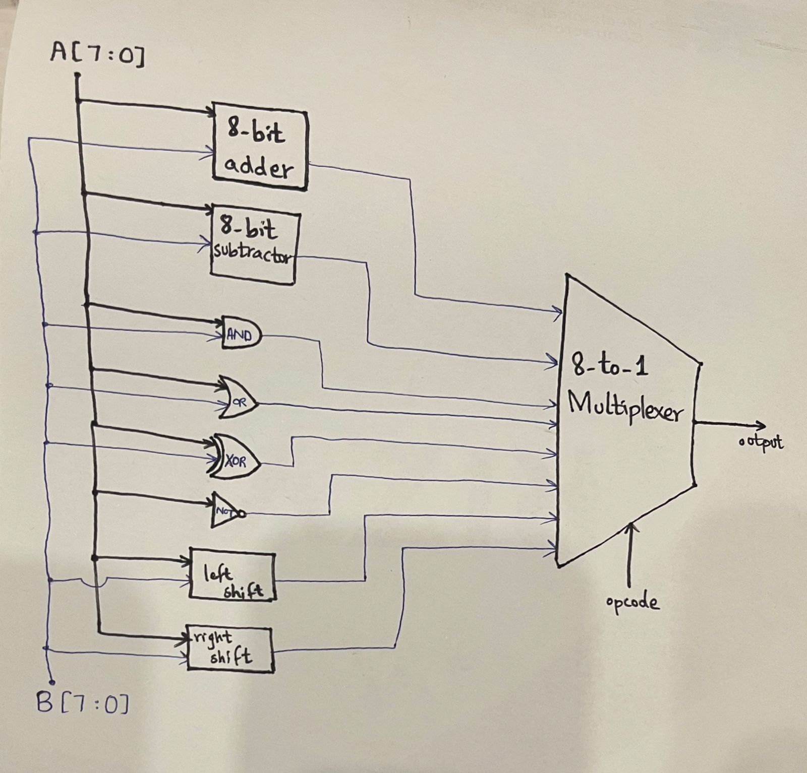

### 8-bit Adder
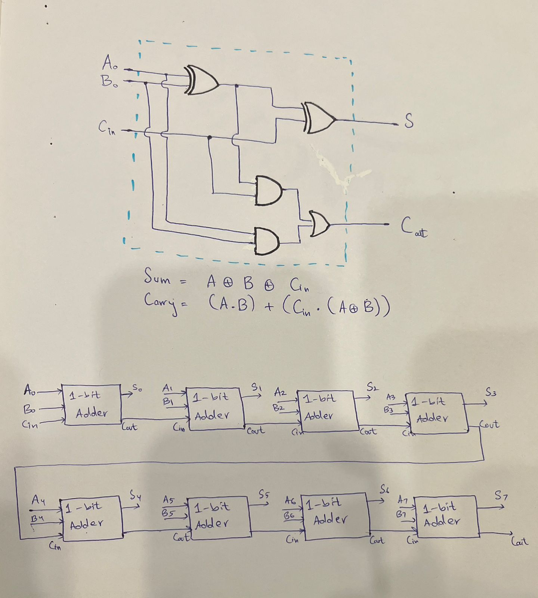


---

# Lab 1B: Priority Encoder with Enable

## Overview
A **priority encoder** is a digital circuit that encodes multiple input lines into a smaller number of output lines. Unlike a simple encoder, a priority encoder assigns priority to the inputs: if two or more inputs are active at the same time, the input with the **highest priority (MSB)** is considered, and its binary code is generated at the output.

In this project, we designed an **8-to-3 Priority Encoder** with:
- 8 active-high inputs (`I7` down to `I0`)
- 3-bit binary output (`O2 O1 O0`)
- An enable input (`EN`)
- A valid output (`V`) to indicate when at least one input is active.

The **most significant input (`I7`) has the highest priority**, while the **least significant input (`I0`) has the lowest priority**.

---

## Architecture
The architecture of the **8-to-3 priority encoder** consists of **eight input lines** and a single **enable input**. The encoder logic is built using **three OR gates** that generate the three output bits based on the highest-priority active input. Each output is further controlled by the **enable signal**, which is ANDed with the OR gate outputs to ensure that the encoder only produces a valid output when enabled.

## Block Diagram
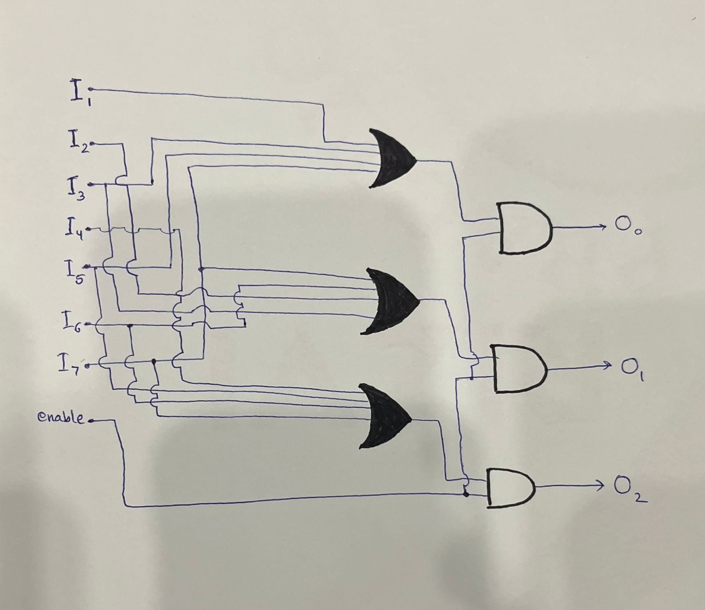

---

## Working
The encoder works as follows:
1. If multiple inputs are high, the **highest-index input** determines the output.
2. If no inputs are high, the `valid` signal (`V`) is `0` and the outputs are undefined or zero.
3. When enabled (`EN = 1`), the circuit checks inputs in descending order from `I7` to `I0`.

---

## Truth Table

|I7|I6|I5|I4|I3|I2|I1|I0||02|01|O0|
|--|--|--|--|--|--|--|--|--|--|--|--|
|0 |0 |0 |0 |0 |0 |0 |1 ||0 |0 |0 |        
|0|0|0|0|0|0|1|x||0|0|1|        
|0|0|0|0|0|1|x|x||0|1|0|              
|0|0|0|0|1|x|x|x||0|1|1|              
|0|0|0|1|x|x|x|x||1|0|0|             
|0|0|1|x|x|x|x|x||1|0|1|             
|0|1|x|x|x|x|x|x||1|1|0|             
|1|x|x|x|X|x|x|x||1|1|1|             

**Notes:**
- `x` means “don’t care” because higher-priority inputs mask lower ones.
- Example: If `I5=1` and `I2=1`, the output corresponds to `I5` (`101`).
---
## Simulation Waveform
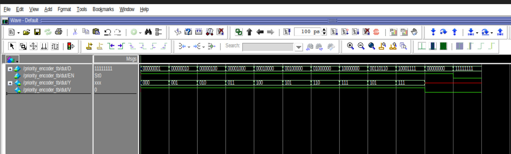

---

# ---------------------------LAB 2-------------------------
# Lab 2A: 32-bit Barrel Shifter
## Overview
A **Barrel Shifter** is a combinational circuit that can shift or rotate a data word by a specified number of bit positions in a **single cycle**. Unlike a serial shifter that shifts one bit at a time, the barrel shifter achieves the result in parallel using multiplexers, making it highly efficient for high-speed digital systems such as processors, cryptographic units, and DSP applications.

In this project, we implement a **32-bit Barrel Shifter** that supports both **left and right shifting** operations, as well as **logical shifts and rotations**.

---
##  Specifications of Our Design
- **Data Width**: 32-bit input and 32-bit output  
- **Shift Amount**: 5-bit input (allowing shift amounts from 0 to 31)  
- **Direction Control**: Selects left shift or right shift  
- **Mode Control**: Selects between logical shift and rotate operation  
- **Operation Cycle**: Single cycle (purely combinational)  

---

## Architecture
The design is based on a **multiplexer-based architecture**.  

- A **5-bit shift input** controls the shifting amount, where each bit corresponds to shifting by a power of two:
  - `S0`: shift by 1  
  - `S1`: shift by 2  
  - `S2`: shift by 4  
  - `S3`: shift by 8  
  - `S4`: shift by 16  

- At each stage, multiplexers select whether the input is shifted by the corresponding amount.  
- A total of **31 multiplexers** are used in the datapath to route the signals efficiently.  
- The **direction control** determines whether the shift occurs left or right.  
- The **mode control** selects between a **shift** (filling with zeros) or a **rotate** (wrapping around bits).  

## Block Diagram
**shifter**

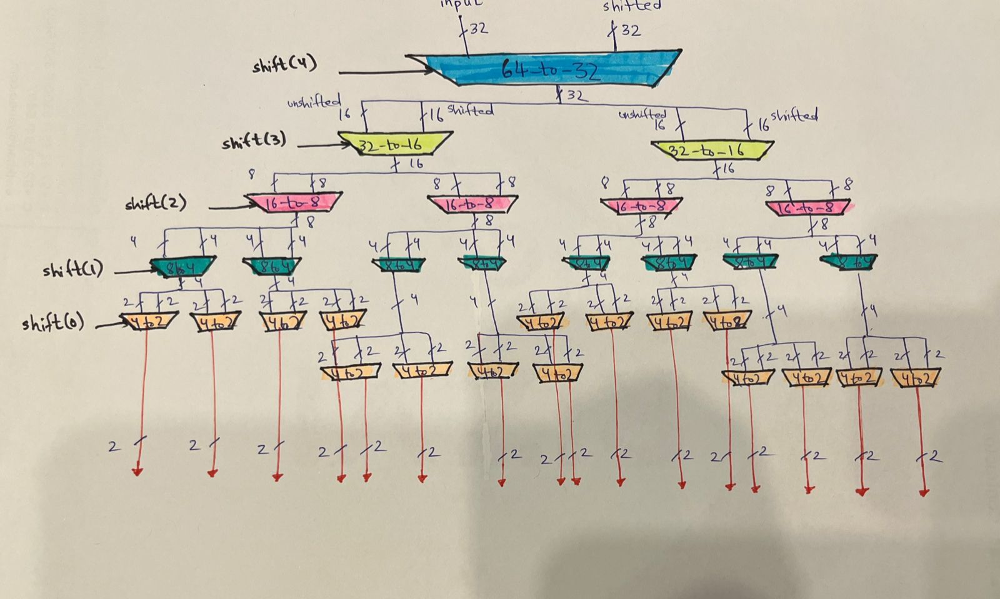

**top diagram**

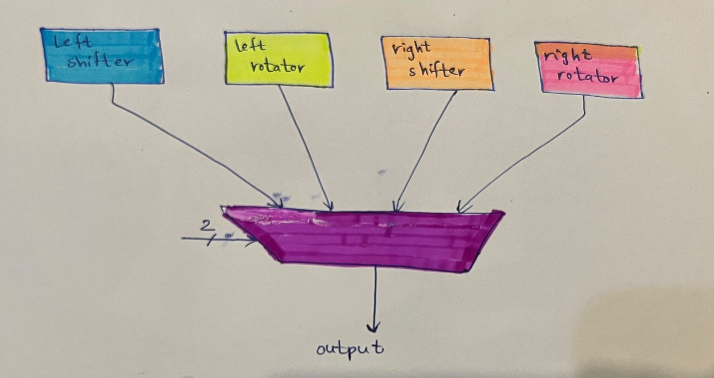

--- 

## Simulation Waveform
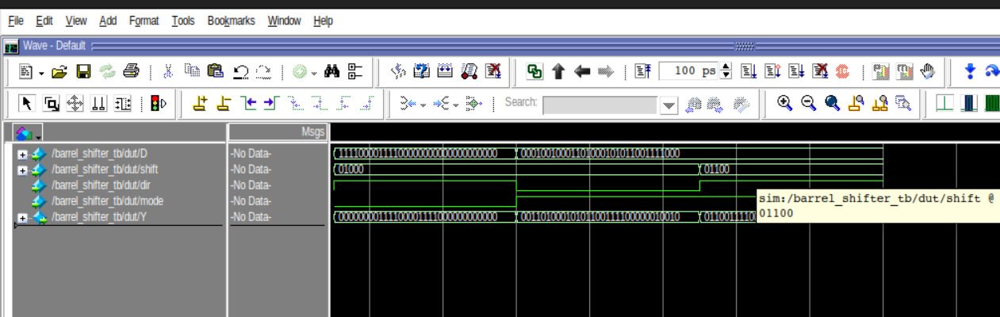

---

# Lab 2B: Binary Coded Decimal (BCD) Converter
## Overview
This project implements an **8-bit Binary to BCD Converter**.  
The purpose of the design is to convert an unsigned binary number (0–255) into its **three-digit BCD (Binary Coded Decimal)** representation.  
The conversion is done using a purely **combinational circuit**, ensuring single-cycle operation without sequential elements.

---

## Specifications
- **Input:** 8-bit binary number (0–255)  
- **Output:** 3-digit BCD (000–255)  
- **Algorithm:** Double-Dabble (Shift-and-Add-3)  
- **Design Style:** Purely combinational, no clocking  
- **Operation:** Single-cycle latency  

---

### Key Features:
- **Multiplexers:** Used for conditional add-3 adjustments during shifting  
- **Shift Bits:** 8 shifts (one per binary input bit)  
- **BCD Registers:** Three 4-bit registers (Hundreds, Tens, Units)  

---

## How It Works
1. Start with the **8-bit binary input** and initialize three BCD registers (`hundreds`, `tens`, `ones`) to zero.  
2. For each bit (from MSB to LSB):  
   - If any BCD digit ≥ 5, add 3 to it (using multiplexers for conditional logic).  
   - Shift all BCD digits left by 1 and bring in the next binary bit.  
3. After 8 shifts, the BCD registers hold the final decimal digits.  

## Simulation Waveform
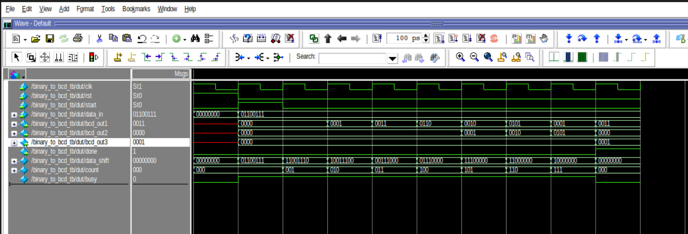

---

# ---------------------------LAB 3-------------------------
# Lab 3: Sequential Circuit Fundamentals  
## Lab 3A: Programmable Counter  

### Overview  
This project implements an **8-bit up/down programmable counter** with flexible control signals and status outputs. The counter can load a specific value, count up or down based on user control, and generate status flags such as **terminal count** and **zero detect**. The design emphasizes **synchronous operation** to ensure predictable behavior and reliable performance in digital systems.  

### Specifications  
- **Counter Width:** 8-bit  
- **Control Inputs:**  
  - `load`: Load a new starting value into the counter  
  - `enable`: Enable/disable counting operation  
  - `up_down`: Select counting direction (up = 1, down = 0)  
  - `rst_n`: Active-low reset for initialization  
- **Data Inputs:**  
  - `load_value`: Value to be loaded into the counter  
  - `max_count`: Programmable upper limit for counting  
- **Outputs:**  
  - `count`: Current counter value  
  - `tc`: Terminal count flag (reached `max_count` in up mode or 0 in down mode)  
  - `zero`: Asserted when counter reaches zero  

- **Status Flags (TC and Zero):**  
  - `tc` (Terminal Count): Activated when the counter reaches the upper limit in up mode or the minimum value in down mode.  
  - `zero`: Indicates the counter has reached zero regardless of counting direction.  

### How It Works  
1. **Initialization:** On reset, the counter value is set to `0`.  
2. **Load Operation:** When `load` is asserted, the counter immediately loads `load_value`.  
3. **Counting:**  
   - If `enable = 1`, the counter begins updating on each clock cycle.  
   - `up_down = 1` → Counter increments until `max_count`, then asserts `tc`.  
   - `up_down = 0` → Counter decrements until zero, then asserts `zero`.  
4. **Status Monitoring:** The `tc` and `zero` outputs allow external logic to monitor counter boundaries and react accordingly.  

### State Transition Diagram
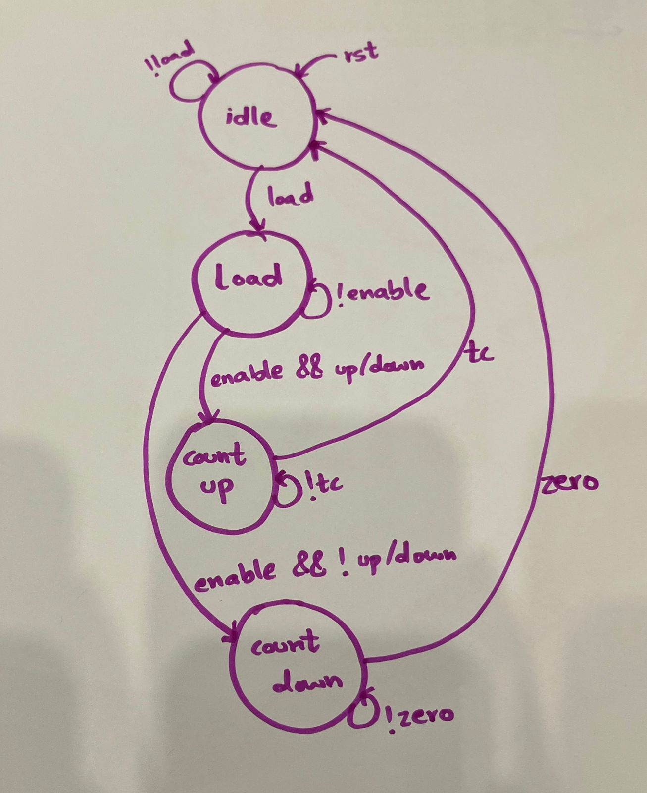

 ## Simulation Waveform
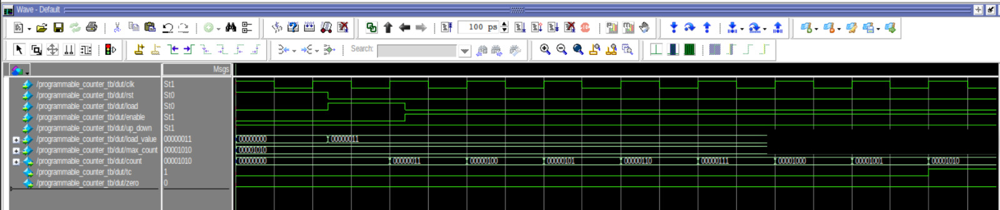

# --------------------LAB 4-------------------
# Lab 4A: Traffic Light Controller

## Project Overview
This project implements a **Traffic Light Controller** for a 4-way intersection (North-South and East-West).  
The design manages normal traffic cycles, emergency overrides, and pedestrian crossing requests.

---

## Design Specifications
- **Intersection Setup**
  - Two main directions: **North-South (NS)** and **East-West (EW)**
  - Each direction has **Red, Yellow, and Green signals**

- **Normal Cycle**
  - Green → 30 seconds
  - Yellow → 5 seconds
  - Red → Remains active while the opposite direction has Green/Yellow

- **Emergency Mode**
  - Triggered immediately on `emergency` input
  - All signals turn **Red with flashing**
  - Ensures safety by stopping all traffic

- **Pedestrian Request Handling**
  - Pedestrian request (`pedestrian_req`) is only checked during the state **NS = RED, EW = YELLOW**
  - When the request occurs:
    - Both NS and EW lights switch to **Red**
    - Pedestrian walk signal (`ped_walk`) is enabled.
  - After pedestrian crossing time ends:
    - The controller transitions back to the **initial state** i.e. (NS = Green, EW = Red).

- **Timer**
  - A timer module maintains delays for Green and Yellow states.

- **State Diagram**
  States considered:
  - `NS_GREEN_EW_RED`
  - `NS_YELLOW_EW_RED`
  - `NS_RED_EW_GREEN`
  - `NS_RED_EW_YELLOW`
  - `PEDESTRIAN_CROSSING`
  - `EMERGENCY_ALL_RED`

  
---

# Lab 4B: Vending Machine Controller

## Project Overview
This project implements a **Vending Machine Controller** using a **Finite State Machine (FSM)**.  
The vending machine accepts 5¢, 10¢, and 25¢ coins to purchase a 30¢ item, provides the correct change, and also allows users to request a coin return.  

---

## Design Specifications
- **Accepted Coins**
  - 5¢, 10¢, 25¢  

- **Item Price**
  - Fixed price = **30¢**  

- **Normal Operation**
  - Tracks the total amount inserted
  - Dispenses item when amount ≥ 30¢
  - Returns excess amount as change (prioritizing higher-value coins first)

- **Coin Return**
  - User can press `coin_return` button
  - Machine returns the total inserted amount
  - Resets to idle (0¢ state)

---

## State Table

| Current State | Input Coin | Next State | Output (Action) |
|---------------|------------|------------|-----------------|
| **S0 (0¢)**   | 5¢         | S5         | Display 5¢ |
|               | 10¢        | S10        | Display 10¢ |
|               | 25¢        | S25        | Display 25¢ |
|               | Return Btn | S0         | Return 0¢ |
| **S5 (5¢)**   | 5¢         | S10        | Display 10¢ |
|               | 10¢        | S15        | Display 15¢ |
|               | 25¢        | S30        | Vend Item |
|               | Return Btn | S0         | Return 5¢ |
| **S10 (10¢)** | 5¢         | S15        | Display 15¢ |
|               | 10¢        | S20        | Display 20¢ |
|               | 25¢        | S30+       | Vend Item + Return 5¢ |
|               | Return Btn | S0         | Return 10¢ |
| **S15 (15¢)** | 5¢         | S20        | Display 20¢ |
|               | 10¢        | S25        | Display 25¢ |
|               | 25¢        | S30+       | Vend Item + Return 10¢ |
|               | Return Btn | S0         | Return 15¢ |
| **S20 (20¢)** | 5¢         | S25        | Display 25¢ |
|               | 10¢        | S30        | Vend Item |
|               | 25¢        | S30+       | Vend Item + Return 15¢ |
|               | Return Btn | S0         | Return 20¢ |
| **S25 (25¢)** | 5¢         | S30        | Vend Item |
|               | 10¢        | S30+       | Vend Item + Return 5¢ |
|               | 25¢        | S30+       | Vend Item + Return 20¢ |
|               | Return Btn | S0         | Return 25¢ |
| **S30 (30¢+)**| Any Coin   | Reset→S0   | Vend Item + Return (extra – 30¢) |

---

## State Transition Diagram
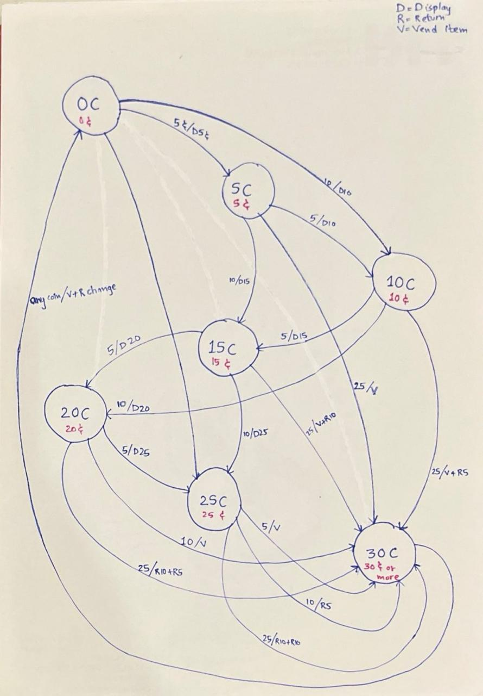

---

## Code Description
The design is implemented in **SystemVerilog** as a **Moore FSM**.

- **Inputs**
  - `clk`: System clock
  - `rst_n`: Active-low reset
  - `coin_5`, `coin_10`, `coin_25`: Coin insertion signals
  - `coin_return`: Coin return button  

- **Outputs**
  - `dispense_item`: Activates when 30¢ has been inserted
  - `return_5`, `return_10`, `return_25`: Signals to return coins
  - `amount_display[5:0]`: Current inserted amount

- **FSM States**
  - States represent cumulative amount inserted (`S0`, `S5`, …, `S30`)
  - Transitions occur based on coin input
  - From `S30`, item is dispensed and machine resets to idle  

- **Coin Return Handling**
  - At any state, pressing `coin_return` returns the equivalent amount in coins
  - After return, FSM resets to `S0`  

- **Change Handling**
  - If amount > 30¢ at vend time, machine returns change before resetting  

---

# -------------------LAB 5-------------------
# Lab 5A: Multi-Mode Timer

### Specification
- **32-bit programmable timer** with multiple modes:
  - **One-shot**: Count down once and stop  
  - **Periodic**: Reload and restart automatically  
  - **PWM**: Generate PWM with programmable duty cycle  

---

### Design Approach

1. **Mode Control Logic**  
   - Decode the `mode` input:  
     - `00`: Off  
     - `01`: One-shot  
     - `10`: Periodic  
     - `11`: PWM  

2. **Reload Mechanism**  
   - In **one-shot**, stop at zero.  
   - In **periodic**, reload from `reload_val`.  

3. **PWM Duty Cycle**  
   - Use `compare_val` to determine **ON** time vs **OFF** time.  

---

### Code Framework


## Input Signals
- **clk** (1 MHz) → Main system clock input.  
- **rst_n** → Active-low reset, clears all counters and outputs.  
- **mode [1:0]** → Selects timer mode:  
  - `00` → Off  
  - `01` → One-shot  
  - `10` → Periodic  
  - `11` → PWM  
- **prescaler [15:0]** → Divides the input clock to generate a slower tick.  
- **reload_val [31:0]** → Value loaded into the counter when starting or reloading.  
- **compare_val [31:0]** → Duty cycle threshold for PWM mode.  
- **start** → Starts the timer and loads `reload_val`.  

---

## Output Signals
- **timeout** → One-cycle pulse when the counter reaches zero (used for interrupt).  
- **pwm_out** → PWM signal, high when `counter > compare_val`.  
- **current_count [31:0]** → Current value of the 32-bit counter.  
- **tick_out** → Pulse from prescaler (debug/verification of divided clock).  

---

## Internal Working

### 1. **Prescaler Logic**
- A 16-bit counter `prescaler_cnt` divides the input clock.  
- When `prescaler_cnt == prescaler`, it resets and generates a **tick pulse (`tick_en`)**.  
- This tick drives the **main 32-bit counter**, so it doesn’t decrement every cycle of `clk`.  

### 2. **Main Counter**
- Counter behavior depends on the selected `mode`:  

#### Off Mode (`mode=00`)
- Counter and outputs are cleared.  
- `pwm_out` stays low.  

#### One-Shot Mode (`mode=01`)
- Counter loads `reload_val` when `start` is asserted.  
- Decrements on each tick until it reaches 0.  
- When 0 → asserts `timeout` for 1 cycle and stops (`running=0`).  

#### Periodic Mode (`mode=10`)
- Counter loads `reload_val` when `start` is asserted.  
- Decrements on each tick.  
- When it reaches 0 → reloads automatically from `reload_val` and asserts `timeout`.  
- Repeats continuously.  

#### PWM Mode (`mode=11`)
- Counter decrements on each tick and reloads when it reaches 0.  
- `pwm_out` is high when `counter > compare_val`.  
- Thus, duty cycle = `(reload_val - compare_val) / reload_val`.  

### 3. **Control & Initialization**
- `start` → Loads `reload_val` into counter and enables `running`.  
- `rst_n=0` → Resets everything (counter = 0, outputs cleared).  
- `timeout` is always a **single-cycle pulse** (not latched).  

---

# -------------------LAB 6------------------
# Lab 6A: Synchronous SRAM Controller

## Overview
This module implements a **controller for a 32K × 16 synchronous SRAM**.  
It supports:
- **Single-cycle read and write operations**  
- **Address and data bus management**  
- **Chip Enable (CE), Output Enable (OE), and Write Enable (WE)** control signals  

---

## Input Signals
- **clk** → System clock.  
- **rst_n** → Active-low reset.  
- **read_req** → Asserted when a read operation is requested.  
- **write_req** → Asserted when a write operation is requested.  
- **address [14:0]** → Memory address (32K locations).  
- **write_data [15:0]** → Data to be written into SRAM.  

---

## Output Signals
- **read_data [15:0]** → Data read from SRAM.  
- **ready** → Indicates completion of read/write operation.  

---

## SRAM Interface Signals
- **sram_addr [14:0]** → Address lines connected directly to SRAM.  
- **sram_data [15:0]** → Bidirectional data bus.  
- **sram_ce_n** → Chip Enable (active-low).  
- **sram_oe_n** → Output Enable (active-low, used during reads).  
- **sram_we_n** → Write Enable (active-low, used during writes).  

---

## Internal Working

### 1. **Address Handling**
- `sram_addr` is always driven by the input `address`.  
- 
### 2. **Read Cycle**
- `read_req = 1` → Controller enables SRAM for read:
  - `sram_ce_n = 0` (chip enabled)  
  - `sram_oe_n = 0` (output enabled)  
  - `sram_we_n = 1` (no write)  
- On next clock, incoming `sram_data` is latched into `read_data`.  
- `ready = 1` indicates valid data.  

### 3. **Write Cycle**
- `write_req = 1` → Controller enables SRAM for write:
  - `sram_ce_n = 0` (chip enabled)  
  - `sram_we_n = 0` (write enabled)  
  - `sram_oe_n = 1` (disable output to avoid conflict)  
- `write_data` is placed on `sram_data`.  
- `ready = 1` indicates the write is complete.  

### 4. **Idle State**
- If no request:  
  - `sram_ce_n = 1`, `sram_we_n = 1`, `sram_oe_n = 1`  
  - Data bus is released (high-Z).  
  - `ready = 0`.  

---

# ------------------LAB 7------------------
# Lab 7A: Synchronous FIFO Design

## Overview
In this lab, we designed and implemented a **Synchronous FIFO (First-In-First-Out) buffer**.  
A FIFO is widely used in digital systems to temporarily store data between producer and consumer modules running at the **same clock domain**.  

---

## Specifications
- **FIFO Type**: Synchronous FIFO  
- **Data Width**: Configurable (`DATA_WIDTH` parameter, default = 8 bits)  
- **FIFO Depth**: Configurable (`FIFO_DEPTH` parameter, default = 16 entries)  
- **Flags**:
  - `full`: FIFO completely filled  
  - `empty`: FIFO has no data  
  - `almost_full`: Activated before FIFO is full (threshold = `FIFO_DEPTH-2`)  
  - `almost_empty`: Activated before FIFO is empty (threshold = 2)  
- **Counter**: Maintains the number of stored elements  
- **Reset**: Active-low (`rst_n`)  

---

## Design Methodology
1. **Pointer Width Selection**
   - Used `$clog2(FIFO_DEPTH)` to calculate pointer width dynamically.  
   - Ensures flexibility for any FIFO depth.  

2. **Write Logic**
   - On `wr_en`, input data is written to memory at `wr_ptr`.  
   - Pointer auto-increments after each write.  

3. **Read Logic**
   - On `rd_en`, data is read from memory at `rd_ptr`.  
   - Pointer auto-increments after each read.  

4. **Count Management**
   - A counter keeps track of the number of valid entries in FIFO.  
   - Increment on write, decrement on read.  

5. **Flag Generation**
   - Simple combinational comparisons of `count` with thresholds.  

6. **Reset Strategy**
   - Active-low reset clears pointers, memory, and counter.  

---

# Lab 7B: Asynchronous FIFO

## Overview
In this lab, we designed and implemented an **Asynchronous FIFO** to safely transfer data between two modules operating in **different clock domains**.  
Unlike synchronous FIFOs, asynchronous FIFOs must handle **clock domain crossing (CDC)** issues such as metastability and incorrect flag generation.  

---

## Specifications
- **FIFO Type**: Asynchronous FIFO  
- **Data Width**: Configurable (`DATA_WIDTH`, default = 8 bits)  
- **FIFO Depth**: Configurable (`FIFO_DEPTH`, default = 16 entries)  
- **Write Clock**: `wr_clk`  
- **Read Clock**: `rd_clk`  
- **Flags**:
  - `full`: Indicates FIFO cannot accept more writes  
  - `empty`: Indicates FIFO has no data  
- **Reset**: Active-low (`rst_n`), clears pointers and memory  

---

## Code Overview
## Inputs
- **wr_clk** → Write clock domain.  
- **rd_clk** → Read clock domain.  
- **rst_n** → Active-low reset.  
- **wr_en** → Write enable.  
- **wr_data [DATA_WIDTH-1:0]** → Data to write.  
- **rd_en** → Read enable.  

## Outputs
- **rd_data [DATA_WIDTH-1:0]** → Data read out.  
- **full** → High when FIFO is full (write side).  
- **empty** → High when FIFO is empty (read side).  

---

## Working Principle
1. **Write Operation (wr_clk domain)**  
   - If `wr_en=1` and FIFO not full → `wr_data` written into memory at `wr_ptr_bin`.  
   - Pointers updated, `wr_ptr_gray` generated.  

2. **Read Operation (rd_clk domain)**  
   - If `rd_en=1` and FIFO not empty → data read from `rd_ptr_bin`.  
   - Pointers updated, `rd_ptr_gray` generated.  

3. **Pointer Synchronization**  
   - `wr_ptr_gray` synchronized into `rd_clk` domain for empty detection.  
   - `rd_ptr_gray` synchronized into `wr_clk` domain for full detection.  

4. **Flag Logic**  
   - **Empty:** when both pointers match in read domain.  
   - **Full:** when write pointer is exactly one wrap ahead of read pointer in write domain.  

---

# ------------------LAB 8--------------------
# Lab 8: UART Transmitter

## Overview
This project implements a **UART (Universal Asynchronous Receiver/Transmitter) Transmitter**. 
UART is widely used in serial communication systems, transmitting data bit-by-bit over a single wire.  

The design includes:
- A **state machine** to control transmission flow,
- A **datapath** with a shift register for serializing data,
- A **Fifo** to store data to be transmitted,

---

## Specifications

- **Data Format**:  
  - 8 data bits,  
  - 1 start bit (logic `0`),  
  - 1 stop bit (logic `1`),  
- **Frame_error**: Frame error logic has been incorporated. High when stop bit isn't 1.  
- **bit_counter**: Keeps track of how many bits have been transmitted.
- **Transmit FIFO**: Can buffer multiple bytes.  
- **Status Flags**:  
  - `busy`: indicates transmission in progress.
  - `tx_done`: high when transmission completes.
  - `data_available`: high when fifo is not empty.
  -  FIFO status (`full`/`empty`) .  


---

## Design Steps
   - **Moore FSM**: Moore FSM has been implemented.

   -  **UART Frame Format**  
```
  | Start (0) | 8 Data Bits | Stop (1) |
```
   -  **Transmit State Machine (FSM)**  
      -  **IDLE** → Waits for `load` signal.  
      - **LOAD** → Loads data into shift register.  
      - **TRANSFER** → Shifts data serially at baud rate until complete.  
      - **DONE** → resets flags.

   - **Dataflow**  
      - Uses a **10-bit shift register** (`start + data + stop`).  
      - Shift register gets data from fifo
      - Shifts out bits one at a time on `tx_out`.  
      - Controlled by baud-rate ticks.  

   - **Top Module**  
    FIFO, Controller and Datapath integrated.  
---
## State Transition Diagram
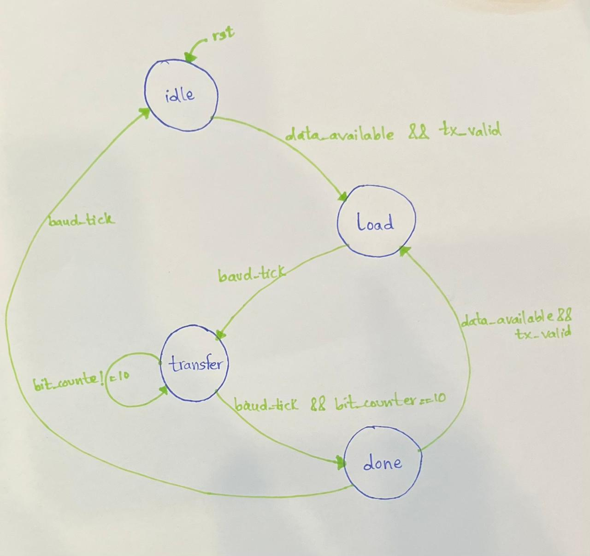

---

# UART Receiver

### Overview
The **UART Receiver** module is designed to reliably receive serial data, sample it at correct intervals, and transfer it into a FIFO buffer for further processing. 

### Design Specifications

- **Baud rate**: Synchronized with transmitter through clock division.
- **Data Sampling**: Samples each data bit at the `baud_tick`.
- **Stop Bit Validation**: Ensures correct frame termination.
- **Frame Error Detection**: Flags incorrect framing.
- **FIFO Integration**: Stores received bytes in an 8-bit RX FIFO for further use.

### Input Signals
- **clk** : System clock for synchronous operation.
- **reset_n** : Active-low reset to initialize the receiver.
- **data_in** : Serial data input line from the transmitter.
- **rd_data** : Read enable signal to fetch data from the RX FIFO.

### Output Signals
- **fifo_data_out [7:0]** : 8-bit parallel output data from the RX FIFO.
- **fifo_full** : RX FIFO full flag.
- **fifo_empty** : RX FIFO empty flag.
- **frame_error**  : Indicates invalid frame detection.
- **rx_done**    : Signals that a byte has been received and stored.

### Working
1. **Idle State**: The receiver waits for a falling edge on `data_in`, indicating the start bit.
2. **Data Reception**: The next 8 data bits are sampled at the baud_tick and shifted into a register.
3. **Stop Bit Check**: The receiver verifies that the stop bit is logic high.
4. **Frame Validation**: If the stop bit is valid, the byte is written into the RX FIFO. Otherwise, a frame error is flagged.
5. **FIFO Output**: The stored byte can be read using `rd_data`, and FIFO status flags indicate availability.
## State Transition Diagram


# ----------------LAB 9---------------------
# Lab 9: SPI Master Controller

### Overview
The **SPI Master Controller** module is designed to support serial communication with one or more SPI slave devices. It provides configurability for **clock polarity (CPOL)**, **clock phase (CPHA)**, and **clock frequency**, making it compatible with all four SPI modes. The controller manages chip select signals, generates the SPI clock, and enables **full-duplex bidirectional data transfer**.  

---

### Design Specifications
- **Configurable CPOL/CPHA** : Supports all four SPI modes.
- **Variable Clock Frequency** : Achieved using a programmable clock divider.
- **Automatic Slave Select Control** : Controller asserts/deasserts chip select signals automatically.
- **Bidirectional Data Transfer** : Simultaneous transmit (MOSI) and receive (MISO).
- **Multi-Slave Support** : Up to `NUM_SLAVES` slave devices selectable.

---

### Input Signals
- **clk** : System clock.
- **rst_n** : Active-low reset.
- **tx_data [DATA_WIDTH-1:0]** : Parallel data to transmit.
- **slave_sel [$clog2(NUM_SLAVES)-1:0]** : Selects which slave device is active.
- **start_transfer** : One-cycle pulse to begin SPI communication.
- **cpol** : Clock polarity (idle level of SPI clock).
- **cpha** : Clock phase (sample/shift edge selection).

---

### Output Signals
- **rx_data [DATA_WIDTH-1:0]** : Parallel data received from MISO.
- **transfer_done** : Asserted when a complete transfer is finished.
- **busy** : Indicates that a transfer is ongoing.
- **spi_clk** : SPI serial clock generated by the master.
- **spi_mosi** : Master Out Slave In line (transmit data).
- **spi_cs_n [NUM_SLAVES-1:0]** : Active-low chip select lines for slaves.

---

### Working
1. **Idle State**:  
   The controller waits for `start_transfer`. The selected slave is stored, and the first MOSI bit is prepared.
   
2. **Chip Select Assertion**:  
   The appropriate slave select line is pulled low after the required setup delay.

3. **Data Transfer**:  
   - The SPI clock (`spi_clk`) is generated based on `clk_div`, `cpol`, and `cpha`.  
   - **MOSI**: Data is shifted out bit-by-bit from the master to the slave.  
   - **MISO**: Data is sampled from the slave into the receive shift register.  
   - Transmission and reception occur **simultaneously** (full-duplex).

4. **Chip Select Deassertion**:  
   After the last bit is transferred and sampled, the chip select remains asserted for the hold time, then released.

5. **Completion**:  
   The received byte is latched to `rx_data`, and `transfer_done` is asserted for one cycle. The controller returns to Idle.

---

## Simulation Waveform
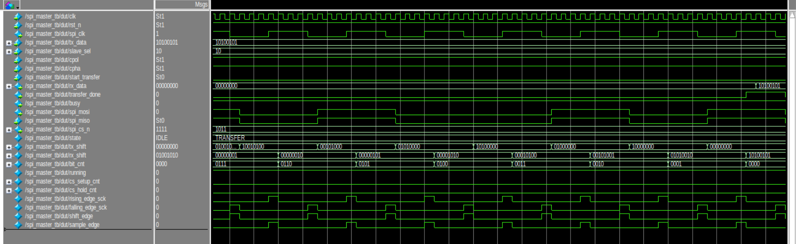


# ----------------LAB 10---------------
# Lab 10: AXI4-Lite Interface Design

The **AXI4-Lite interface** is a lightweight subset of the AXI4 protocol, designed for simple memory-mapped communication between a **master** (CPU, controller) and a **slave** (peripheral).  
This project implements an **AXI4-Lite Slave** with a **register bank of 16 × 32-bit registers**.
## AXI4-Lite Signals
> AXI4-Lite has 5 channels:
### 1. Write Address Channel
- **AWADDR** : Address to write  
- **AWVALID** : Master valid signal  
- **AWREADY** : Slave ready signal  

### 2. Write Data Channel
- **WDATA** : Data to write  
- **WSTRB** : Byte strobe  
- **WVALID** : Master valid  
- **WREADY** : Slave ready  

### 3. Write Response Channel
- **BRESP** : Response (OKAY/SLVERR)  
- **BVALID** : Slave valid  
- **BREADY** : Master ready  

### 4. Read Address Channel
- **ARADDR** : Address to read  
- **ARVALID** : Master valid  
- **ARREADY** : Slave ready  

### 5. Read Data Channel
- **RDATA** : Data from slave  
- **RRESP** : Response  
- **RVALID** : Slave valid  
- **RREADY** : Master ready  

## AXI4-Lite Transactions

### Write Transaction
1. Master asserts `AWADDR + AWVALID`  
2. Slave asserts `AWREADY`  
3. Master sends `WDATA + WVALID`  
4. Slave asserts `WREADY`  
5. Slave responds with `BRESP + BVALID`  

### Read Transaction
1. Master asserts `ARADDR + ARVALID`  
2. Slave asserts `ARREADY`  
3. Slave sends `RDATA + RVALID + RRESP`  
4. Master asserts `RREADY`  

## Data Flow Overview

1. **Master initiates a transaction**:
   - Sends **address** and **control signals** for read/write.
   - Asserts `valid` signals on the appropriate channel.

2. **Slave responds**:
   - Accepts the transaction by asserting `ready`.
   - Returns write response or read data depending on operation.

3. **Handshake Protocol**:
   - Data transfer occurs only when **both `valid` and `ready` are high** at the same clock edge.
  
---


## Simulation Waveform
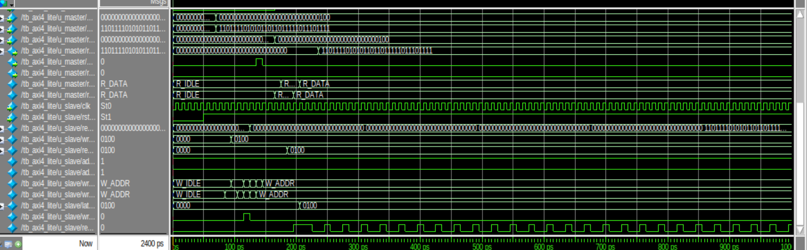


## Sources and AI usage

- Understanding the working of UART, API,AXI, BCD, Barrel shifter
- Revised concepts of Moore and Mealy FSM 
- Assistance in writing System Verllog 
- Code refining and error fixing
- How to covert binary encodidng to gray encoding