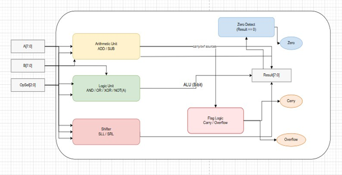

# LAB1: Basic Combinational Circuits 
**Lab1A: 8‑bit ALU**  
Module: alu_8bit   

Purpose: The alu_8bit module is an 8-bit Arithmetic Logic Unit (ALU) that performs a set of arithmetic and logical operations on two signed 8-bit inputs a and b. 
The specific operation is selected using a 3-bit control signal op_sel. 
The ALU produces an 8-bit result along with three status flags (zero, carry, and overflow) to indicate the outcome of the operation.

**Supported operations**   

•	~a (bitwise NOT)   
•	a + b (addition with carry and overflow detection)   
•	a - b (subtraction with carry and overflow detection)   
•	a & b (bitwise AND)   
•	a | b (bitwise OR)   
•	a ^ b (bitwise XOR)   
•	a << b (logical shift left)   
•	a >> b (logical shift right)   

**Signals**

Inputs   
•	a [7:0]: First signed operand for the operation.   
•	b [7:0]: Second signed operand for the operation or shift amount (for shift operations).   
•	op_sel [2:0]: Operation selector that decides which arithmetic/logic function to perform.   
Outputs   
•	result [7:0]: The 8-bit result of the selected operation.   
•	zero: Status flag, set to 1 when the result is zero.   
•	carry: Status flag, set when there is a carry out (for addition/subtraction).   
•	overflow: Status flag, set when signed overflow occurs during addition or subtraction.   

**ALU Operation Flags**

This table shows the flags affected by each ALU operation based on the 3-bit 'op_sel' input.

| op_sel | Operation | Flags Used |
|--------|-----------|------------|
| 000    | NOT       | zero       |
| 001    | ADD       | carry, overflow, zero |
| 010    | SUB       | carry, overflow, zero |
| 011    | AND       | zero       |
| 100    | OR        | zero       |
| 101    | XOR       | zero       |
| 110    | SLL       | zero       |
| 111    | SRL       | zero       |

**ALU Datapath**

**8-Bit ALU Operation Descriptions**

**1. ADD (op_sel = 000)**

- Performs unsigned and signed addition of A and B.  
- The 9th bit (sum[8]) is exposed as **carry**.  
- **Signed overflow** occurs when A[7] and B[7] are equal and differ from `result[7].  

**Flags:** zero, carry, overflow

#

**2. AND (op_sel = 011)**
 
 **Flags:** zero (1 if result is all zeros)  

| A | B | A & B |
|---|---|-------|
| 0 | 0 | 0     |
| 0 | 1 | 0     |
| 1 | 0 | 0     |
| 1 | 1 | 1     |

#

**3. OR (op_sel = 100)**
  
**Flags:** zero only  

| A | B | A &#124; B |
|---|---|-----------|
| 0 | 0 | 0         |
| 0 | 1 | 1         |
| 1 | 0 | 1         |
| 1 | 1 | 1         |

#

**4. XOR (op_sel = 101)**

**Flags:** zero only  

| A | B | A ^ B |
|---|---|-------|
| 0 | 0 | 0     |
| 0 | 1 | 1     |
| 1 | 0 | 1     |
| 1 | 1 | 0     |
#

**5. SUB (op_sel = 010)**
  
**Flags:** overflow 

#

**6. NOT (op_sel = 000)**
 
 
- **Flags:** zero

| A | ~A |
|---|----|
| 0 | 1  |
| 1 | 0  |

#

**7. SLL (op_sel = 110)**

- **Logical left shift** by B. Bits shift toward **MSB**; zeros fill **LSB**.  
- For B ≥ 8, result becomes zero.  
- **Flags:** zero  

**8. SRL (op_sel = 111)**

- **Logical right shift** by B. Bits shift toward **LSB**; zeros fill **MSB**.  
- Uses >> in SystemVerilog (logical shift).  
- **Flags:** zero 
#
**Resources**

I did most of the work by myself. I only looked at online articles and AI help to understand how carry and overflow work in ADD and SUB operations.

#
**Design Review Checklist **

- [x] Specification completely understood  
- [x] Block diagrams drawn and reviewed (ALU datapath & flag logic)  
- [x] Consistent naming conventions (e.g., `op_sel`, `result`, `carry`)  
- [x] No combinational loops  
- [x] No unintended latches   
 
