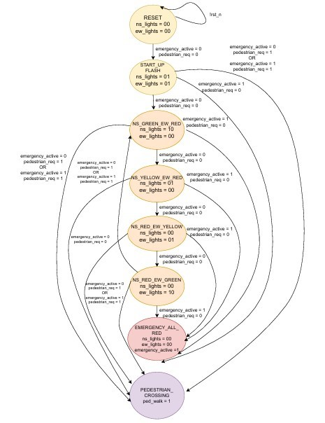

# Lab 4: Finite State Machines 
**Lab 4A: Traffic Light Controller**

Module: traffic_controller   

Purpose:
The purpose of the `traffic_controller` module is to design and implement a traffic light control system for a four-way intersection using a finite state machine (FSM).  
- The controller manages the timing and sequencing of green, yellow, and red lights for both north-south and east-west directions.  
- Pedestrian crossing requests have the **highest priority**, followed by emergency vehicle overrides.  
#
**Signals**  

•	clk – Input: 1 Hz system clock used for timing and FSM transitions.   
•	rst_n – Input: Active-low asynchronous reset; initializes the controller to all-red safe state.   
•	emergency – Input: Emergency override signal; when high, forces all lights to red (flashing).   
•	pedestrian_req – Input: Pedestrian crossing request; triggers pedestrian walk cycle.   
•	ns_lights [1:0] – Output: North-South traffic lights. Encoded as 2’b00 = OFF, 2'b01 = Red, 2’b10 = Yellow, 2’b11 = Green.     
•	ew_lights [1:0] – Output: East-West traffic lights. Encoded as 2’b01 = Red, 2’b10 = Yellow, 2’b11 = Green.   
•	ped_walk – Output: Pedestrian walk signal; high when it is safe for pedestrians to cross.   
•	emergency_active – Output: Indicates when the FSM is in emergency mode.   

#
## State Machine

**FSM**

 
# 
**All States Clearly Labeled**  

The FSM consists of the following states:   
•	IDLE – Reset/initial state, system is inactive.   
•	STARTUP_FLASH – Startup sequence, lights flash red for initialization.   
•	NS_GREEN_EW_RED – North-South green, East-West red.   
•	NS_YELLOW_EW_RED – North-South yellow, East-West red.   
•	NS_RED_EW_GREEN – North-South red, East-West green.   
•	NS_RED_EW_YELLOW – North-South red, East-West yellow.   
•	EMERGENCY_ALL_RED – Emergency override state, all signals red (flashing).   
•	PEDESTRIAN_CROSSING – Pedestrian walk phase, all vehicle lights red.   
#
**All Transitions with Conditions**

•	IDLE → STARTUP_FLASH : occurs automatically on reset release.   
•	STARTUP_FLASH → NS_GREEN_EW_RED : if no emergency and no pedestrian request.   
•	NS_GREEN_EW_RED → NS_YELLOW_EW_RED : after 30 cycles, if no higher-priority request.   
•	NS_YELLOW_EW_RED → NS_RED_EW_GREEN : after 5 cycles, if no higher-priority request.   
•	NS_RED_EW_GREEN → NS_RED_EW_YELLOW : after 30 cycles, if no higher-priority request.  
•	NS_RED_EW_YELLOW → NS_GREEN_EW_RED : after 5 cycles, if no higher-priority request.   
•	Any traffic state → EMERGENCY_ALL_RED : if emergency = 1.    
•	Any traffic state → PEDESTRIAN_CROSSING : if pedestrian_req = 1.   
•	EMERGENCY_ALL_RED → prev_state : after 15 cycles or when emergency = 0.   
•	PEDESTRIAN_CROSSING → prev_state : after 15 cycles or when pedestrian_req = 0.  
# 
**Reset State Identified**    

•	On reset (rst_n = 0), the FSM initializes to IDLE state with all outputs inactive.   
#
**Timing Relationships Specified**

•	State durations are determined by the counter.   
•	Green: 30 cycles (30 seconds).   
•	Yellow: 5 cycles (5 seconds).   
•	Pedestrian crossing: 15 cycles (15 seconds).   
•	Emergency red: 15 cycles (15 seconds, flashing).   
•	Counter resets whenever a state transition occurs, ensuring precise timing.
#
**FSM type**  

The traffic controller is implemented as a **Moore machine**, where all outputs depend only on the current state and not directly on the inputs.  
#
**State Transition Table**

| Current State           | Condition / Inputs                        | Next State                | NS Lights | EW Lights | Ped Walk | Emergency Active |
|-------------------------|------------------------------------------|--------------------------|-----------|-----------|----------|-----------------|
| IDLE                    | rst_n released                             | STARTUP_FLASH            | 00        | 00        | 0        | 0               |
| STARTUP_FLASH           | no emergency, no pedestrian_req           | NS_GREEN_EW_RED          | 10        | 01        | 0        | 0               |
| STARTUP_FLASH           | emergency = 1                             | STARTUP_FLASH            | 10        | 01        | 0        | 0               |
| STARTUP_FLASH           | pedestrian_req = 1                        | STARTUP_FLASH            | 10        | 01        | 0        | 0               |
| NS_GREEN_EW_RED         | counter < 30, no requests                 | NS_GREEN_EW_RED          | 11        | 01        | 0        | 0               |
| NS_GREEN_EW_RED         | counter = 30, no requests                 | NS_YELLOW_EW_RED         | 11        | 01        | 0        | 0               |
| NS_GREEN_EW_RED         | counter < 30, emergency = 1               | NS_GREEN_EW_RED          | 11        | 01        | 0        | 0               |
| NS_GREEN_EW_RED         | counter = 30, emergency = 1               | EMERGENCY_ALL_RED        | 11        | 01        | 0        | 1               |
| NS_GREEN_EW_RED         | counter = 30, pedestrian_req = 1          | PEDESTRIAN_CROSSING      | 11        | 01        | 0        | 0               |
| NS_YELLOW_EW_RED        | counter < 5, no requests                  | NS_YELLOW_EW_RED         | 10        | 01        | 0        | 0               |
| NS_YELLOW_EW_RED        | counter = 5, no requests                  | NS_RED_EW_GREEN          | 10        | 01        | 0        | 0               |
| NS_YELLOW_EW_RED        | emergency = 1                             | EMERGENCY_ALL_RED        | 10        | 01        | 0        | 1               |
| NS_YELLOW_EW_RED        | pedestrian_req = 1                        | PEDESTRIAN_CROSSING      | 10        | 01        | 0        | 0               |
| NS_RED_EW_GREEN         | counter < 30, no requests                 | NS_RED_EW_GREEN          | 01        | 11        | 0        | 0               |
| NS_RED_EW_GREEN         | counter = 30, no requests                 | NS_RED_EW_YELLOW         | 01        | 11        | 0        | 0               |
| NS_RED_EW_GREEN         | emergency = 1                             | EMERGENCY_ALL_RED        | 01        | 11        | 0        | 1               |
| NS_RED_EW_GREEN         | pedestrian_req = 1                        | PEDESTRIAN_CROSSING      | 01        | 11        | 0        | 0               |
| NS_RED_EW_YELLOW        | counter < 5, no requests                  | NS_RED_EW_YELLOW         | 01        | 10        | 0        | 0               |
| NS_RED_EW_YELLOW        | counter = 5, no requests                  | NS_GREEN_EW_RED          | 01        | 10        | 0        | 0               |
| NS_RED_EW_YELLOW        | emergency = 1                             | EMERGENCY_ALL_RED        | 01        | 10        | 0        | 1               |
| NS_RED_EW_YELLOW        | pedestrian_req = 1                        | PEDESTRIAN_CROSSING      | 01        | 10        | 0        | 0               |
| EMERGENCY_ALL_RED       | counter < 15, emergency = 1               | EMERGENCY_ALL_RED        | 01        | 01        | 0        | 1               |
| EMERGENCY_ALL_RED       | counter = 15 or emergency = 0             | PREVIOUS_STATE           | -         | -         | -        | 0               |
| PEDESTRIAN_CROSSING     | counter < 15, pedestrian_req = 1          | PEDESTRIAN_CROSSING      | 00        | 00        | 1        | 0               |
| PEDESTRIAN_CROSSING     | counter = 15 or pedestrian_req = 0        | PREVIOUS_STATE           | -         | -         | -        | 0               |

**NOTE:**
“PREVIOUS_STATE” means the controller remembers where it was interrupted and resumes the normal sequence from there, instead of always restarting from NS side. 

#
**Resources**
- The FSM syntax and state handling were understood from previous lab modules.  
- The overall traffic controller design, state transitions, and output logic were implemented entirely by myself.  
#
**Code Quality Checklist**

- [x] Consistent signal and state naming (clk, rst_n, emergency, pedestrian_req, ns_lights, ew_lights, ped_walk, emergency_active).

- [x] All outputs driven in every state (Moore FSM).

- [x] No combinational loops (always_comb used for next state and output logic).

- [x] No unintended latches (default assignments for next_state).

- [x] Counter reset on state change ensures proper timing.

- [x] Clear separation between state register, next state logic, and output logic.
