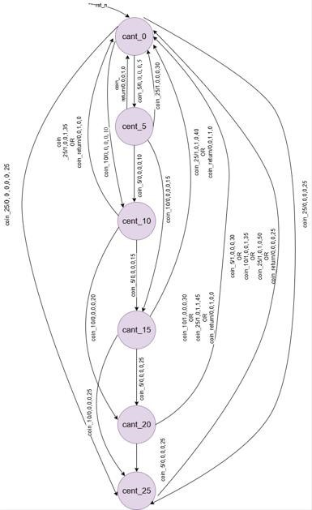

# Lab 4B: Vending Machine Controller  

Module: vending_machine 

Purpose: The vending machine module is designed to accept coins of 5, 10, and 25 cents, track the total amount inserted, and dispense an item when the required cost is reached. It also supports a coin return function to give back the balance in appropriate denominations. The FSM ensures correct handling of coin inputs, manages the amount display, and generates control signals for dispensing items and returning coins, providing a reliable and user-friendly vending system. 
#
**Signals**

•	clk (input): System clock used to drive the FSM and timing of operations.   
•	rst_n (input): Active-low reset; initializes the machine to idle state and clears balance.   
•	coin_5 (input): Signal that a 5-cent coin is inserted.   
•	coin_10 (input): Signal that a 10-cent coin is inserted.   
•	coin_25 (input): Signal that a 25-cent coin is inserted.   
•	coin_return (input): User presses coin return button to get back inserted balance.   
•	dispense_item (output): Asserted when the total inserted amount reaches the required value for an item; triggers item release.   
•	return_5 (output): Activates when a 5-cent coin must be returned to the user.   
•	return_10 (output): Activates when a 10-cent coin must be returned.   
•	return_25 (output): Activates when a 25-cent coin must be returned.   
•	amount_display [5:0] (output): Binary output showing the current inserted amount (in cents) for display purposes.   
#
## State Machine
**FSM**

#
**All States Clearly Labeled** 

Each state corresponds to the total balance (e.g., IDLE, 5, 10, 15,25). 

**All Transitions with Conditions**

•	coin_5 → Add 5¢ and move to next balance state.   
•	coin_10 → Add 10¢ and move to next balance state.   
•	coin_25 → Add 25¢ and move to next balance state.   
 
**Reset State Identified**   

•	On reset (rst_n = 0), machine goes to IDLE state with balance = 0.

**FSM Type**   

Designed  Mealy FSM, because outputs (dispense_item, return_5/10/25, amount_display) depend on both the current state and the input (coin_x, coin_return) at the same clock cycle. 

#

**State Transition Table**

| Current State | Input Condition | Next State | Outputs (dispense, return_25, return_10, return_5, amount_display) |
|---------------|-----------------|------------|-------------------------------------------------------------------|
| **IDLE (0¢)** | coin_5 = 1      | cent_5     | 0, 0, 0, 0, 5  |
|               | coin_10 = 1     | cent_10    | 0, 0, 0, 0, 10 |
|               | coin_25 = 1     | cent_25    | 0, 0, 0, 0, 25 |
|               | coin_return = 1 | IDLE       | 0, 0, 0, 0, 0  |
|               | no input        | IDLE       | 0, 0, 0, 0, 0  |
| **cent_5 (5¢)** | coin_5 = 1    | cent_10    | 0, 0, 0, 0, 10 |
|               | coin_10 = 1     | cent_15    | 0, 0, 0, 0, 15 |
|               | coin_25 = 1     | IDLE       | 1, 0, 0, 0, 30 |
|               | coin_return = 1 | IDLE       | 0, 0, 0, 1, 0  |
|               | no input        | cent_5     | 0, 0, 0, 0, 5  |
| **cent_10 (10¢)** | coin_5 = 1  | cent_15    | 0, 0, 0, 0, 15 |
|               | coin_10 = 1     | cent_20    | 0, 0, 0, 0, 20 |
|               | coin_25 = 1     | IDLE       | 1, 0, 0, 1, 35 |
|               | coin_return = 1 | IDLE       | 0, 0, 1, 0, 0  |
|               | no input        | cent_10    | 0, 0, 0, 0, 10 |
| **cent_15 (15¢)** | coin_5 = 1  | cent_20    | 0, 0, 0, 0, 20 |
|               | coin_10 = 1     | cent_25    | 0, 0, 0, 0, 25 |
|               | coin_25 = 1     | IDLE       | 1, 0, 1, 0, 40 |
|               | coin_return = 1 | IDLE       | 0, 0, 1, 1, 0  |
|               | no input        | cent_15    | 0, 0, 0, 0, 15 |
| **cent_20 (20¢)** | coin_5 = 1  | cent_25    | 0, 0, 0, 0, 25 |
|               | coin_10 = 1     | IDLE       | 1, 0, 0, 0, 30 |
|               | coin_25 = 1     | IDLE       | 1, 0, 1, 1, 45 |
|               | coin_return = 1 | IDLE       | 0, 0, 1, 0, 0  |
|               | no input        | cent_20    | 0, 0, 0, 0, 20 |
| **cent_25 (25¢)** | coin_5 = 1  | IDLE       | 1, 0, 0, 0, 30 |
|               | coin_10 = 1     | IDLE       | 1, 0, 0, 1, 35 |
|               | coin_25 = 1     | IDLE       | 1, 0, 1, 0, 50 |
|               | coin_return = 1 | IDLE       | 0, 1, 0, 0, 0  |
|               | no input        | cent_25    | 0, 0, 0, 0, 25 |

#
**Resources**

- I understood the FSM syntax from the lab module.  
- The complete design part was easy.  
- The difficult part was figuring out how to handle returning 2 and 10 coins, but I managed to work it out by taking some help from AI.  
- The rest of the design and implementation was done by myself.  
#
**Design review checklist**

- [x] Consistent naming conventions.
- [x] No combinational loops  
- [x]  No unintended latches (synchronous FSM design)  
- [x] Reset strategy consistent (asynchronous active-low `rst_n`)  
 