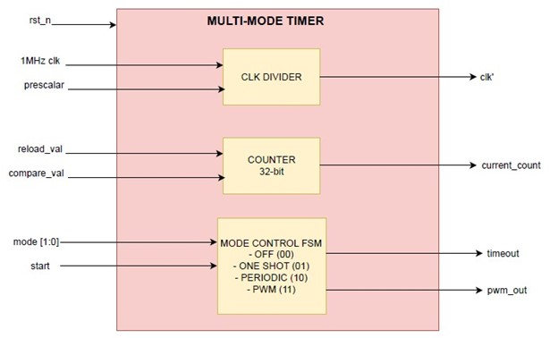

# LAB05: Counters and Timers  

**Multi-Mode Timer** 

Module: `multi_mode_timer`  

Purpose: 
This module works as a **basic countdown timer**, a **repeating timer**, or a **PWM generator**, depending on the selected mode.  
It is reusable in different digital systems where different timing behaviors are required.  

---

**Modes Supported**

| Mode | Binary | Behavior |
|------|--------|----------|
| OFF | 00 | Timer is disabled. |
| ONE-SHOT | 01 | Counts down once from `reload_val` to 0 when triggered, then stops. |
| PERIODIC | 10 | Continuously counts down and reloads, generating periodic `timeout` pulses. |
| PWM | 11 | Generates a PWM signal with period = `reload_val` and duty cycle = `compare_val / reload_val`. |

---

**Signals**

#### Inputs

- `clk` → System clock input (e.g., 1 MHz).  
- `rst_n` → Active-low reset.  
- `mode` → Selects the operating mode (00=OFF, 01=ONE-SHOT, 10=PERIODIC, 11=PWM).  
- `prescaler` → Clock divider used **only in PWM mode** to slow down counting.  
- `reload_val` → Max count for ONE-SHOT/PERIODIC or PWM period.  
- `compare_val` → Duty cycle control for PWM (number of clock cycles `pwm_out` stays HIGH).  
- `start` → Trigger signal to start ONE-SHOT/periodic or enable PWM mode.  

#### Outputs

- `timeout` → Goes HIGH for **1 clock cycle** when timer reaches end of countdown or PWM period.  
- `pwm_out` → PWM output signal (HIGH for `compare_val` counts, LOW otherwise).  
- `current_count` → Shows the current counter value (useful for debugging or waveform observation).  

---

### Architecture Overview

1. **Clock and Prescaler:**  
   - Timer uses a base clock.  
   - Prescaler divides the clock for longer timing intervals in PWM mode.  
   - Prescaler value is programmable via the input.  

2. **Counter Register:**  
   - 32-bit counter holds current timer value.  
   - Counter loads `reload_val` when timer starts or resets.  
   - Counter counts up (PWM) or down (ONE-SHOT / PERIODIC).  
   - `current_count` is available for monitoring.  

3. **Mode Control Logic:**  
   - Determines how the timer behaves based on `mode`.  
   - Handles mode changes by resetting counter and prescaler.  
   - Controls enabling and disabling of timer operation.  

4. **Timeout Generator:**  
   - In ONE-SHOT mode, generates a single pulse when counter reaches 0.  
   - In PERIODIC mode, generates a pulse each time counter rolls over.  
   - In PWM mode, indicates the **end of the PWM period**.  

5. **PWM Generator:**  
   - Compares `current_count` with `compare_val` to generate `pwm_out`.  
   - `reload_val` defines PWM period.  
   - `compare_val` defines duty cycle (how long output stays HIGH).  

6. **Control Signals:**  
   - `start` → Starts the timer or PWM operation.  
   - `timeout` → Indicates timer completion.  
   - `pwm_out` → Active PWM waveform in PWM mode.  

---

### How It Works

- **OFF Mode:** Everything stays at 0. Timer does nothing.  
- **ONE-SHOT Mode:** On rising edge of `start`, counter loads `reload_val` and counts down.  
  - When counter = 0 → `timeout` = 1 for 1 clock cycle, then stops.  
- **PERIODIC Mode:** Counter counts down continuously.  
  - Each time counter reaches 0 → `timeout` = 1 and counter reloads.  
- **PWM Mode:** Counter counts up to `reload_val`.  
  - `pwm_out` = 1 when `current_count` < `compare_val`.  
  - `pwm_out` = 0 when `current_count` ≥ `compare_val`.  
  - `timeout` = 1 when counter rolls over to 0 (end of PWM period).  
#
**Top Diagram**

#
**Resources**  
During this lab, I faced high difficulty understanding PWM timing and prescaler logic.
To implement and debug the timer:
AI Assistance (ChatGPT) to explain sequential logic, next_count logic, and prescaler handling. Most of the AI guidance was used for understanding how to implement PWM and multi-mode behavior, while the code was written and verified manually.
#
**Code Quality Checklist**

- [x] Correct mode handling (OFF, ONE-SHOT, PERIODIC, PWM).

- [x] PWM logic correctly uses prescaler to slow down counting.

- [x] Clean and readable Verilog syntax with meaningful signal names.

- [x] Inputs and outputs are well-documented.