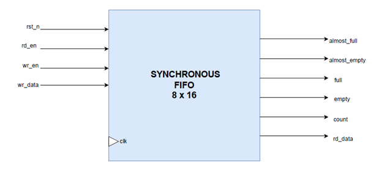

# LAB: Synchronous FIFO

module: sync_fifo  
Purpose:  
The sync_fifo module implements a parameterized synchronous FIFO buffer. It temporarily stores data in a First-In-First-Out manner, providing full, empty, almost_full, and almost_empty flags. The FIFO supports configurable data width, depth, and thresholds, making it reusable in digital systems for buffering between different modules running on the same clock domain.

---

**Interface Signals**

**Inputs**  
- clk → system clock  
- rst_n → active-low reset  
- wr_en → write enable, pushes data into FIFO  
- wr_data → data to be written, DATA_WIDTH wide  
- rd_en → read enable, pops data from FIFO  

**Outputs**  
- rd_data → data read from FIFO, DATA_WIDTH wide  
- full → high when FIFO is completely full  
- empty → high when FIFO is empty  
- almost_full → high when FIFO has reached almost full threshold  
- almost_empty → high when FIFO has reached almost empty threshold  
- count → current number of entries in FIFO  

---
**Top Diagram**

#
### Overview of Working  

1. **Idle / Reset**  
   - On reset, all pointers and counters are set to zero.  
   - Flags full = 0, empty = 1, almost_full = 0, almost_empty = 1.  

2. **Write Operation**  
   - When wr_en is high and FIFO is not full, data is written into memory at write_pointer.  
   - write_pointer increments, count increments.  
   - full and almost_full flags updated accordingly.  

3. **Read Operation**  
   - When rd_en is high and FIFO is not empty, data is read from memory at read_pointer.  
   - read_pointer increments, count decrements.  
   - empty and almost_empty flags updated accordingly.  

4. **Flags**  
   - full → high when count equals FIFO_DEPTH  
   - empty → high when count equals 0  
   - almost_full → high when count >= ALMOST_FULL_THRESH  
   - almost_empty → high when count <= ALMOST_EMPTY_THRESH  

---

**Resources**  
- I implemented this FIFO myself. I used my understanding of counters, pointers, and memory arrays in Verilog to design a synchronous FIFO.  

---

**Code Quality Checklist**  
- [x] All outputs are assigned in every clock cycle to prevent latches  
- [x] Write and read pointers wrap around correctly using modulo operation  
- [x] Count and status flags are updated synchronously with clock  
- [x] Reset properly initializes memory pointers and flags 
