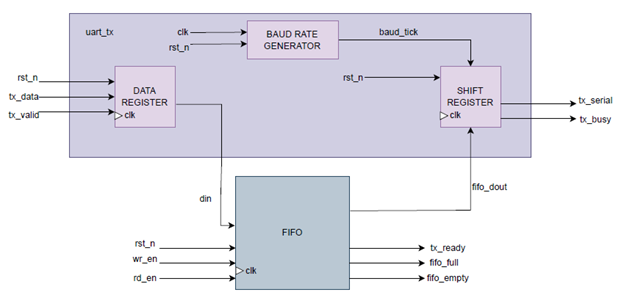

# LAB 08: UART Controller

### Lab 8A: UART Transmitter
module: uart_tx  
Purpose:
The UART transmitter module converts parallel data into serial form with configurable baud rate. It supports start, stop, and optional parity bits. FIFO buffering ensures smooth data transmission while status flags indicate readiness and busy states. The module uses a state machine and shift register to handle serial data bit-by-bit.

---

**Interface Signals**

**Inputs**
- clk → system clock
- rst_n → active-low reset
- wr_en → write enable for FIFO
- tx_data → data to transmit, WIDTH-bit wide

**Outputs**
- tx_serial → serial data output
- busy → high when transmitter is sending a frame
- fifo_full → high when FIFO is full
- fifo_empty → high when FIFO is empty
- tx_ready → high when FIFO can accept new data  
#
**Datapath**

---

### Overview of Working

The module works in the following sequence:

1. **Idle State**
   - Waits for data in FIFO.
   - tx_serial = 1, tx_busy = 0
   - Moves to LOAD when data is available.

2. **Load State**
   - Reads byte from FIFO into shift register.
   - Prepares for start bit transmission.

3. **Start Bit State**
   - Transmits start bit (0).
   - Sets tx_busy = 1.

4. **Data Bits State**
   - Transmits 8 data bits, LSB first.
   - Shift register shifts after each bit.
   - Timing controlled by baud_tick.

5. **Parity Bit State** (if enabled)
   - Transmits parity bit according to configuration.

6. **Stop Bit State**
   - Transmits stop bit (1).
   - Returns to IDLE if FIFO is empty, otherwise goes to LOAD.

---
### State Machine
#
**FSM**

**Moore machine**

#
### Transmit State Machine Table

| Current State | Input        | Next State | Output                     |
|---------------|--------------|------------|----------------------------|
| Idle          | !fifo_empty  | Load       | tx_serial = 1, tx_busy = 0 |
| Idle          | fifo_empty   | Idle       | tx_serial = 1, tx_busy = 0 |
| Load          | always       | Start_bit  | tx_busy = 1                |
| Start_bit     | baud_tick    | Data_bits  | tx_serial = 0              |
| Data_bits     | bit_index < WIDTH-1 | Data_bits  | tx_serial = data[bit_index], shift |
| Data_bits     | bit_index = WIDTH-1 | Parity/Stop | tx_serial = data[bit_index] |
| Parity_bit    | baud_tick    | Stop_bit   | tx_serial = parity_bit     |
| Stop_bit      | !fifo_empty  | Load       | tx_serial = 1, tx_busy = 0 |
| Stop_bit      | fifo_empty   | Idle       | tx_serial = 1, tx_busy = 0 |

---

**Resources**
- The UART transmitter code was not written entirely by me. The tasks in our group were divided — my teammate implemented the UART module and later explained it to me.Now, I have a complete understanding of how the UART works (states, signals, parity logic, FIFO handling, baud generator, etc.), but the original coding work was done by my group member.
- I used AI explanations to strengthen my understanding of the UART design.
#
**Code Quality Checklist**
- [x] FSM uses clear, descriptive state names (Idle, Load, Start_bit, Data_bits, Parity_bit, Stop_bit).   
- [x]  All outputs are assigned in every state to avoid latches.  
- [x] Active-low reset properly initializes all registers and counters.