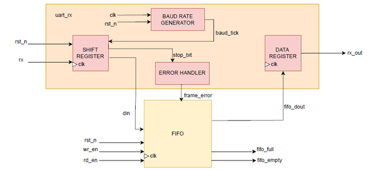

### Lab 8B: UART Receiver
module: uart_rx  
Purpose:  The UART receiver module converts serial data into parallel form. It detects start, data, and stop bits using a baud rate generator. A FIFO buffer stores received bytes to prevent data loss, and status flags indicate valid data availability. The module uses a Moore state machine and shift register to capture incoming serial bits.

---

**Interface Signals**

**Inputs**  
- clk → system clock  
- rst_n → active-low reset  
- rd_en → read enable for FIFO  
- rx_serial → serial input data  

**Outputs**  
- rx_out → parallel output data from FIFO  
- rx_valid → high when new data is available  
- fifo_full → high when FIFO is full  
- fifo_empty → high when FIFO is empty  

---
**Datapath**

#
### Overview of Working  

The module works in the following sequence:  

1. **Idle State**  
   - Waits for the line to go low (start bit).  
   - fifo_wr_en = 0  
   - Transitions to START when start bit detected  

2. **Start State**  
   - Confirms valid start bit at baud tick  
   - fifo_wr_en = 0  
   - Transitions to DATA if valid, or back to IDLE if line glitch detected  

3. **Data State**  
   - Shifts in each data bit at every baud tick  
   - fifo_wr_en = 0 until full byte received  
   - After all bits are received, transitions to STOP  

4. **Stop State**  
   - Verifies stop bit  
   - If correct, writes received byte into FIFO (fifo_wr_en = 1)  
   - Returns to IDLE  

---

### State Machine  

**FSM**: Moore machine  

---

### Receive State Machine Table  

| Current State | rx (serial input) | Output         | Next State |
|---------------|-----------------|----------------|------------|
| Idle          | 1               | fifo_wr_en = 0 | Idle       |
| Idle          | 0               | fifo_wr_en = 0 | Start      |
| Start         | 0               | fifo_wr_en = 0 | Data       |
| Start         | 1               | fifo_wr_en = 0 | Idle       |
| Data          | 0 / 1           | fifo_wr_en = 0 | Data / Stop|
| Stop          | 1               | fifo_wr_en = 1 | Idle       |
| Stop          | 0               | fifo_wr_en = 0 | Idle       |

---

**Resources** 
- The UART receiver code was not written entirely by me. The tasks in our group were divided — my teammate implemented the UART module and later explained it to me.Now, I have a complete understanding of how the UART works (states, signals, parity logic, FIFO handling, baud generator, etc.), but the original coding work was done by my group member. 
- I used class notes, online tutorials, and AI explanations to strengthen my understanding of the UART design.

---

**Code Quality Checklist**  
- [x] FSM uses clear, descriptive state names (Idle, Start, Data, Stop)  
- [x] All outputs are properly assigned in every state to prevent latches  
- [x] Active-low reset initializes shift registers, counters, and FIFO correctly  
- [x] Start bit validation prevents false triggering from line glitches  
