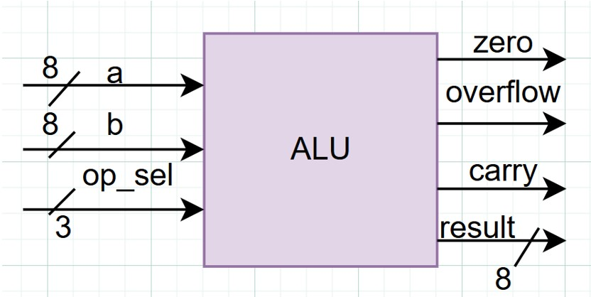
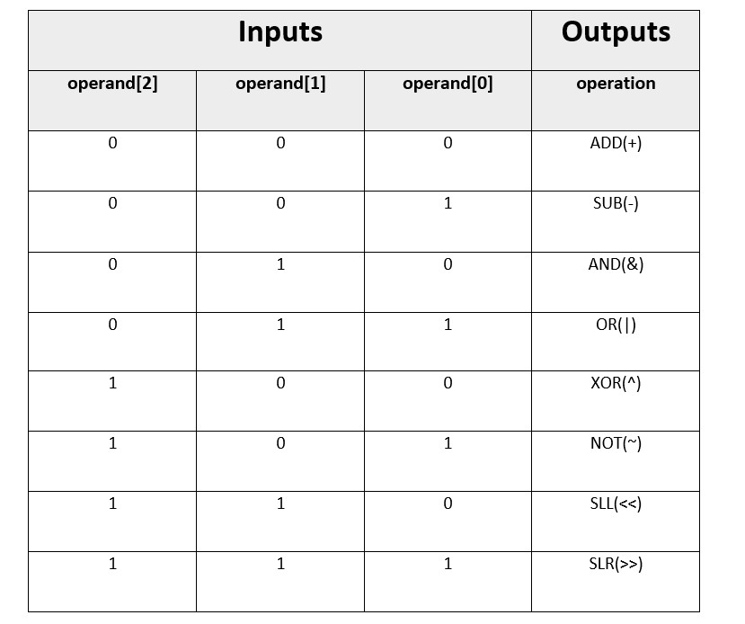
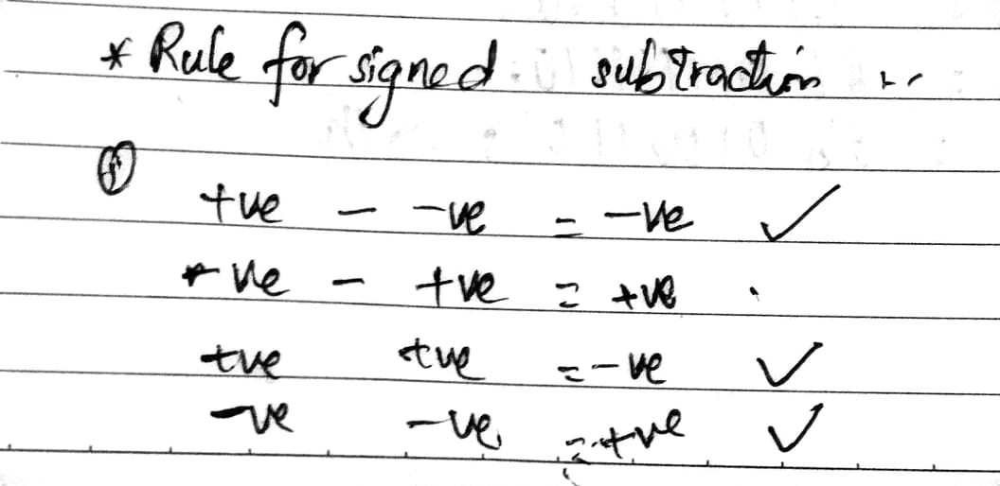
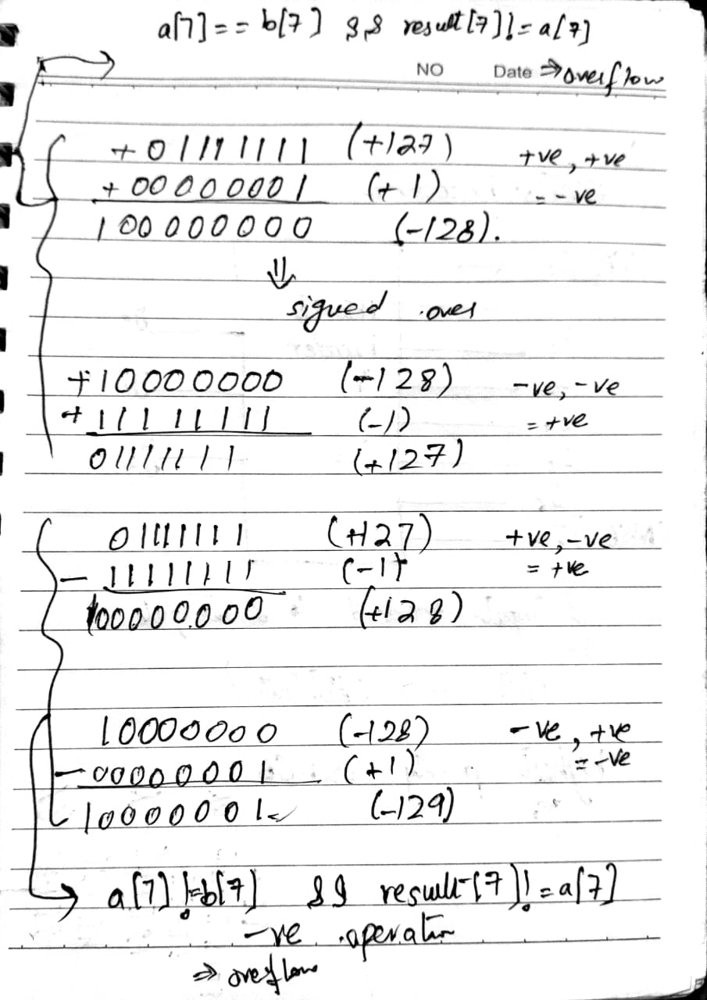
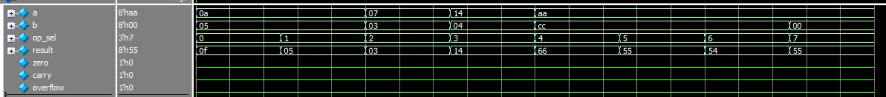

## 8-Bit ALU  

###  Design Requirements
- 8-bit ALU supporting the following operations:
  - ADD (`000`)
  - SUB (`001`)
  - AND (`010`)
  - OR  (`011`)
  - XOR (`100`)
  - NOT (`101`)
  - Shift Left Logical (SLL, `110`)
  - Shift Right Logical (SRL, `111`)
- 3-bit operation select (`op_sel`)
- Status outputs:
  - **Zero** flag
  - **Carry** flag (for unsigned arithmetic)
  - **Overflow** flag (for signed arithmetic)
- Optimized for FPGA implementation

###  Design Steps
1. Create truth table for all 8 operations.
2. Draw block diagram showing datapath.
3. Implement add/subtract logic with carry/overflow detection.
4. Add logical and shift operations.
5. Verify design through simulation testbench.
6. Consider FPGA resource utilization.
## Overview  
This module implements an 8-bit ALU in SystemVerilog supporting arithmetic, logical, and shift operations.  
The ALU provides flags for zero, carry, and signed overflow detection.  
It supports addition, subtraction, AND, OR, XOR, NOT, and single-bit left/right shifts.  


##  Block Diagram


---
###  Operation Table



--- 

#### Rules for Signed Subtraction for Calculation of Overflow bit



#### Examples for Calculation of Overflow Bit


---
#### Carry Bit Calculation
```text
 carry = (op_sel == 3'b000) && (result < a);
 ```
  Example: Carry out for addition is calculated as:
   8'b01111111 + 8'b00000001 = 8'b00000000 
So,always Addition operation yields carryout bit as 1 when operation result < a .

---
 
#### ALU Table


---

#### Example Run

Input:
a = 00000101  
b = 00000011  
op_sel = 001 (basically it's subtraction)

Output:
result = 00000010 (2)
zero = 0
carry = 0
overflow = 0

---

#### Simulation


---
