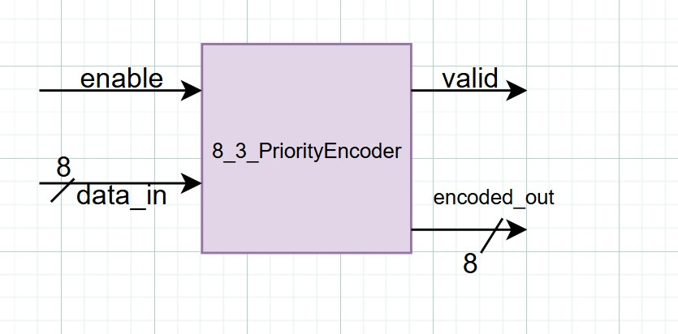
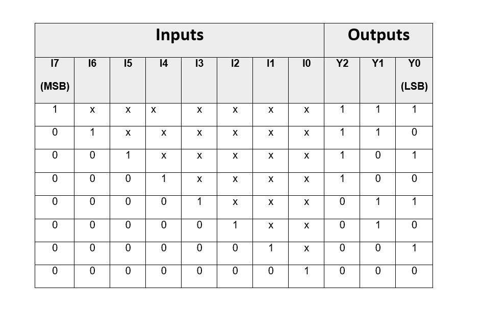
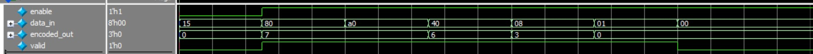

##  Lab 1B: Priority Encoder

###  Design Requirements
- **8-to-3 Priority Encoder** with input enable
- Inputs: Active-high (`I7` will always have highest priority  while `I0`the  lowest)
- Outputs:
  - `Y2, Y1, Y0` (3-bit binary code)
  - `Valid` signal (asserted when any input = 1)
- Must handle **all-zero input case**

###  Design Steps
1. Construct truth table for all 8 inputs.
2. Use K-map simplification to derive optimized equations.
3. Implement priority logic ensuring highest index has priority.
4. Add `Valid` output for all-zero detection.
5. Verify design using testbench.
### Overview
This module implements an 8-to-3 priority encoder with enable control.  
It encodes the highest-priority active input bit (bit7 highest, bit0 lowest) into a 3-bit binary output.  
The `valid` signal indicates whether any input bit is active when enable is asserted.  

###  Optimized Output Equations
From K-map minimization:
Y2 = I7 + I6 + I5 + I4
Y1 = I7 + I6 + I3 + I2
Y0 = I7 + I5 + I3 + I1

---

### Block Diagram

---

### Truth Table

---
## Example Run

Input:
enable = 1
data_in = 10000000

Output:
encoded_out = 111
valid = 1
(as shown in waveform).

---

### Simulation

---