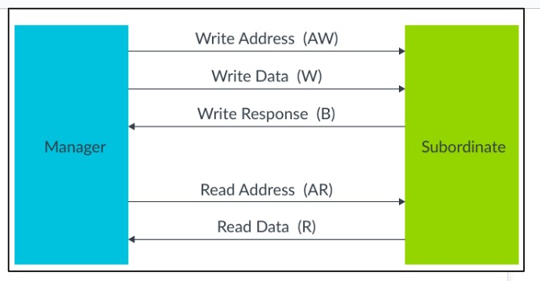
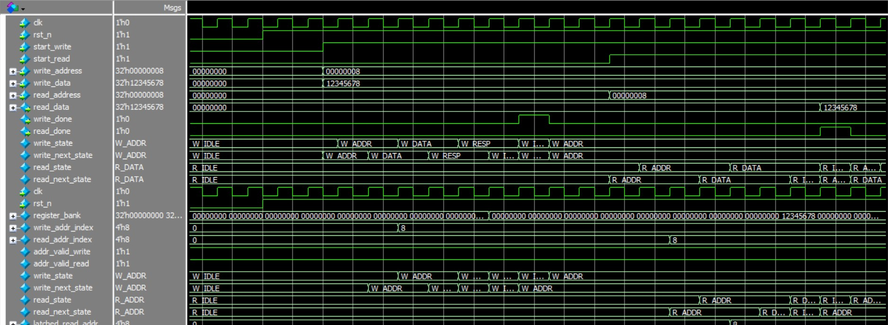
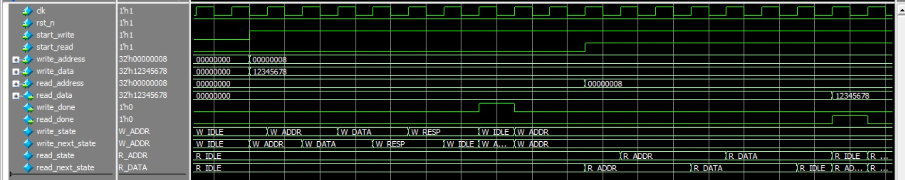
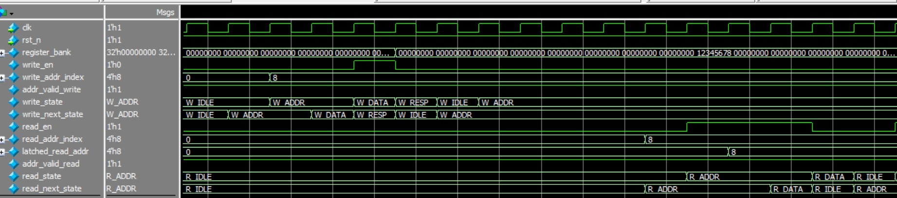

### 12. Lab 10: AXI4-Lite Interface Design 
#### 12.1 AXI4-Lite Protocol Overview 
#### Key Characteristics 
● 32-bit address and data buses 
● Separate read/write address channels 
● Write response channel 
● No burst support (single transfers only) 
● Simple handshake protocol (VALID/READY) 
#### Channel Structure 
Write Address Channel: AWADDR, AWVALID, AWREADY 
Write Data Channel:    WDATA, WSTRB, WVALID, WREADY   
Write Response:        
BRESP, BVALID, BREADY 
Read Address Channel:  ARADDR, ARVALID, ARREADY 
Read Data Channel:     RDATA, RRESP, RVALID, RREADY 
#### 12.2 AXI4-Lite Slave Design 
#### Specification 
● Register bank with 16 x 32-bit registers 
● Read/write access to all registers 
● Address decode logic 
● Proper AXI4-Lite response handling 
● Error responses for invalid addresses 
#### Design Process 
1. Study AXI4-Lite specification - understand handshake protocol 
2. Draw timing diagrams for read and write transactions 
3. Design address decoder 
4. Plan register bank implementation 
5. Design response logic

---

#### AXI4-lite

---
#### FSM's

#### Write

#### Read

---

### AXI4-Lite Master Module
This module implements a simple **AXI4-Lite master** capable of performing **read** and **write transactions** on an AXI4-Lite slave interface.

#### Features
- Separate finite state machines (FSMs) for **read** and **write** channels.
- Handles **address, data, and response phases** according to AXI4-Lite protocol.
- Generates `write_done` and `read_done` flags for transaction completion.

#### Inputs
- `clk` : System clock  
- `rst_n` : Active-low reset  
- `start_write` : Trigger a write transaction  
- `start_read` : Trigger a read transaction  
- `write_address` : Address to write data to  
- `write_data` : 32-bit data to write  
- `read_address` : Address to read data from  

#### Outputs
- `read_data` : Data read from the slave  
- `write_done` : Goes high for one clock cycle when write completes  
- `read_done` : Goes high for one clock cycle when read completes  

####  Internal Blocks
1. **Write FSM**
   - States: `W_IDLE`, `W_ADDR`, `W_DATA`, `W_RESP`  
   - Handles write address, data, and response handshake.
2. **Read FSM**
   - States: `R_IDLE`, `R_ADDR`, `R_DATA`  
   - Handles read address, captures read data, and acknowledges response.
3. **AXI Signals**
   - `awvalid`, `wvalid`, `bready` for write channel  
   - `arvalid`, `rready` for read channel  
   - Properly controlled in each state according to AXI4-Lite handshake rules.

 ---

### AXI4-Lite Slave (`axi4_lite_slave`)

This module implements a **16x32-bit register bank** and acts as a slave for the AXI4-Lite interface.

#### Ports

- `clk`       : System clock  
- `rst_n`     : Active-low reset  
- `axi_if`    : AXI4-Lite slave interface (modport `slave`)  

#### Register Bank

- 16 registers, each 32-bit wide  
- Addresses: `0x00` to `0x3C` (increments of 4)  
- Holds write data from the AXI master  
- Returns `32'hDEAD_DEAD` for invalid read addresses  

#### Write Channel FSM

- States: `W_IDLE`, `W_ADDR`, `W_DATA`, `W_RESP`  
- Transitions when `awvalid`, `wvalid`, `bready` signals change  
- `awready`, `wready`, `bvalid` managed in output logic  
- Address decode checks for valid write addresses  

#### Read Channel FSM

- States: `R_IDLE`, `R_ADDR`, `R_DATA`  
- Latches read address when `arvalid & arready`  
- Returns register data for valid addresses  
- Returns `32'hDEAD_DEAD` for invalid addresses  
- `arready`, `rvalid`, `rdata` signals controlled in output logic  

#### Address Decode

- Write and read addresses checked for range `0x00` to `0x3C`  
- `addr_valid_write` and `addr_valid_read` flags used for valid transactions  

#### Write Logic

- Writes `wdata` to the corresponding register if `addr_valid_write` and write FSM in `W_DATA`  
- `write_addr_index` selects register index  

#### Read Logic

- Outputs `rdata` from register selected by latched read address  
- Controlled by `read_en` and `addr_valid_read`  

#### Notes

- Implements **AXI4-Lite slave behavior** including handshaking and responses  
- Ready and valid signals are properly managed for **write and read channels**  

---

### AXI4-Lite Interface (`axi4_lite_if`)

This   interface defines the **signals and modports** for an AXI4-Lite communication between a master and a slave.

#### Channels

#### Write Address Channel
- `awaddr` : 32-bit write address  
- `awvalid` : Master asserts when address is valid  
- `awready` : Slave asserts when ready to accept address  

#### Write Data Channel
- `wdata` : 32-bit write data  
- `wstrb` : 4-bit write strobe (byte enables)  
- `wvalid` : Master asserts when data is valid  
- `wready` : Slave asserts when ready to accept data  

#### Write Response Channel
- `bresp` : 2-bit write response (`OKAY`, `SLVERR`)  
- `bvalid` : Slave asserts when response is valid  
- `bready` : Master asserts when ready to accept response  

#### Read Address Channel
- `araddr` : 32-bit read address  
- `arvalid` : Master asserts when address is valid  
- `arready` : Slave asserts when ready to accept address  

#### Read Data Channel
- `rdata` : 32-bit read data  
- `rresp` : 2-bit read response (`OKAY`, `SLVERR`)  
- `rvalid` : Slave asserts when read data is valid  
- `rready` : Master asserts when ready to accept data  

#### Modports

#### Master Modport
- **Outputs**: `awaddr, awvalid, wdata, wstrb, wvalid, bready, araddr, arvalid, rready`  
- **Inputs**: `awready, wready, bresp, bvalid, arready, rdata, rresp, rvalid`  

#### Slave Modport
- **Inputs**: `awaddr, awvalid, wdata, wstrb, wvalid, bready, araddr, arvalid, rready`  
- **Outputs**: `awready, wready, bresp, bvalid, arready, rdata, rresp, rvalid`  

---

#### Simulation 

**Master Module**

**Slave Module**
